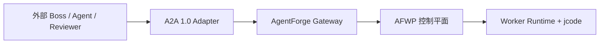
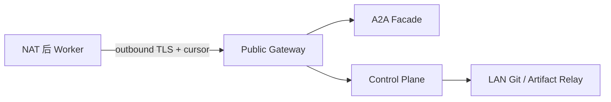

# ADR-0003：A2A 只作为互操作边界，AFWP 保持内部事实源

- 状态：Accepted
- 日期：2026-08-07
- 决策者：AgentForge Architecture
- 影响组件：Gateway、Agent Registry、Boss Adapter、Worker Adapter、Artifact Gateway
- 相关规范：AFWP/1.0、Submission/1.0

## 1. 上下文

AgentForge 要连接分布在不同机器、使用不同模型和 Agent 框架的 Boss、Worker 与 Reviewer。A2A 已经提供 Agent Card、Message、长时 Task、Artifact、状态/Artifact 流和认证声明，适合作为跨系统互操作协议。A2A 1.0 的官方规范将 Agent Card、Task/Message/Artifact 与多个协议绑定定义为公共模型，并要求客户端在请求中发送 major.minor 协议版本；扩展通过版本化 URI 协商。[A2A 1.0 规范](https://a2a-protocol.org/latest/specification/)

但 AgentForge 的代码工厂语义还包括：

- 不可变 WorkPackage revision 与内容哈希；
- Project Contract、动态 WorkGraph 与多种依赖边；
- Offer、Bid、能力匹配、预算与结算；
- Attempt 与 TaskLease 分离、generation fencing；
- 精确 Git base/candidate/tree OID 和 branch 权限；
- 逐项 acceptance、独立 Reviewer、干净 Runner 与 Evidence Bundle；
- `ACCEPTED` 与 `INTEGRATED` 分离；
- Outbox/Inbox、CAS、幂等与 Obligation Engine。

A2A Task 生命周期故意保持通用。官方任务说明也把依赖任务和 Artifact 版本链接的管理留给客户端；同一 `contextId` 中可以创建并行 Task，但 Artifact 的接受/版本关系不由服务 Agent 负责。[Life of a Task](https://a2a-protocol.org/latest/topics/life-of-a-task/)

因此，若直接把 A2A Task 当数据库 WorkPackage，会丢失 fencing、Git、验收与图语义；若完全不用 A2A，又会把 AgentForge 锁进 jcode 和自有 Worker 实现。

## 2. 决策

采用两层协议：



1. **边界层**：对第三方/异构 Agent 提供 A2A 1.0 HTTP+JSON/REST 与 SSE；
2. **内部层**：AFWP、WorkGraph、Attempt、Lease、Candidate、VerificationRun、Submission、Integration、事件账本和 Git 状态保持唯一事实源；
3. **适配层**：A2A Task 是一次远程 Agent 交互的对外投影，不是 WorkPackage 本体；
4. **扩展层**：AgentForge 专属语义通过版本化 A2A extension 引用，不把整个 AFWP 塞进自由文本；
5. **Artifact 层**：A2A 交换小型描述和内容寻址引用，大代码/证据经 Artifact Store 或 Git Relay 传输。

本决策不要求 MVP 内部组件彼此使用 A2A。控制面内部仍使用领域命令/事件；jcode Bridge 可以是进程/SDK adapter。只有跨产品或跨 Agent 边界时才经过 A2A Adapter。

## 3. 采用的 A2A 基线

- 协议版本：`A2A-Version: 1.0`；
- 首个绑定：HTTP+JSON/REST；流式更新使用 SSE；
- 发现：`/.well-known/agent-card.json`；
- 私有详情：认证后的 Extended Agent Card；
- 扩展协商：`A2A-Extensions` header + Message/Artifact 的 extension URI；
- 主要操作：SendMessage、SendStreamingMessage、GetTask、ListTasks、CancelTask、SubscribeToTask、GetExtendedAgentCard；
- Task 状态只使用 v1 枚举：`SUBMITTED/WORKING/INPUT_REQUIRED/AUTH_REQUIRED/COMPLETED/FAILED/CANCELED/REJECTED` 对应的 wire enum。

A2A 1.0 规定 HTTP 绑定可用 `POST /message:send`、`POST /message:stream`、`GET /tasks/{id}` 与订阅等端点；Agent Card 的标准发现位置和版本/扩展 header 也已在规范中定义。[A2A 1.0 HTTP 与发现](https://a2a-protocol.org/latest/specification/)

实现必须 pin 官方 Proto/Schema 的 digest。`latest` 链接只用于本文阅读，不得在构建时动态下载。升级 A2A minor/major 需单独 ADR、兼容测试和 Agent Card 更新。

## 4. AgentForge Extension

### 4.1 标识

Canonical URI：

```text
https://agentforge.dev/a2a/extensions/afwp/v1
```

Breaking change 使用新 URI `/v2`，不得自动回退。A2A 官方扩展模型允许 Agent 在 Agent Card 声明 URI、说明、required 与参数，客户端通过绑定相应的 extension header 选择使用；breaking extension 应获得新 URI。[A2A Extensions](https://a2a-protocol.org/latest/topics/extensions/)

在“执行 AgentForge 工单”的 Agent Skill 上，该 extension 标记 `required: true`；普通问答/发现可以不要求。对不支持 extension 的客户端，Gateway 返回 unsupported extension，而不是把 AFWP 降级为一段 Prompt。

### 4.2 Extension metadata

扩展元数据只放不可变引用和非敏感状态：

```json
{
  "extensions": [
    "https://agentforge.dev/a2a/extensions/afwp/v1"
  ],
  "metadata": {
    "https://agentforge.dev/a2a/extensions/afwp/v1": {
      "projectId": "agentforge",
      "packageId": "wp-lease-fencing-001",
      "packageRevision": 3,
      "packageHash": "sha256:e02271c1d96c4b82fa250eecaac34ea4a8542639b9d87d7cf4b26d11ac95b83f",
      "attemptId": "att-lease-fencing-04",
      "afwpRef": "artifact://afwp/agentforge/wp-lease-fencing-001/3",
      "phase": "IMPLEMENTING",
      "progressSeq": 17
    }
  }
}
```

不得放入：原始 fencing bearer token、Git credential、模型 API key、私有 Prompt、数据库 DSN、跨租户内部 ID 列表。对租约只可带 `lease_id`、generation 和 token hash；真正有副作用请求仍在受认证的 AgentForge command endpoint 验证当前 token/fence。

### 4.3 为什么只引用 AFWP

- A2A Message/metadata 的历史和保留策略不等同于不可变 Artifact Store；
- 完整 AFWP 可能包含私有仓库路径、权限和输入；
- 内容寻址引用便于 ACL、缓存、签名和单一 revision；
- Gateway 拉取 `afwpRef` 后必须重算 package hash，不能信任 metadata 文本。

## 5. 概念映射

| A2A 概念 | AgentForge 映射 | 明确不等于 |
| --- | --- | --- |
| Agent Card | Agent/Executor 的公开能力、接口、模态和认证摘要 | 实测信誉、实时容量、完整安全域 |
| Extended Agent Card | 经授权的工具、内部 skills、安全域摘要 | 可直接授予 Lease 的凭据 |
| Agent Skill | 可报价/执行/审查某类任务的入口 | 已验证 capability score |
| `contextId` | 一次项目协作/委派上下文的外部 opaque ID | `project_id` 本身或安全边界 |
| A2A Task | 一次远程 Agent 调用，通常映射一个 Attempt/Review/规划会话 | WorkPackage、WorkGraph 或 Project |
| `taskId` | A2A adapter 的交互 ID，映射表指向 internal aggregate | `package_id`/`attempt_id` 直接外露保证 |
| Message | 澄清、协商、Nudge、输入/授权请求 | 领域命令事实源 |
| Artifact | AFWP、RFC、候选描述、报告或 Evidence 的引用/小型内容 | Git branch 或 Artifact Store 本身 |
| TaskStatusUpdate | Attempt 对外的有损状态投影 | 内部 state transition event |
| TaskArtifactUpdate | 增量 Artifact 通知 | Artifact 已验收/已集成的证明 |

映射表存入 Adapter 数据库，并受租户 ACL 保护。外部 `taskId/contextId` 必须 opaque，不能让调用方枚举内部项目。

## 6. 状态投影

A2A Task 状态较粗，使用下表做**单向投影**：

| AgentForge 状态/原因 | A2A Task state | 说明 |
| --- | --- | --- |
| CREATED、PROVISIONAL_LEASE | `TASK_STATE_SUBMITTED` | 已登记，未进入正式执行 |
| PREPARING、PLANNING、IMPLEMENTING、LOCAL_VERIFY、REVIEW/REPRODUCE 进行中 | `TASK_STATE_WORKING` | 精确 phase 放 extension metadata |
| WAITING_INPUT | `TASK_STATE_INPUT_REQUIRED` | status message 给问题引用与 wake condition |
| WAITING_AUTH | `TASK_STATE_AUTH_REQUIRED` | 凭据通过 transport/out-of-band 交付，不放 Message |
| 远程 Agent 的交互目标完成且 Artifact 已登记 | `TASK_STATE_COMPLETED` | 不表示 WorkPackage ACCEPTED/INTEGRATED |
| Attempt/Review 确定失败 | `TASK_STATE_FAILED` | 可重派仍由内部控制面决定 |
| 调用在允许状态被取消 | `TASK_STATE_CANCELED` | Lease revoke 是另一个内部事务 |
| Agent 在执行前决定不能/不愿承接 | `TASK_STATE_REJECTED` | 区别于执行中失败 |

不得从 A2A state 反向直接设置内部 aggregate。Adapter 收到外部更新后，先验证身份、extension、映射、版本、幂等和 fencing，再转换为一个领域命令；领域命令可能拒绝该更新。

A2A `COMPLETED` 只说明该远程 Agent task 完成。例如作者 Task 完成可以产生 candidate Artifact，但内部 WorkPackage 仍处于 VERIFYING。只有 AFWP hard criteria、Reviewer、clean reproduction 和 Merge Queue 决定 ACCEPTED/INTEGRATED。

## 7. Task 与 WorkGraph

一个 AFWP Attempt 通常创建一个 A2A Task。若远程 Agent 被允许分解：

1. 它只能提交 `ExpansionProposal` Artifact；
2. AgentForge 验证 DelegationGrant、预算、依赖和图版本；
3. 批准后控制面创建新的 AFWP child packages；
4. 每个 child Attempt 再拥有独立 A2A Task；
5. parent A2A Task 可以 WAITING_INPUT/WORKING，但 A2A task history 不作为 DAG。

同一 `contextId` 可以承载平行 Task，符合 A2A 的并行 follow-up 模型；真正的 `blocks/provides_contract/uses_artifact/integration_after` 边只存 WorkGraph。

## 8. Message 与 Artifact 规则

### 8.1 Message

Message 用于：

- 接单前能力/格式协商；
- `QuestionRaised` 的人类可读说明；
- Nudge、诊断请求和状态摘要；
- 引用新的只读输入；
- 取消请求及其说明。

Message 不用于：授予 Git 权限、修改 AFWP、改变 hard criterion、续 Lease 或确认合并。这些都必须调用结构化控制面命令。

每个 Message 的 `messageId` 进入 Adapter Inbox 去重；AFWP extension 还必须带领域 `idempotency_key/progressSeq`。A2A 消息成功不等于领域命令成功，Adapter 应回传稳定 AgentForge error code。

### 8.2 Artifact

小型 RFC/报告可作为 A2A Artifact part；大文件使用 descriptor：

```json
{
  "artifactId": "evidence-run-0198f221",
  "name": "Signed Evidence Bundle",
  "parts": [
    {
      "data": {
        "uri": "artifact://evidence/0198f221-52f8-7d6b-92b4-2d89aa25a341/bundle.tar.zst",
        "sha256": "sha256:b7644131536f1dad3247d4d20dfc3551f15032e6206a3586525e2d2ab9b3040d",
        "mediaType": "application/zstd",
        "sizeBytes": 4382912
      }
    }
  ],
  "extensions": [
    "https://agentforge.dev/a2a/extensions/afwp/v1"
  ]
}
```

TaskArtifactUpdate 的 chunking 只用于交互流，不替代断点续传 Artifact API；Artifact Store 负责分片、digest、ACL、配额和保留。Git 数据优先使用增量 Git Bundle + Relay，不用 A2A 文本/bytes 反复复制。

## 9. Agent Card 与能力发现

### 9.1 公共 Card

公共 Agent Card 只公布：

- 名称、说明、公开 endpoint；
- A2A protocol/interface 与 supported content types；
- 粗粒度 skills/modalities；
- 认证 scheme；
- AFWP extension URI 和版本；
- 是否支持 streaming/push/extended card。

不得公开：项目名、仓库、实时空闲槽、模型密钥、内网地址、细分评分、历史缺陷或安全域拓扑。官方规范也明确 Agent Card 不应包含敏感凭据/内部实现详情，并允许签名；AgentForge 的公网 Card 必须 HTTPS，生产应签名并 pin key。[A2A Agent Card 发现与安全](https://a2a-protocol.org/latest/topics/agent-discovery/)

### 9.2 Extended Card

认证授权后可返回：

- canonical capability taxonomy IDs；
- 工具与 Runner classes；
- 允许的 security levels 与数据区摘要；
- 任务类别和最大预算范围；
- Executor fingerprint 引用。

实测 `P_pass`、成本、信誉和实时容量仍由中央 Matcher 管理，不相信远程 Card 自报。Extended Card 是候选发现输入，不是 admission 结论。

## 10. 网络拓扑与 NAT

Worker 默认不暴露 A2A Server：



- Worker 作为客户端向 Gateway 建立出站 HTTPS/SSE；
- Gateway 可为已认证 Worker 暴露虚拟 A2A 地址，但请求通过现有出站 session/队列投递；
- SSE 不可用时使用带 cursor 的长轮询；
- 公网不暴露 PostgreSQL、NATS、局域网 Git 或 Worker 入站端口；
- NodeSessionLease 只表示大致在线，TaskLease 仍单独维护；
- 外部 Agent 若原生暴露 A2A Server，Gateway 可作为 A2A Client 调用，但依然先创建内部 Attempt/Lease。

推送 webhook 只允许预注册 HTTPS endpoint、出站 allowlist、签名验证和重放保护；MVP 可只实现 SSE/轮询，避免 SSRF 与 webhook credential 管理。

## 11. 身份、安全与授权

A2A 身份建立在 transport/HTTP 层，不应在 payload 自报。AgentForge 使用 mTLS 或 OAuth 2.0 client credentials/短期 token，将认证主体映射到 tenant、node、executor 和 policy。Agent Card 只声明支持的 scheme，不嵌入静态 Secret。官方企业安全说明同样把身份放在传输层，并通过 Card 声明认证方式。[A2A 企业安全](https://a2a-protocol.org/latest/topics/enterprise-ready/)

每个入站请求执行：

1. TLS 与认证；
2. tenant/agent/task ACL；
3. `A2A-Version` 与 extension negotiation；
4. A2A Schema 验证、大小/速率限制；
5. extension Schema 与内容哈希验证；
6. task mapping 与 idempotency；
7. 若有副作用，验证 active Lease/generation/fencing；
8. 生成内部 command 与审计记录。

文件引用必须防 SSRF：默认只接受 AgentForge Artifact URI；外部 HTTPS URI 需要域名 allowlist、DNS/IP 再验证、大小和 digest，禁止 `file:`、环回、link-local 和云 metadata 地址。

## 12. 错误映射

Adapter 保留稳定 AgentForge code，在 A2A error details 中使用扩展 typed detail：

| AgentForge | A2A/HTTP 表现 | Task 影响 |
| --- | --- | --- |
| `AF_SCHEMA_VERSION_UNSUPPORTED` / unsupported extension | A2A version/extension error，4xx | REJECTED 或保持原状态 |
| `AF_SCHEMA_INVALID` / `AF_PACKAGE_HASH_MISMATCH` | invalid request，422 | 不创建/不更新 Task |
| `AF_LEASE_STALE` | conflict，409 + extension code | 当前外部 Task FAILED；salvage 另行登记 |
| `AF_LEASE_EXPIRED` | gone，410 + extension code | 当前外部 Task FAILED；等待重派或登记 salvage |
| `AF_IDEMPOTENCY_KEY_REUSED` | conflict，409 | 不重复执行 |
| `WAITING_INPUT` | status update | INPUT_REQUIRED |
| `WAITING_AUTH` | status update | AUTH_REQUIRED |
| `AF_TASK_INVALID` | failed dependency/spec detail | FAILED，并唤起 Boss 修订；不处罚 Worker |
| transient internal/limit | server/rate-limit + Retry-After | 保持状态，客户端同 key 重试 |

调用方只按 code 决策，不匹配 message。Adapter 不得把未知错误映射为 COMPLETED。

## 13. 可观测性

记录：

```text
a2a taskId/contextId (opaque)
<-> adapter mapping ID
<-> project/package/revision/hash
<-> attempt/lease generation
<-> internal trace ID
```

只在受权日志中保存映射。指标包括请求/stream、版本/extension 拒绝、映射失败、重复 message、Artifact digest mismatch、状态投影延迟和 task 泄漏。不得把完整 Message、Prompt 或私有 Artifact 内容作为默认 telemetry label/log。

## 14. 备选方案

### 14.1 直接以 A2A Task 作为 WorkPackage

拒绝。A2A 的通用状态无法表达不可变 revision/hash、DAG、报价/租约 fencing、Git OID、独立验收与 integration。扩展所有内部字段最终会把通用 Task 变成脆弱数据库模型。

### 14.2 完全自研跨 Agent 协议

拒绝。短期简单，但第三方 Boss/Worker/Reviewer 都要写 AgentForge 私有 adapter，失去标准发现、Message/Task/Artifact 与多绑定生态。

### 14.3 内部所有微服务都强制 A2A

拒绝。领域组件需要事务命令、事件和批量查询；把它们包装成 Agent 对话增加歧义和运维成本。A2A 用在自治 Agent 边界，而不是替代内部 RPC/event bus。

### 14.4 Worker 直接公开 A2A Server

不作为默认。大量节点在 NAT/移动网络后，开放入站端口扩大攻击面。使用出站 Gateway 和虚拟 façade；明确可达且受管的第三方 Agent 可以例外。

## 15. 后果

### 正面

- 可接入 jcode 以外的 Agent 框架；
- 标准化发现、长任务、流式状态和 Artifact 交互；
- AFWP 核心不受外部协议状态粒度限制；
- Worker 无需公网入站端口；
- A2A 升级和 AFWP 演进可以分开管理。

### 代价

- 需要维护 Adapter 映射、状态投影和两套 Schema；
- A2A COMPLETED 与内部 ACCEPTED/INTEGRATED 的区别需要在 UI/日志明确展示；
- extension 使用者仍需理解 AFWP 引用和控制面命令；
- 流式/重连产生至少一次投递，必须做 Inbox/idempotency；
- Gateway 成为高价值安全边界，需要限流、ACL、审计和高可用。

## 16. 实施顺序

1. 固定 A2A 1.0 Proto/JSON Schema digest，生成 adapter types；
2. 实现公共/Extended Agent Card 与 extension 声明；
3. 实现 SendMessage/GetTask/Cancel/Subscribe 的 HTTP+JSON/SSE 最小集；
4. 建立 task/context 与 internal aggregate 映射表；
5. 实现 extension metadata 验证和 AFWP Artifact fetch/hash；
6. 实现状态单向投影与结构化错误映射；
7. 接入 Gateway outbound session/cursor；
8. 加 Artifact descriptor 与 Git Relay；
9. 执行互操作、安全、乱序和断线测试；
10. 稳定后再考虑 gRPC、push notification 和外部 A2A Registry。

## 17. 验收标准

- AC-A2A-01：官方 A2A 1.0 conformance client 能发现 Card、发送消息、读取/订阅 Task；
- AC-A2A-02：不发送 `A2A-Version: 1.0` 或 required AFWP extension 的执行请求被稳定拒绝，不降级；
- AC-A2A-03：A2A Task COMPLETED 后内部 WorkPackage 仍按实际处于 VERIFYING/ACCEPTED/INTEGRATED，不被误推进；
- AC-A2A-04：同 Message/Artifact update 重放 100 次，内部领域副作用只有一次；
- AC-A2A-05：generation 3 的 A2A 更新在 generation 4 激活后返回 `AF_LEASE_STALE`，不能登记正式 Candidate；只可走 salvage；
- AC-A2A-06：SSE 在第 37 个 event 断线后按 cursor 恢复，无缺口且重复可去重；
- AC-A2A-07：NAT 后 Worker 无入站端口仍能完整接单、执行、更新和提交；
- AC-A2A-08：public Card、Task、Message、telemetry 中不存在 Secret、内网 Git URL、原始 Prompt 或细粒度信誉；
- AC-A2A-09：Artifact 的 URI/digest/ACL 任一不符时拒绝，SSRF fixtures 全部被拦截；
- AC-A2A-10：Adapter 重启后可从映射表、A2A task projection 与内部账本恢复，不创建重复 Attempt；
- AC-A2A-11：外部 A2A Agent、jcode 本地 Adapter 对同一 AFWP 产生结构一致的 Candidate Artifact/Candidate handoff；两条路径的终态 Submission 都只能由独立 Verification Coordinator 根据同一验收事实生成；
- AC-A2A-12：A2A protocol 升级测试不改变 AFWP hash、WorkGraph 或历史 Submission。

## 18. 复审触发条件

出现以下任一情况，重新评审本 ADR：

- A2A 新 major 改变 Task/extension/安全模型；
- AgentForge 需要跨组织现金悬赏和不可否认结算；
- Worker 间开始直接协作而不经中央控制面；
- extension 膨胀到复制超过一半 AFWP 字段；
- Gateway 成为性能瓶颈，需要 federation/edge registry；
- 需要 A2A push notification 或 gRPC 作为强制而非可选绑定。
