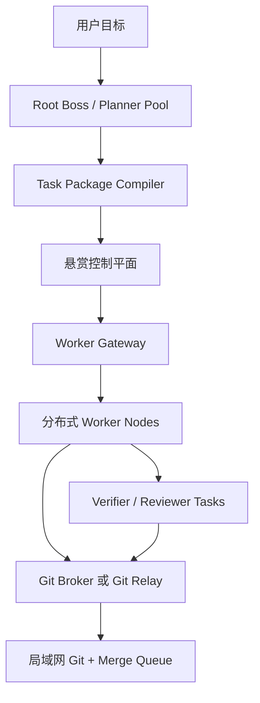
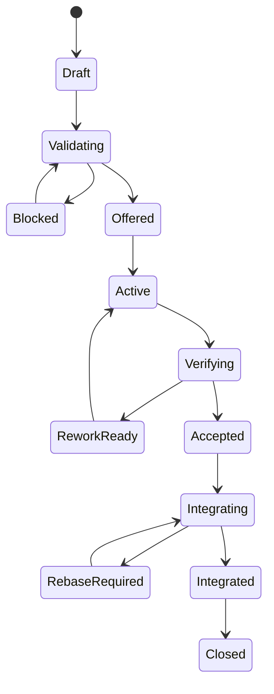
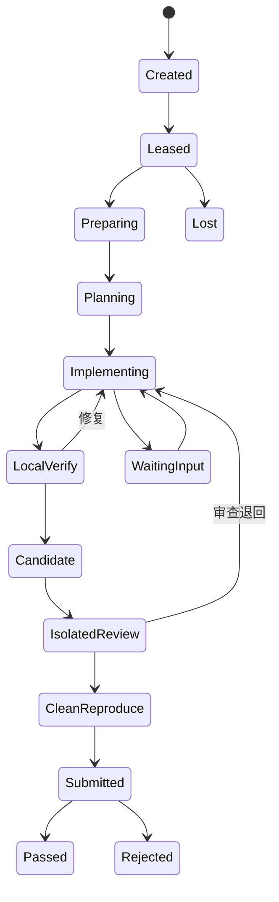
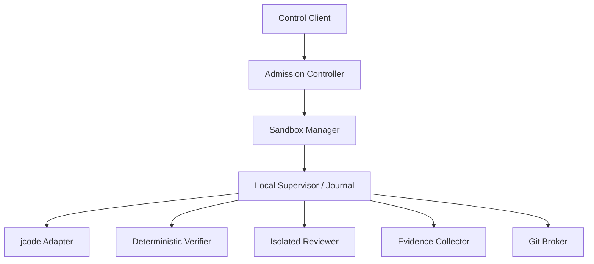
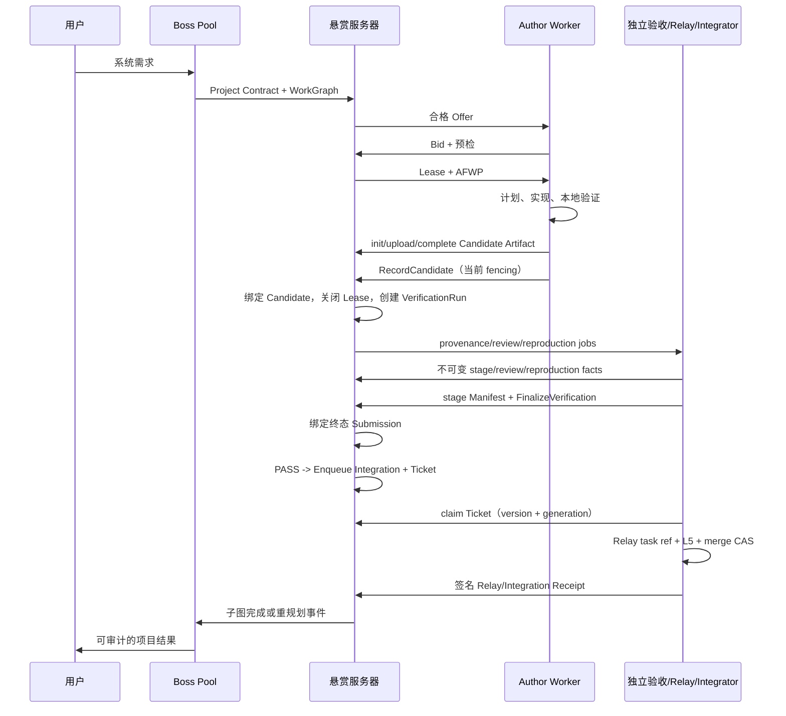

# AgentForge：分布式 Agent 工厂完整架构设计

> 版本：0.1 Design Draft  
> 日期：2026-08-07  
> 目标：让不同机器、不同模型、不同工具能力的 Agent，通过一台中央“悬赏服务器”异步协作，把用户需求稳定地转化为经过验证并进入局域网 Git 的代码。

## 0. 结论先行

这套系统不应做成“Boss 调用 Worker，然后等待 Worker 返回”的远程流水线，而应做成：

> **以不可变任务包作为执行契约，以动态任务图表达依赖，以事件账本保存事实，以租约表达临时执行权，以验收证据和 Git Commit 表达结果的异步任务市场。**

系统的核心不是一个永远在线、永远不停止推理的 Boss，也不是某个特定模型，而是以下必须严格分离的对象：

| 对象 | 定义 | 为什么必须分离 |
| --- | --- | --- |
| `WorkPackage` | Boss 发布的、不可变且版本化的工作契约 | 需求、范围和验收不能在执行中被静默篡改 |
| `Attempt` | 某个 Worker 对某一任务包版本的一次执行 | 同一任务可能失败、重试、换节点或并行竞赛 |
| `Lease` | Worker 在有限时间内拥有的临时执行权 | 防止失联 Worker 永久占单或迟到覆盖新成果 |
| `Candidate` | 作者在有效 Lease 下封存并登记的不可变 Commit | 作者交付与独立验收事实不能混在一起 |
| `VerificationRun` | 独立来源检查、复现、Review 和逐项 AC 的可推进运行记录 | 中间状态不能通过改写最终证明保存 |
| `Submission` | Coordinator 在 run 终结后一次性创建的签名终态 Manifest | 结果可审计、比较和返工，但不能原地补写 |
| `Integration` | Candidate 与目标基线合成、L5 复验和合并的记录 | `Accepted` 不能冒充 `Integrated` |

最重要的设计原则有八条：

1. **任务包是真正的协议，模型只是动态执行资源。**
2. **Boss 可以停止一次会话，但项目监督义务不能消失。**监督义务由服务器持久化，在事件触发时重新唤起合适的 Boss。
3. **Worker 的一次模型回复结束，不等于任务结束。**确定性的本地 Supervisor 决定继续、等待、提交还是失败。
4. **作者不能成为自己代码的唯一验收者。**最终验收必须在干净环境中独立执行。
5. **被测试、被审查、被提交和 Relay 接收的必须是同一个精确 Candidate Commit。**集成可产生新的 Integration Commit，但它必须绑定 Candidate 与目标基线并在自身 SHA 上重跑集成门禁。
6. **Worker 永远不能直接写保护分支。**代码通过任务分支、Git Relay 和合并队列进入局域网 Git。
7. **系统不追求虚假的“恰好一次”。**采用至少一次投递、幂等键、事务 Outbox、fencing token 和唯一 Attempt 分支。
8. **模型名不能写死为岗位。**实际调度对象是“模型部署 + jcode + 提示词包 + 工具 + 节点 + 权限策略”的完整 Executor。

---

## 1. 目标与非目标

### 1.1 系统目标

- 用户只需描述系统需求，Root Boss 能形成项目契约、架构决策和动态工作图。
- 大型系统可沿模块、接口、风险和验证边界拆成细致、可独立接单的任务包。
- 架构设计本身也可成为任务包，由局部 Architect Agent 完成并继续提出子任务图。
- Worker 分布在不同电脑、不同网络和不同操作系统上，只需能够主动连接中央服务器。
- 调度器把任务交给最合适的 Executor，而不是简单按模型品牌或先到先得分配。
- Worker 能自我推进、自我检查、独立审查、保存检查点、断线恢复并提交证据。
- 所有代码最终进入局域网 Forgejo/Gitea 等 Git 服务，并经过保护分支与合并验证。
- Boss、Worker、Reviewer、Integrator 和模型路由器都可测量、替换、降级和恢复。

### 1.2 非目标

- 不把中央服务器做成集中执行所有编译和模型推理的超级节点。
- 不要求每个 Agent 对外开放公网端口；Worker 只需建立出站连接。
- 不把所有 Agent 塞进同一个共享工作目录并依赖文件锁协作。
- 不用区块链或代币解决私有 Agent 集群的调度问题；“悬赏”首先是预算、优先级和内部信誉。
- 不保存或依赖模型的完整隐式思维过程；只保存结构化计划、技术决策、工具事件、证据和结果。
- 不让通用 A2A Task 状态直接承担 Git 基线、DAG、租约 fencing、验收矩阵和合并语义。

---

## 2. 总体架构



中央悬赏服务器是**控制平面和耐久事实账本**，不承担 Worker 的主要编译负载。它包含：

| 服务 | 职责 |
| --- | --- |
| Identity Service | 节点身份、Agent 身份、证书、租户和权限 |
| Agent Registry | Agent Card、Executor 能力画像、模型与工具指纹 |
| Project Service | 用户目标、Project Contract、ADR、需求追踪矩阵 |
| WorkGraph Service | 动态 DAG、图版本、边、互斥关系、重规划 |
| Package Registry | WorkPackage 的创建、校验、版本和发布 |
| Bounty & Matcher | Offer、Bid、能力过滤、评分、容量与预算 |
| Lease Service | Attempt、Lease、续租、fencing、过期和回收 |
| Event & Obligation Engine | 事件账本、Outbox、状态投影、监督义务和唤醒 |
| Artifact Registry | 日志、测试报告、截图、Git Bundle 等制品的引用与哈希 |
| Verification Service | 调度独立 Runner 和 Reviewer，汇总逐项验收结果 |
| Git Integration Service | Git Relay 队列、分支验证、合并队列和回滚 |
| Metrics & Audit | 成本、时延、质量、信誉、漂移和审计 |

### 2.1 推荐的数据与消息边界

- **PostgreSQL 是业务事实来源。**任务状态、Attempt、Lease、验收和图版本必须以数据库事务为准。
- **NATS JetStream 是耐久事件传递和唤醒层，不是业务真相来源。**消息确认只说明消息已消费，不等于任务已完成。
- **对象存储保存大证据。**控制数据库只保存 URI、内容哈希、大小、类型、签名和保留策略。
- **局域网 Git 保存代码历史。**中央服务器只处理候选分支元数据，必要时短期中转加密的增量 Git Bundle。
- **高频 token 和长日志不逐条写事件库。**应分块压缩到对象存储，事件只记录摘要和内容哈希。

NATS JetStream 的消费者游标、显式 ACK 和至少一次重投递适合做任务唤醒与事件扇出，但所有副作用仍需幂等处理。官方说明见 [NATS JetStream 文档](https://docs.nats.io/concepts/jetstream)。

### 2.2 单机悬赏服务器的部署形态

若中央服务器仍是资源较小的 2 核 4 GB、40 GB 云主机，首版不应拆成大量微服务。建议：

- 一个 Rust `agent-factoryd` 进程，内部按领域模块划分；
- PostgreSQL 作为唯一强一致数据库；
- Transactional Outbox + SSE/长轮询先完成闭环；
- NATS JetStream 可在第二阶段加入，或首版以单节点方式运行；
- 大型构建物、完整仓库和长期日志不留在中央服务器；
- 所有 Worker 主动出站连接，中央服务器不尝试直接拨入家庭或局域网节点；
- 无域名时使用 WireGuard 私网，或私有 CA + 固定 IP SAN + 证书钉扎，不依赖明文 HTTP。

---

## 3. 角色系统：分层 Boss 不是进程树

### 3.1 Root Boss

Root Boss 是项目总设计者，负责：

- 把用户需求编译成版本化 `Project Contract`；
- 识别歧义、约束、非目标、风险和成功条件；
- 形成总体架构、核心不变量、接口方向和 ADR；
- 决定哪些局部架构可委派；
- 审批动态 WorkGraph 和重要 `PlanPatch`；
- 在架构冲突、连续失败、需求变更或预算异常时重规划；
- 汇总多个模块的结果并判断系统是否达到用户目标。

Root Boss 的状态不能只存在聊天上下文中。控制平面必须持久化：

- Project Contract 与版本；
- 需求追踪矩阵；
- 架构决策记录；
- 接口和数据契约；
- 当前 WorkGraph 版本；
- 未解决问题、风险和假设；
- 已接受、已集成的制品及哈希；
- 预算、监督策略和最近一次状态摘要。

### 3.2 Domain Boss / Architect Agent

“设计存储模块”“制定前端设计系统”“规划数据库迁移”本身都是架构类任务包。Domain Boss 获得受限的委派授权：

```yaml
delegation_grant:
  namespace: "modules/storage/**"
  immutable_invariants:
    - "public_api_v1_compatible"
    - "encrypted_storage_by_default"
  can_propose_children: true
  can_publish_children: false
  max_depth: 2
  max_child_tasks: 12
  max_budget_units: 400
  allowed_task_profiles:
    - architecture
    - rust_backend
    - database_testing
```

Domain Boss 输出的不是一段随意建议，而是：

- 局部 RFC/ADR；
- 模块边界和接口 Schema；
- 依赖、故障传播和回滚分析；
- 数据迁移与兼容策略；
- 测试、性能与可观测性方案；
- `ExpansionProposal`，包含拟新增任务和依赖边；
- 预算、能力需求和对关键路径的影响。

控制平面校验无环、权限、预算和全局不变量后，才把子任务原子化发布。父 Agent 不需要在线等待子任务完成。

### 3.3 Package Planner 与 Decomposition Critic

高智商模型也会产生模糊、遗漏或不可验收的工单，因此“拆任务”本身必须被验收：

- Package Planner 生成 WorkPackage 草案；
- Package Compiler 将草案编译为严格 Schema；
- Decomposition Critic 在看不到 Boss 原始对话的条件下冷启动审查；
- Linter 检查依赖、范围、验收、预算、权限和输入是否完整；
- 通过后才发布到市场。

Critic 必须重点回答：

1. 一个陌生 Worker 只读取任务包，能否立即开始工作？
2. 每条 MUST 要求能否映射到可观察的验收证据？
3. 是否漏掉异常路径、兼容性、迁移、性能或安全要求？
4. 是否存在隐含的共享写入区域和高概率合并冲突？
5. 是否应先冻结接口或测试夹具，再并行开发？
6. 任务是否过大、过碎、不可估算或无法在一个上下文内完成？

### 3.4 Integrator Boss

Integrator 不是普通作者 Worker，负责：

- 对已通过独立验收的候选 Commit 排序；
- 在最新目标分支上构造临时合成 Commit；
- 运行全量回归、接口兼容和跨模块测试；
- 把冲突转化为独立 `RebasePackage` 或 `IntegrationPackage`；
- 合并、生成版本基线并记录回滚点；
- 将合并后缺陷回写到 Worker、Executor、Reviewer 和规划者评分。

### 3.5 角色不是固定模型

系统实际调度的执行单元是：

\[
\text{Executor}
=
\text{Model Deployment}
+\text{jcode Version}
+\text{Prompt Pack}
+\text{Tool Set}
+\text{Runtime Image}
+\text{Node}
+\text{Policy}
\]

用户提出的模型分工可以作为冷启动先验：

| 初始角色候选 | 初始模型候选 | 最终判定依据 |
| --- | --- | --- |
| 深度架构、跨模块设计、任务规划 | GPT-5.6-sol 等 | 架构审查通过率、需求遗漏率、返工率、关键路径误差 |
| 视觉理解、图形与视觉资产 | MiniMax-M3 等 | 真实端点模态、视觉基准、图像工具和资产验收结果 |
| 前端和交互实现 | Kimi-K3 等 | 浏览器工具、截图回归、可访问性、组件测试和首轮通过率 |
| 低风险 CRUD、样板代码和普通测试 | DeepSeek-V4-Flash 等 | 单位接受成本、编译通过率、返工率和逃逸缺陷 |

任何名字都只能是路由提示，不能是永久岗位。模型、端点、工具、提示词或 jcode 版本变化后，应生成新的 Executor 指纹并重新评测。

---

## 4. Project Contract 与动态 WorkGraph

### 4.1 Project Contract

Boss 在拆任务前必须先输出项目契约：

- 用户目标和可衡量的成功条件；
- 明确的非目标；
- 用户、环境、平台和部署约束；
- 系统级不变量；
- 技术栈和可变/不可变决策；
- 质量门槛、性能预算和安全等级；
- 仓库、分支和发布策略；
- 待确认问题及默认假设；
- 需求 ID 与后续 WorkPackage 的追踪关系。

Project Contract 发生实质变化必须升 revision，并进行影响分析，不能只给运行中 Agent 发一条聊天补充。

### 4.2 WorkGraph 边类型

WorkGraph 不是只有 `depends_on` 的静态 DAG：

| 边类型 | 语义 |
| --- | --- |
| `hard_dependency` | 上游达到指定业务状态后，下游才可执行 |
| `artifact_dependency` | 下游依赖上游某个精确内容哈希的制品 |
| `soft_context` | 下游可先启动，随后吸收上游的新信息 |
| `review_of` | 当前包负责独立审查目标包 |
| `gate` | 指定验收门禁通过后才放行 |
| `conflicts_with` | 存在潜在文件、接口或语义冲突 |
| `mutex` | 竞争同一个数据库迁移、公共 Schema 或排他资源 |
| `integration_after` | 规定进入合并队列的顺序 |
| `supersedes` | 新包替代旧包，但保留旧结果以便复用 |

任务就绪条件由确定性控制器计算：

\[
\begin{aligned}
Ready(T)={}&RevisionValid(T) \\
&\land DependenciesSatisfied(T) \\
&\land ArtifactsResolvable(T) \\
&\land \neg MutexConflict(T) \\
&\land BudgetAvailable(T) \\
&\land \neg CancelledOrSuperseded(T).
\end{aligned}
\]

控制器只把满足条件的任务投影成 `OFFERED`。没有线程、Boss 会话或 Worker 进程在原地等待依赖。

### 4.3 动态扩图与 PlanPatch

重规划必须提交针对精确图版本的 `PlanPatch`：

```yaml
base_graph_version: 18
add_nodes: []
add_edges: []
supersede_nodes: []
change_priorities: []
reuse_artifacts: []
impact:
  invalidated_tasks: []
  reusable_tasks: []
  budget_delta: 120
  critical_path_delta: "+35m"
```

服务器必须检查：

- DAG 环、孤儿任务和互斥死锁；
- 权限是否扩大；
- 委派深度、数量和预算是否越界；
- 已完成任务是否被隐式改写；
- 接口版本是否不兼容；
- 运行中的 Attempt 是继续、协作式取消，还是转换为可复用候选；
- 新图是否仍覆盖全部 Project Contract 要求。

### 4.4 `ACCEPTED` 与 `INTEGRATED` 必须分开

- `ACCEPTED`：候选交付物针对其固定任务版本和固定 base commit 通过验收。
- `INTEGRATED`：候选已在最新目标分支上重新复验并成功合并。

代码类下游任务默认依赖上游 `INTEGRATED`，而不是只依赖 `ACCEPTED`。架构文档、接口 Schema 等内容寻址制品可以按任务策略依赖 `ACCEPTED`。

---

## 5. AFWP：Agent Factory Work Package 1.0

A2A 适合跨框架发现、消息、长任务和 Artifact 交换，但通用 Task 不足以完整表达代码工厂的 Git、DAG、租约和验收语义。因此内部定义 `AFWP/1.0`，并通过 A2A 扩展暴露。

### 5.1 任务包的四层契约

每个任务包同时是：

1. **目标契约**：要产生什么业务结果；
2. **边界契约**：允许与禁止改变什么；
3. **证据契约**：如何证明结果满足要求；
4. **集成契约**：结果如何进入代码库和后继任务。

### 5.2 完整字段

| 分区 | 必需内容 |
| --- | --- |
| 身份 | `package_id`、`revision`、`package_hash`、`project_id`、`graph_version`、`parent_id`、`kind`、`schema_version` |
| 目标 | 背景、业务目标、单一任务目标、价值、术语表、假设 |
| 需求 | 原子化 `REQ-*`、优先级、来源需求 ID、边界条件、错误语义 |
| 范围 | `must_do`、`should_do`、`non_goals`、允许路径、禁止路径、系统不变量 |
| 输入快照 | Git 仓库、`base_commit`、锁文件、依赖任务 revision、制品 URI 和 SHA-256 |
| 接口 | API、Schema、事件、数据模型、兼容性、迁移和版本约束 |
| 交付物 | 文件、Commit、测试、文档、截图、报告、构建物、SBOM |
| 验收 | `AC-*`、Given/When/Then、命令参数、Runner 镜像、阈值、证据和门禁级别 |
| 路由 | 必需/偏好能力、模态、工具、OS、硬件、安全域、预计时长和成本 |
| 权限 | 网络域、凭据作用域、文件范围、Git 分支前缀、外部副作用策略 |
| 调度 | 优先级、预算、报价方式、租约、最大 Attempt、离线策略、执行模式 |
| 冲突 | 预计写集、共享接口、互斥资源、合并策略、集成顺序 |
| 沟通 | 可自主决定事项、必须请示事项、问题和阻塞的结构化格式 |
| 委派 | 是否允许拆子任务、授权范围、深度、数量和预算上限 |
| 完成 | Definition of Done、提交规范、回滚方案、残余风险格式 |

### 5.3 Definition of Ready

任务只有同时满足以下条件才可发布：

- revision 和内容哈希已固定；
- base commit 与输入制品可解析；
- 每条 MUST 要求至少关联一个验收标准；
- 验收环境、期望值和证据类型明确；
- 修改范围和禁止范围明确；
- 所需工具、权限、凭据和数据域可提供；
- 依赖图无环且边语义明确；
- 预算、租约、重试、阻塞和升级规则完整；
- 一个不读取 Boss 原始对话的 Worker 能准确复述目标和边界；
- 不包含“功能正常”“代码优雅”“UI 美观”等无法判定的孤立表述。

主观要求必须转换为量表、参考图、视口列表、对比阈值或人工门禁。

#### 任务拆分质量评分

所有硬门槛通过后，可以使用 `Decomposition Quality Score` 比较任务图质量：

\[
DQS=
0.20C_{coverage}
+0.20A_{acceptance}
+0.15S_{startability}
+0.15I_{isolation}
+0.10D_{dependency}
+0.10B_{budget}
+0.10R_{rollback}.
\]

建议发布阈值从 (DQS\ge 0.85) 起步，再根据真实项目校准。综合分数不能抵消硬门槛：例如 DAG 有环、MUST 要求没有验收映射，即使其他项得分很高也不得发布。

还应随机抽样执行“冷启动模拟”：让未参与规划的 Agent 只读 AFWP，在不查看任何历史对话的情况下，输出目标复述、首个可执行动作、预期修改范围和验收方法。复述明显偏离时，说明任务包仍依赖隐含上下文。

### 5.4 Definition of Done

“Agent 说完成了”不属于完成条件。代码类包至少要满足：

- 全部硬性验收项为 `PASS`；
- 没有未处理的 Critical/High Reviewer finding；
- PASS/candidate-ready 时 `TestedHead = ReviewedHead = SubmittedHead = CandidateHead`；提前失败只记录真实已产生的 Head。IntegrationHead 可不同，但必须绑定 Candidate、目标基线和独立 L5 复验；
- 干净环境复现通过；
- 证据包已签名并登记；
- 任务分支已进入局域网 Git；
- 最新目标分支上的集成复验通过；
- 合并完成并记录回滚点；
- 需求追踪矩阵和后继 WorkGraph 已更新。

### 5.5 任务包概念示例

以下 YAML 用于解释设计，不作为 conformance vector。机器可执行的权威定义是 `schemas/afwp.schema.json`，完整可校验实例是 `examples/afwp-lease-fencing.json`：

```yaml
schema_version: "afwp/1.0"
package_id: "wp-lease-fencing-001"
revision: 3
package_hash: "sha256:..."
project_id: "agentforge"
graph_version: 18
parent_id: "epic-control-plane"
kind: "implementation"
title: "实现租约 fencing 校验"

goal:
  background: "Worker 失联后任务可能被重新授予，旧 Worker 随后恢复并迟到提交。"
  objective: "阻止旧租约代次的续租、检查点、制品登记和正式 Candidate 登记。"
  value: "消除双重执行对任务状态和 Git 集成的污染。"

requirements:
  - id: "REQ-01"
    level: "must"
    source: "SYS-LEASE-04"
    text: "同一 package revision 每次重新授予执行权时 generation 必须严格递增。"
  - id: "REQ-02"
    level: "must"
    source: "SYS-LEASE-05"
    text: "低 generation 的 renew、checkpoint、artifact 和 Candidate 登记必须返回 AF_LEASE_STALE。"
  - id: "REQ-03"
    level: "must"
    source: "SYS-SALVAGE-01"
    text: "过期 Attempt 可以登记 salvage bundle，但不能进入自动验收或合并。"

scope:
  must_do:
    - "在数据库事务中生成和验证 generation。"
    - "在作者侧 progress/checkpoint、Candidate Artifact init/chunk/complete 和 RecordCandidate 上验证 fencing_token。"
    - "增加并发与迟到提交测试。"
  non_goals:
    - "修改 Agent 匹配算法。"
    - "实现跨地域 PostgreSQL 共识。"
  allowed_paths:
    - "crates/control-plane/src/lease/**"
    - "crates/control-plane/src/attempt/**"
    - "crates/control-plane/tests/lease_*"
  forbidden_paths:
    - "infra/production/**"
    - ".github/**"
  invariants:
    - "现有 API 的成功响应结构保持兼容。"
    - "Worker 无法通过客户端时间影响 generation。"

snapshot:
  repo: "ssh://git.lan/agentforge/control-plane.git"
  base_commit: "2a6d..."
  toolchain_lock: "rust-toolchain.toml@sha256:..."
  inputs:
    - artifact_id: "adr-lease-22"
      sha256: "8e92..."

routing:
  required:
    capabilities: ["rust", "postgresql", "distributed_systems"]
    tools: ["git", "cargo", "postgres_test_container"]
    os: ["linux"]
    security_level: "project_private"
  preferred:
    task_profiles: ["architecture_code", "backend_concurrency"]
  minimum_first_pass_probability: 0.80

permissions:
  network_allowlist:
    - "dependency-proxy.lan"
  git_write_prefix: "task/wp-lease-fencing-001/attempt/"
  external_side_effects: "deny"
  secrets:
    - name: "git_branch_token"
      delivery: "host_broker_only"

scheduling:
  mode: "author_reviewer_pair"
  priority: 80
  max_budget_units: 24
  max_attempts: 3
  offline_grace_seconds: 600
  lease:
    ttl_seconds: 1200
    renew_after_seconds: 400
    max_execution_seconds: 14400

conflicts:
  expected_write_set:
    - "crates/control-plane/src/lease/**"
  mutex:
    - "db-schema:lease-generation"
  integration_after:
    - "wp-attempt-schema-002"

acceptance:
  criteria:
    - id: "AC-FUNC-01"
      covers: ["REQ-01", "REQ-02"]
      kind: "command"
      given: "PostgreSQL 测试实例和两个并发 claim 请求"
      when: "旧 generation 在新租约产生后调用任一作者侧 Attempt/Candidate/Artifact mutation API"
      then: "新 generation 成功；旧 generation 全部返回 AF_LEASE_STALE，且数据库无旧代次写入"
      runner_image: "registry.lan/agentforge/rust-test@sha256:..."
      argv: ["cargo", "test", "-p", "agentforge-control-plane", "lease_fencing", "--", "--exact"]
      expect:
        exit_code: 0
      evidence: ["junit", "stdout", "db_assertions", "git_tree_hash"]
      hard: true
      flaky_retry_limit: 0
    - id: "AC-SALVAGE-01"
      covers: ["REQ-03"]
      kind: "integration_test"
      given: "一个仍为当前但已过服务器到期时间的作者 Lease，以及可内容寻址的迟到 Bundle"
      when: "先调用正式 RecordCandidate，再显式调用 RegisterSalvage"
      then: "正式登记返回 AF_LEASE_EXPIRED 且无 Candidate；只有 salvage Submission 被记录为 QUARANTINED"
      argv: ["cargo", "test", "-p", "agentforge-control-plane", "expired_candidate_rejected_and_salvage_quarantined"]
      expect:
        exit_code: 0
        submission_state: "QUARANTINED"
      hard: true
    - id: "AC-SCOPE-01"
      kind: "changed_paths"
      allow:
        - "crates/control-plane/src/lease/**"
        - "crates/control-plane/src/attempt/**"
        - "crates/control-plane/tests/lease_*"
      deny:
        - "infra/production/**"
        - ".github/**"
      hard: true
    - id: "AC-REGRESSION-01"
      kind: "command"
      argv: ["cargo", "test", "--workspace", "--locked"]
      expect:
        exit_code: 0
      hard: true

deliverables:
  - "候选 Git Commit"
  - "新增并发与迟到提交测试"
  - "逐项验收证据"
  - "兼容性与残余风险说明"

completion:
  branch_pattern: "task/{package_id}/attempt/{attempt_id}"
  commit_trailers:
    - "Task-ID"
    - "Task-Revision"
    - "Attempt-ID"
    - "Package-Hash"
    - "Evidence-Digest"
  rollback: "revert merge commit；本任务不得执行不可逆数据库迁移"
```

验收命令应保存为参数数组，不拼接任意 shell 字符串。

---

## 6. 状态模型：不要用一个 `task.status` 包打一切

### 6.1 WorkPackage 投影状态



旁路终态包括 `CANCELLED`、`SUPERSEDED` 和 `FAILED`。这些状态是事件投影，不是唯一事实来源。

### 6.2 Attempt 状态



所有等待状态必须带机器可解释的 `wake_condition`，例如：

- `artifact:api-schema-v2 accepted`；
- `question:q-107 answered`；
- `permission:req-88 approved`；
- `dependency:wp-31 integrated`。

进入等待时释放模型与计算资源，由事件触发恢复。

### 6.3 Lease 状态

```text
RenewLease: ACTIVE -> ACTIVE（产生 LeaseRenewed 事件）
ACTIVE -> RELEASED | REVOKED | EXPIRED
```

每次重新授予生成单调递增的 `generation/fencing_token`。作者侧 Attempt/Candidate/Artifact mutation——包括 progress、checkpoint、Candidate Artifact init/chunk/complete 与 `RecordCandidate`——都必须携带当前 token，并由服务器时间判定 Lease 仍有效。作者必须先完整上传并完成内容寻址校验，再由 `RecordCandidate` 原子绑定不可变 Candidate、创建 VerificationRun 并关闭作者 Lease。

后续 Verifier、Reviewer、Verification Coordinator、Relay 与 Integrator 不要求作者 Lease 继续有效，也不得接收或重放作者 bearer token。它们分别使用服务身份、最小 capability、job/queue lease 和 version CAS，并重新校验 Candidate 中已保存的 fencing 来源、Artifact digest、OID/tree 与 lineage。

### 6.4 Candidate、VerificationRun 与 Submission 状态

```text
Candidate:       SEALED（不可变）
VerificationRun: QUEUED -> PROVENANCE_CHECK -> REVIEWING -> REPRODUCING
                 -> PASS | FAIL | INCONCLUSIVE | CANCELLED
Submission:      PASS | FAIL | INCONCLUSIVE | QUARANTINED（创建即终态）
```

Candidate 只在有效 Lease 下登记；独立服务按 provenance → isolated review → clean reproduction 推进 VerificationRun，只有 clean reproduction 完成且全部 PASS 条件成立后才能进入 PASS；Coordinator 在 run 终结后一次性创建签名 Submission。`INCONCLUSIVE` 永远不能按通过处理。过期租约产生的结果只可形成 `QUARANTINED` salvage Submission，不能自动验证或合并。

---

## 7. 悬赏、能力路由与租约

### 7.1 悬赏不是先到先得

任务发布后，服务器只向满足硬约束的 Worker 发送摘要。支持四种模式：

| 模式 | 用途 |
| --- | --- |
| `exclusive` | 普通、边界清晰的单作者任务 |
| `sealed_bid` | Worker 报价，调度器综合质量、时延和成本选择 |
| `redundant(N)` | 高不确定或高风险任务由多个 Worker 并行探索 |
| `author_reviewer_pair` | 作者与独立 Reviewer 成对安排 |

架构方案可使用 Tournament：多个 Agent 产生相互独立的 RFC，由 Root Boss 或架构 Critic 汇合，而不是让第一个方案自动胜出。

### 7.2 Executor 能力画像

能力画像分为：

- 静态身份：Provider、端点、模型指纹、jcode 版本、提示词包、工具、OS、硬件；
- 声明能力：语言、框架、模态、任务类型、安全域、最大预算；
- 实测能力：按任务类别统计首次通过率、返工、缺陷、P50/P95 时延、成本和估时校准；
- 实时状态：空闲槽位、负载、本地仓库、网络、缓存和故障状态。

信誉必须按任务类型、技术栈和仓库分别计算，不能用一个总分掩盖差异。

### 7.3 任务画像

```yaml
task_profile:
  class: "frontend.component"
  risk: "medium"
  complexity: 0.64
  required:
    languages: ["typescript"]
    frameworks: ["react"]
    tools: ["browser", "git", "test_runner"]
    modalities: ["text", "image"]
    permissions: ["repo_write_task_branch"]
  preferred_capabilities:
    frontend_implementation: 0.90
    visual_fidelity: 0.80
    debugging: 0.60
  constraints:
    deadline_minutes: 120
    max_cost_units: 8
    min_first_pass_probability: 0.82
    data_zone: "project_private"
```

### 7.4 四阶段路由

1. **硬约束过滤**：模态、工具、系统、硬件、权限、数据域、上下文、预算和可靠性底线。
2. **预测**：估计首轮通过概率、完成时延、总成本、逃逸缺陷风险。
3. **Pareto 候选集**：保留质量、成本、时延和可靠性上不被支配的候选。
4. **风险调整选择**：按任务策略选择，关键任务使用可信下界和异构 Reviewer。

总成本不等于首次调用价格：

\[
E[C_{total}]
=C_{first}
+(1-P_{pass})C_{rework}
+P_{escape}C_{defect}.
\]

可使用风险调整效用：

\[
S(e,t)=
w_qP_{pass}
+w_dP_{deadline}
-w_c\widehat{C}_{total}
-w_l\widehat{L}_{95}
-w_uU
+w_aA_{repo}.
\]

其中 (U) 是预测不确定性，(A_{repo}) 是对目标代码库和本地缓存的亲和度。更稳妥的调度目标是：

\[
\min E[C_{total}]
\quad \text{s.t.} \quad
P_{pass}\ge p_{min},\;
P_{deadline}\ge d_{min}.
\]

### 7.5 Bid

```yaml
bid:
  executor_id: "executor-207"
  estimated_cost_units: 3.8
  estimated_minutes: 42
  self_confidence: 0.86
  earliest_start_at: "2026-08-07T20:00:00+09:00"
  capacity_reserved_until: "2026-08-07T20:03:00+09:00"
  plan_digest: "sha256:..."
  key_risks:
    - "目标仓库当前缺少浏览器 E2E 夹具"
```

服务器需按历史校准修正 Worker 的自报置信度。

### 7.6 两阶段接单

1. Worker 根据任务广告做轻量评估并报价；
2. 服务器授予短时 `provisional lease`；
3. Worker 拉取 base commit、检查工具链和基线；
4. 预检通过后将租约转为正式 Lease；
5. 失败则立即释放，不处罚任务规格本身造成的失败。

### 7.7 租约续期与 fencing

续期不能只有“我还活着”，应带语义进度：

```json
{
  "lease_id": "lease-19",
  "generation": 4,
  "progress_seq": 17,
  "phase": "integration-tests",
  "milestones_completed": ["schema-ready", "lease-cas-tested"],
  "checkpoint_sha256": "a71...",
  "operation_deadline": "2026-08-07T20:18:00+09:00",
  "idempotency_key": "renew:lease-19:g4:seq17"
}
```

节点在线租约与任务执行租约必须分开：

- `NodeSessionLease` 只表示节点大致在线和可接单；
- `TaskLease` 表示某个 Attempt 当前拥有执行权。

无需每秒 Ping。典型 TaskLease 可为 10–30 分钟，在 TTL 的约三分之一处续期；长编译或测试开始时登记预计截止时间，Supervisor 根据事件和截止时间判断，而不是机械打断。

只有作者侧 Attempt/Candidate/Artifact mutation 验证当前 fencing token；旧代次的作者结果只能上传到隔离区。独立验收、终态 Submission、Relay 和集成写入改由对应服务身份、作用域 capability、job/queue lease、幂等键与 CAS 防止迟到覆盖，并校验 Candidate 已保存的来源事实：

```text
task/{project_id}/{package_id}/attempt/{attempt_id}
```

### 7.8 结算和信誉

内部赏金可以分段结算：

- Submission 通过独立验收；
- 候选成功集成；
- 结果在观察期内无逃逸缺陷；
- 即使未胜出，但架构或代码被最终方案实质吸收，可获得部分价值积分。

不能只奖励最快完成，否则会诱导跳过测试和隐藏风险。任务本身无效时应标记 `AF_TASK_INVALID` 并修订任务包，不应处罚 Worker。

---

## 8. Worker Node：jcode 只是执行器

Worker 节点不是“运行一个 jcode 的机器”，而是可靠任务执行宿主。



### 8.1 节点组件

| 组件 | 职责 |
| --- | --- |
| Control Client | 出站连接、命令与事件同步、持久 Inbox/Outbox、断线恢复 |
| Capability Profiler | 上报硬件、工具、模型、任务类型能力和当前容量 |
| Admission Controller | 判断是否竞标、预检资源、安全域和成本 |
| Sandbox Manager | 为每个 Attempt 创建独立 worktree、容器或 VM |
| Local Supervisor | 持久状态机、Turn Pump、Watchdog、预算和续租 |
| jcode Adapter | 创建/恢复会话、发送任务包、消费结构化事件 |
| Deterministic Verifier | 编译、测试、lint、范围、性能和安全门禁 |
| Isolated Reviewer | 以独立上下文和只读 checkout 审查候选 diff |
| Evidence Collector | 收集命令、环境、结果、资源、制品和内容哈希 |
| Git Broker | 独占 Git 凭据，签名并推送任务分支或生成 Git Bundle |

### 8.2 jcode 集成方式

jcode 官方 SDK 可启动私有实例、创建会话、流式接收工具事件、恢复持久会话、进行结构化 JSON 输出和安全点软中断。它适合被 Worker Runtime 驱动，见 [jcode TypeScript SDK](https://jcode.sh/sdk)。

建议实现：

- Rust `worker-daemon` 负责可靠状态机；
- 使用官方 TypeScript SDK 做 `jcode-bridge` sidecar，避免直接耦合内部协议；
- 每个 Attempt 使用私有 jcode 实例或严格隔离的 session namespace；
- 使用固定 `jcodeHome` 保存可恢复 transcript，但事实状态仍在本地 Journal；
- `runStructured` 输出 `plan.json`、阶段报告和结果摘要；
- 订阅 `tool_start`、`tool_done`、`background_progress`、`permission_request`、`turn_done` 等事件；
- 通过 `softInterrupt` 在安全点注入新约束或失败证据；
- 不对不可信任务直接使用无边界 `autoApprove`。

jcode 的本机 Swarm 可以作为单个 Worker 内的局部并行优化，例如让两个会话探索不同修复方案；但中央 AgentForge 仍拥有 WorkPackage、Lease、Evidence 和 Git 集成的最终事实。局部 Swarm 不能绕过任务预算、权限包络和独立验收。

jcode 的实例隔离不是执行不可信代码的安全沙箱；官方文档也明确建议使用容器或 VM。首版优先使用 Linux Worker。当前官方 SDK 文档说明 Windows 已构建接线但尚无完整端到端覆盖，因此 Windows 节点可先通过 WSL2 或单独兼容测试进入实验池。

### 8.3 Prompt Compiler

发送给 jcode 的上下文分三层：

1. **不可变策略层**：权限、安全、提交协议、禁止自降验收标准；
2. **仓库层**：`AGENTS.md`、代码地图、接口 Schema、仓库约定；
3. **任务层**：AFWP 的目标、范围、验收、输入和当前失败证据。

不要把整个 Boss 对话和全仓库文档直接塞进提示词。大型上下文使用内容寻址引用、符号定位和受限检索。

### 8.4 准备与基线

正式执行前：

- 固定 `base_commit`，禁止跟随浮动分支；
- 创建 Attempt 专属工作区；
- 任务输入只读挂载；
- 记录工具链镜像、锁文件和环境摘要；
- 运行任务包规定的基线测试；
- 保存已有失败的稳定指纹；
- 若任务要求基线全绿而实际失败，生成 `BaselineBlocker`，不把红灯冒充为本任务问题。

### 8.5 计划门禁

jcode 首轮先输出结构化 `plan.json`，至少包含：

- 对相关模块和接口的理解；
- 计划修改的文件与符号；
- 每个 `AC-*` 对应的实现步骤和证据；
- 兼容性、安全、性能和回滚风险；
- 是否需要提议子任务。

Supervisor 验证：

- 每个硬性验收项都被覆盖；
- 预计修改未越界；
- 没有未声明的公共接口变化；
- 预计成本未超预算；
- 需要扩展范围时提交 `DecompositionProposal`，不能静默扩大任务。

### 8.6 微循环执行

```text
选择一个尚未通过的验收项
  -> 进行最小相关修改
  -> 运行最接近该修改的测试
  -> 更新验收矩阵与证据
  -> 创建恢复检查点
  -> 选择下一项
```

每轮必须输出：

```yaml
status: "continue | candidate_ready | blocked"
completed_acceptance_ids: []
changed_files: []
evidence_refs: []
next_action: ""
wake_condition: null
blocker: null
```

Worker Runtime 而不是模型自然语言决定是否进入下一状态。

### 8.7 Turn Pump：保证 Agent 不轻易停下

```text
on_jcode_turn_done:
    if all_author_candidate_gates_passed:
        seal_upload_and_record_candidate
    else if valid_external_blocker and wake_condition_is_explicit:
        checkpoint_and_release_executor
    else if budget_remaining:
        choose_highest_priority_unmet_acceptance_gap
        construct_next_bounded_instruction
        immediately_drive_next_turn
    else:
        seal_failure_dossier_and_release_lease
```

允许停止的原因只有：

1. 已满足 Worker 提交门禁；
2. 已证明外部阻塞并给出明确唤醒条件；
3. 预算耗尽且生成可复用失败包；
4. 收到取消、安全终止或租约失效命令。

“我已经完成”“建议接下来运行测试”不构成停止条件。

### 8.8 多层 Watchdog

必须分开判断：

- `Process Liveness`：进程是否存活；
- `Operation Deadline`：当前编译、下载或测试是否超出合理时限；
- `Semantic Progress Deadline`：多久没有任何验收项真正前进。

可定义停滞指纹：

\[
H=\operatorname{hash}(
phase,
candidate\_tree,
failed\_rule\_ids,
failure\_signature,
next\_action).
\]

连续多轮 (H) 不变时依次：

1. 要求结构化状态快照；
2. 指定一个最小且明确的下一动作；
3. 从检查点创建全新 jcode 会话；
4. 切换模型或调用专项诊断 Agent；
5. 提议拆分、移交、salvage 或重新悬赏；
6. 封存失败证据并结束 Attempt。

重试必须改变至少一个条件。重复同一个命令、同一个上下文和同一个失败签名不算恢复策略。

### 8.9 本地 Journal 与断线恢复

每个 Worker 保存 append-only Journal：

- 当前 Attempt、状态和服务器 cursor；
- 租约 generation；
- 未确认事件和幂等键；
- 当前候选 HEAD；
- 验收矩阵；
- 技术事实和已批准决策；
- 最近失败签名；
- 下一明确动作和剩余预算。

重连时服务器裁决：

| 情况 | 行为 |
| --- | --- |
| 租约仍有效 | 同步缺失事件并继续 |
| 已过期但未被重授 | 允许 CAS 重新认领 |
| 已有更高 generation | 停止正式副作用，旧结果转 salvage |
| 任务已完成 | 终止本地 Attempt |
| 任务已升 revision | 旧结果按旧契约隔离，不能静默切换 |

Worker 可在策略允许的 `offline_grace` 内继续本地计算，但不能认为租约自动延长，也不能触发受保护外部副作用。

---

## 9. 验收、独立审查与证据包

### 9.1 五层验收

| 层 | 内容 | 执行者 |
| --- | --- | --- |
| L1 确定性 | 编译、格式、lint、单测、范围 | Worker Verifier |
| L2 契约 | API/Schema、迁移、兼容、不变量 | 专项 Runner |
| L3 非功能 | 性能、安全、资源、许可证、凭据 | 指定硬件/安全 Runner |
| L4 语义 | 需求覆盖、架构一致性、可维护性 | 独立 Reviewer |
| L5 集成 | 最新目标分支合成 Commit 的全量回归 | Integrator Runner |

Worker 自己跑通测试只是“允许提交候选”的条件，不是最终验收。

### 9.2 验收标准格式

```yaml
- id: "AC-PERF-01"
  covers: ["REQ-07"]
  kind: "benchmark_delta"
  given: "固定数据集 v4、冷启动、节点等级 bench-b"
  when: "预热 5 次后连续执行 30 次"
  then: "p95 小于 80 ms、错误率为 0、相对基线退化不超过 3%"
  argv: ["./bench", "--dataset", "v4", "--seed", "42", "--repeat", "30"]
  runner_image: "bench@sha256:..."
  resources:
    node_class: "bench-b"
    cpu_limit: 4
    memory_mb: 4096
  tolerance:
    latency_ms: 2
  evidence:
    - "raw_results.json"
    - "benchmark_summary.json"
  hard: true
  flaky_retry_limit: 1
```

性能测试必须固定节点等级、预热、样本量、随机种子和噪声容忍。Flaky 测试要记录所有尝试，不能挑一次成功即通过。

### 9.3 候选 Commit

本地硬门禁通过后，Git Broker 创建不可变候选 Commit：

- 后续所有测试与审查绑定该精确 Commit；
- 任一字节修改都生成新候选，并使旧证据失效；
- 不允许在审查通过后 amend；
- jcode 沙箱本身没有局域网 Git 写凭据。

### 9.4 独立 Reviewer

Reviewer 必须：

- 使用只读、干净 checkout；
- 只接收任务包、仓库约定、base commit、候选 diff 和验收标准；
- 不读取开发 Agent 的完整对话和自我辩解；
- 使用不同模型家族，或至少全新上下文和独立执行环境；
- 不直接修改候选，只输出结构化问题；
- 可在临时目录编写攻击性测试，但不能污染候选树。

```yaml
reviewed_head: "7bb1..."
verdict: "pass | fail | blocked"
findings:
  - id: "RV-001"
    severity: "critical | high | medium | low"
    acceptance_id: "AC-API-02"
    location: "src/example.rs:120"
    expected: ""
    actual: ""
    reproduction: []
    evidence_refs: []
```

安全、数据库、基础设施和调度核心任务建议使用两个不同模型家族的 Reviewer。

### 9.5 干净环境复现

独立审查通过后，从以下内容重新构建：

- 固定 base commit；
- 候选 Commit；
- 声明的锁文件；
- 指定 Runner 镜像；
- 声明的输入制品。

这样可以发现本地缓存、未跟踪文件、隐式依赖和环境污染。

### 9.6 `candidate_ready` 公式

\[
\begin{aligned}
CandidateReady={}&
\bigwedge_{r\in HardRules}Pass(r) \\
&\land CriticalFindings=0 \\
&\land ReviewedHead=TestedHead=CandidateHead \\
&\land CleanReproduction=Pass \\
&\land ScopeCheck=Pass.
\end{aligned}
\]

任何验收豁免只能通过签名 waiver 或新任务包 revision 表达，Worker 不得自行降低标准。

### 9.7 Evidence Bundle

每次 Submission 附带内容寻址、节点签名的证据包：

- package ID、revision、hash、Attempt ID；
- Worker、Executor、模型、jcode、提示词包和工具链指纹；
- Lease generation、fencing token hash 与 Candidate 登记来源证明；不保存可用 bearer token；
- base commit、candidate commit、tree hash；
- 修改文件、diffstat 和作用域检查；
- 每个 `AC-*` 的 PASS/FAIL/INCONCLUSIVE；
- 完整命令参数、退出码、时间、资源消耗和日志摘要；
- 编译、测试、覆盖率、静态分析和性能报告；
- Reviewer 报告及其 reviewed head；
- 干净环境复现报告；
- 构建物、截图、包和 SBOM 的哈希；
- 外部下载摘要、残余风险和偏离项；
- 节点 Ed25519 签名。

Git Commit trailer：

```text
Task-ID: wp-lease-fencing-001
Task-Revision: 3
Attempt-ID: att-8831
Package-Hash: sha256:...
Evidence-Digest: sha256:...
Worker-ID: worker-tokyo-03
```

### 9.8 Submission Manifest

以下为便于阅读的字段节选；机器可执行的权威定义是 `schemas/submission.schema.json`，candidate/salvage 完整向量位于 `examples/`：

```yaml
schema_version: "agentforge/submission/1.0"
submission_id: "sub-22"
submission_kind: "candidate"
candidate_id: "0198f221-52f8-7d6b-92b4-2d89aa25a340"
candidate_artifact_id: "0198f221-52f8-7d6b-92b4-2d89aa25a342"
verification_run_id: "0198f221-52f8-7d6b-92b4-2d89aa25a341"
terminal_outcome: "PASS"
completed_stage: "candidate_ready"
created_at: "2026-08-07T12:00:00Z"
package_id: "wp-lease-fencing-001"
package_revision: 3
package_hash: "sha256:..."
attempt_id: "att-8831"
lease:
  lease_id: "lease-44"
  generation: 4
  fencing_token_hash: "sha256:..."
  issued_at: "2026-08-07T10:00:00Z"
  expires_at: "2026-08-07T10:20:00Z"
git:
  base_commit: "2a6d..."
  candidate_commit: "7bb1..."
  tree_hash: "12f0..."
  branch: "task/wp-lease-fencing-001/attempt/att-8831"
deliverables:
  - path: "crates/control-plane/src/lease/fence.rs"
criteria:
  - acceptance_id: "AC-FUNC-01"
    status: "PASS"
    runner_digest: "sha256:..."
    exit_code: 0
    evidence_refs: ["artifact://evidence/ac-func-01"]
review:
  reviewed_head: "7bb1..."
  verdict: "pass"
clean_reproduction:
  tested_head: "7bb1..."
  verdict: "pass"
decisions:
  - "使用数据库事务中的单调 generation，而不使用客户端时间。"
residual_risks:
  - "尚未在多地域 PostgreSQL 部署上验证。"
provenance:
  agent_id: "agent-5"
  executor_id: "executor-207"
  node_id: "worker-tokyo-03"
  signature:
    algorithm: "ed25519"
    key_id: "verification-coordinator-1"
    signer_role: "verification_coordinator"
    signed_digest: "sha256:..."
    value: "base64url-ed25519-signature"
lineage:
  parent_submission_id: null
  supersedes: []
```

Submission 一经登记不可覆盖。任何代码、测试环境或验收结果改变，都生成新的 Submission，并保留与旧版本的 lineage。

### 9.9 不同任务类型的验收模板

| 任务类型 | 主要机器门禁 | 独立语义验收 |
| --- | --- | --- |
| 架构/RFC | Schema 完整、需求覆盖、接口引用可解析、DAG 无环 | 反方 Critic、故障场景、演进与回滚量表 |
| CRUD 后端 | OpenAPI/Proto 契约、单测、集成测试、迁移可回滚、幂等和鉴权 | 边界条件、错误语义、数据一致性审查 |
| 前端 | 类型检查、组件测试、E2E、可访问性、指定视口截图 | 参考图差异、交互状态、视觉 Reviewer |
| 图像/视觉资产 | 尺寸、格式、Alpha、色彩空间、文件大小和内容安全 | 参考描述、构图、品牌一致性和人工门禁 |
| 性能优化 | 固定节点、基线、样本量、噪声区间、回归测试 | 方法学审查，确认没有用正确性换性能 |
| 数据库/迁移 | 前向/回滚、旧数据夹具、并发、锁等待和灾难恢复 | 数据丢失风险、兼容窗口和运维审查 |
| 安全修复 | 漏洞复现测试、负向测试、静态/依赖扫描 | 不同模型家族的威胁建模与绕过审查 |

UI 的“美观”不能是唯一验收文本。任务包应提供参考图、组件状态、主题、视口、允许的像素/感知差异、键盘操作和可访问性要求；机器视觉 Agent 的评分只能是证据之一，高价值界面可保留人工最终门禁。

---

## 10. “鞭策模型”：让监督义务持续，而不是让 Boss 永不退出

### 10.1 问题本质

让一个 LLM 会话永久循环不是可靠监督：模型会完成回合、上下文会压缩、网络会断、节点会重启。真正应持久化的是“尚未履行的监督义务”。

### 10.2 Obligation Engine

每个项目维护确定性监督规则：

| 条件 | 自动产生的义务 |
| --- | --- |
| Ready 任务长时间无人报价 | 扩大路由、提高赏金或创建规格诊断包 |
| Attempt 超过语义进度截止时间 | 发送 Nudge；必要时创建 Diagnosis Task |
| Lease 过期 | 回收执行权、隔离迟到结果、重新悬赏 |
| Candidate 登记 | 创建独立 VerificationRun/Review Task；run 终结后一次性创建 Submission |
| 验收失败可修复 | 生成带 Failure Dossier 的返工 Attempt |
| 连续失败超过阈值 | 唤起 Root/Domain Boss 做重规划 |
| 子图完成 | 创建汇总和集成任务 |
| 图未完成但无 Ready/Active 节点 | 创建 Deadlock Diagnosis Task |
| 接口或需求变化 | 生成影响分析和 PlanPatch 任务 |
| 合并冲突无法机械解决 | 创建 Rebase/Integration Package |
| 预算接近阈值 | 创建 Budget Review Task |

每个义务都有：

- `obligation_id`；
- 触发事件和因果 ID；
- 到期时间；
- 可执行动作；
- 所需 Agent 能力；
- 最大重试和升级路径；
- 履行证据。

义务由事件触发的持久定时器或延迟队列唤醒，不需要固定每秒轮询，也不需要一个 Boss 占着模型连接。

### 10.3 Nudge 到重规划的升级链

1. 本地 Supervisor 在安全点注入精确的下一验收缺口；
2. 新上下文 Diagnosis Agent 分析停滞证据；
3. 切换 Executor 或拆出专项子包；
4. Attempt 移交，附带检查点和 salvage bundle；
5. Domain Boss 修改局部计划；
6. Root Boss 在跨模块或系统不变量受影响时重规划。

### 10.4 Supervisor 不判断架构取舍

确定性组件负责状态、超时、预算、租约和验证。以下情形才调用高能力 Boss：

- 规格真正歧义；
- 两个架构约束冲突；
- 原任务无法在预算内完成；
- 任务拆分边界错误；
- 需求或接口发生实质变化；
- 多个候选方案需要语义权衡。

---

## 11. Git 与局域网集成

### 11.1 分支和权限

- 每个 Attempt 唯一分支：`task/{package_id}/attempt/{attempt_id}`；
- Worker 不能写 `main/master/release`；
- Git Broker 只获得任务分支前缀的短期凭据；
- 作者侧 Candidate Artifact init/chunk/complete 与 `RecordCandidate` 验证当前 fencing token、候选 Commit、证据摘要和修改路径；
- 保护分支只允许 Integration Bot 写入；
- Reviewer 和 Runner 使用只读凭据。

### 11.2 两种网络方案

#### 方案 A：WireGuard/私有覆盖网络

适用于所有 Worker 都受信任且网络可维护的环境。Git Broker 直接通过私网访问局域网 Git，只需最小分支权限。

#### 方案 B：Git Relay，推荐作为兼容路径

局域网内运行 `git-relay`，它只建立出站连接：

1. Worker 在有效作者 Lease 下初始化 Candidate Artifact，获得预留 Candidate ID；
2. Worker 上传签名的增量 Git Bundle 和 Author Evidence，中央服务器逐块保存并在 `complete` 时校验 digest、base commit、candidate OID 与 tree hash；
3. `RecordCandidate` 再次验证当前 fencing，把 COMPLETE Artifact 绑定为不可变 Candidate，创建 VerificationRun，并关闭作者 Lease；
4. 独立服务按 provenance → isolated review → clean reproduction 推进并终结 VerificationRun；Coordinator 在事务外预上传签名 Manifest，再由 `FinalizeVerification` 原子绑定终态 Submission；
5. 只有 PASS/Accepted 且 Artifact 仍 COMPLETE、完整 lineage 一致时，`EnqueueIntegration` 才原子创建 Integration、首张版本化 Relay Ticket 与 Relay obligation；
6. 局域网 Relay 使用自己的服务身份领取绑定 `ticket_id + ticket_version` 的 queue claim lease，校验签名、base commit、tree hash、Artifact digest 和 Candidate 中已保存的 fencing 来源证明；它不要求作者 Lease 仍有效，也不接收作者 token；
7. Relay 在 push/result 前重验当前 claim generation/job version，以目标 ref 的 expected OID 做 CAS，把任务分支推送到 Forgejo/Gitea；过期重签保留历史票并 supersede 旧票/旧 claim；
8. 中央临时 Bundle 在确认后按策略删除，Integration Bot 再以独立服务身份完成合并验证。

这样无需把局域网 Git 暴露到公网。低带宽场景使用相对 base commit 的增量 Bundle、压缩、断点续传和内容去重。

### 11.3 合并队列

1. Submission 通过独立验收；
2. `EnqueueIntegration` 签发的当前 live Ticket 被 Relay 接受，任务分支精确指向 Candidate 后进入 `MERGE_QUEUED`；
3. Integrator 基于最新目标分支构造临时合成 Commit；
4. 运行受影响测试和必要全量回归；
5. 若冲突，创建独立 RebasePackage，不改写旧候选；
6. 若通过，使用签名 merge commit 合并；
7. 更新 WorkGraph、需求追踪和 Executor 质量记录。

通过旧 base commit 上测试的代码不能直接进入已经变化的主分支。

---

## 12. A2A 的正确位置

A2A 1.0 提供 Agent Card、长任务生命周期、Message、Artifact、流式状态和多种协议绑定，适合异构 Agent 的发现与交互。官方规范见 [A2A Protocol Specification](https://a2a-protocol.org/latest/specification/)；任务生命周期见 [Life of a Task](https://a2a-protocol.org/latest/topics/life-of-a-task/)。

### 12.1 映射关系

| A2A 概念 | AgentForge 映射 |
| --- | --- |
| Agent Card | Agent/Executor 的公开能力、接口和认证摘要 |
| Extended Agent Card | 私有工具、任务类型分数、安全域和路由能力 |
| `contextId` | 一次项目协作或跨任务上下文标识 |
| A2A Task | 对某个 Agent 的长时交互/Attempt 会话 |
| Message | 协商、澄清、Nudge 和状态说明 |
| Artifact | 架构文档、代码候选、测试报告、截图、Evidence 引用 |
| Task status event | Attempt 对外状态投影 |

### 12.2 AFWP 作为扩展

声明一个版本化扩展，例如：

```text
urn:agentforge:extension:afwp:v1
```

扩展承载：

- WorkPackage 内容哈希；
- DAG 和依赖引用；
- Bid/Lease/fencing；
- Git 基线和分支契约；
- 验收矩阵；
- Evidence Bundle 与集成结果。

### 12.3 Worker 在 NAT 后的连接

Worker 无需暴露 A2A Server 端口。可选择：

- Worker 通过 HTTPS/gRPC 长连接到 Gateway，Gateway 为其提供虚拟 A2A 地址；
- Worker 作为客户端拉取 Offer，并在同一出站会话返回事件；
- 网络受限时降级为带 cursor 的长轮询。

不要把原始 NATS 端口直接暴露给公网 Worker。公共 Gateway 负责认证、速率限制、Schema 校验和协议转换。

### 12.4 A2A 不替代内部控制平面

A2A 的通用 Task 状态适合互操作，但不应直接成为 WorkPackage、Attempt、Lease 和 Submission 的数据库模型。内部仍以 AFWP 和事件账本为准，A2A 是边界协议。

---

## 13. 事件、幂等与数据模型

### 13.1 事件结构

```json
{
  "event_id": "01K...",
  "aggregate_type": "work_package",
  "aggregate_id": "wp-9",
  "aggregate_seq": 31,
  "event_type": "LeaseExpired",
  "schema_version": 1,
  "actor_id": "control-reconciler",
  "correlation_id": "project-3",
  "causation_id": "timer-88",
  "idempotency_key": "expire:lease-19:g4",
  "occurred_at": "...",
  "received_at": "...",
  "payload": {}
}
```

约束：

- 每个 Aggregate 内严格有序，不宣称跨项目全局有序；
- 状态判断使用服务器时间，Worker 时间只作展示；
- `(aggregate_id, aggregate_seq)` 唯一；
- `(actor_id, idempotency_key)` 唯一；
- 命令携带 `expected_version`，过期返回 `AF_VERSION_STALE`；
- 状态行、审计事件和 Outbox 在同一数据库事务提交；
- 外部调用结果未知时先查询幂等结果，不能盲目重放变更操作。

### 13.2 核心事件

```text
GoalCreated
ProjectContractRevised
PlanProposed / PlanApproved / GraphReplanned
WorkPackageCreated / WorkPackageRevised / PackagePublished
BidPlaced
LeaseGranted / LeaseRenewed / LeaseExpired
AttemptStarted / ProgressReported / CheckpointRecorded
QuestionRaised / DecisionRecorded / BlockerRaised
ExpansionProposed
ArtifactProduced / CandidateRecorded / VerificationRunStarted
VerificationFinalized / SubmissionFinalized / ReworkRequested
PackageAccepted
IntegrationConflictDetected / IntegrationSucceeded
PackageSuperseded
BudgetThresholdReached
DefectReported
```

### 13.3 关系数据表

建议采用“关系状态投影 + append-only 审计事件”的混合方式：

| 表 | 关键内容 |
| --- | --- |
| `projects` / `project_revisions` | Project Contract 与版本 |
| `requirements` / `trace_links` | 需求与任务/验收追踪 |
| `work_graphs` / `graph_versions` | 图版本和 PlanPatch |
| `work_packages` / `package_revisions` | 逻辑包与不可变 revision |
| `package_edges` | 依赖、review、mutex、supersedes 等边 |
| `acceptance_criteria` | 可执行验收标准 |
| `agents` / `executors` | Agent Card 和完整 Executor 指纹 |
| `capability_scores` | 按任务类型的质量、成本和置信区间 |
| `offers` / `bids` | 市场和报价 |
| `attempts` / `leases` | 执行尝试、代次、状态和预算 |
| `checkpoints` | 可恢复状态和内容哈希 |
| `candidate_artifacts` / `candidates` | 有效作者 Lease 下完成的不可变 Git 交付与 Candidate |
| `verification_runs` / `verification_stage_results` / `criterion_results` | 独立验收状态、终结阶段和不可变逐阶段/逐项事实 |
| `review_reports` / `review_findings` / `reproduction_results` | 独立审查与干净复现事实 |
| `submission_manifest_staging` / `submissions` | 预上传 Manifest 事实与一次性终态 Submission |
| `relay_tickets` / `relay_claims` / `integrations` | 版本化 Ticket、queue claim 历史、分支、Commit、合并和回滚 |
| `obligations` | 未履行监督义务、到期与升级 |
| `domain_events` / `outbox` / `inbox` | 审计、投递和去重 |

### 13.4 关键 API

所有写 API 接受 actor 身份、`Idempotency-Key`、correlation/causation ID，以及 `If-Match` 或 `expected_version`。

```text
POST /v1/agents/register
POST /v1/node-sessions
POST /v1/node-sessions/{id}:renew

POST /v1/projects
POST /v1/projects/{id}/contracts
GET  /v1/projects/{id}/graph
POST /v1/projects/{id}/plan-patches

POST /v1/work-packages
POST /v1/work-packages/{id}:validate
POST /v1/work-packages/{id}:publish
POST /v1/work-packages/{id}/revisions

GET  /v1/market/offers
POST /v1/work-packages/{id}/bids
POST /v1/work-packages/{id}:claim

POST /v1/leases/{id}:renew
POST /v1/leases/{id}:release

POST /v1/attempts/{id}/progress
POST /v1/attempts/{id}/checkpoints
POST /v1/attempts/{id}/questions
POST /v1/attempts/{id}/blockers
POST /v1/attempts/{id}/expansion-proposals
POST /v1/attempts/{id}/candidate-artifacts
PUT  /v1/candidate-artifacts/{id}/chunks/{index}
POST /v1/candidate-artifacts/{id}:complete
POST /v1/attempts/{id}/candidates

POST /v1/verification-runs/{id}:advance
POST /v1/verification-runs/{id}/submission-manifests
POST /v1/verification-runs/{id}:finalize
GET  /v1/submissions/{id}
POST /v1/submissions/{id}:enqueue-integration  # PASS/Accepted + COMPLETE Artifact + exact lineage
POST /v1/integrations/{id}:requeue-target      # target CAS 前移；复用已 RELAYED Ticket
POST /v1/integrations/{id}:fail
POST /v1/integrations/{id}:complete

GET  /v1/events?after={cursor}
GET  /v1/events/stream
POST /v1/sync/event-batches
```

---

## 14. 安全与信任边界

### 14.1 身份

- 每个节点和 Agent 使用独立 Ed25519 身份；
- mTLS 或私网通道认证设备；
- Agent Card 和 Executor Profile 签名；
- 短期 JWT/Capability Token 只授权当前项目、任务和操作；
- 模型身份在供应商无法证明时只视作声明，路由主要依赖实测能力。

### 14.2 沙箱

- 每个 Attempt 独立 rootless 容器或轻量 VM；
- 工作区是唯一可写挂载；
- 输入、工具链和测试夹具只读；
- 禁止宿主目录、其他任务、Docker Socket 和中央数据库访问；
- 默认关闭网络，下载依赖走白名单或制品代理；
- 限制 CPU、内存、磁盘、PID、文件数、GPU 时间、网络和总时长；
- 资源超限时终止完整进程树并保存检查点。

### 14.3 凭据

- Git、对象存储和模型凭据由宿主 Broker 代持；
- 凭据不写入提示词、仓库或任务日志；
- Worker 只获得任务分支和特定制品前缀权限；
- Lease 失效立即撤销或失效短期令牌；
- 日志采集端执行秘密扫描和脱敏。

### 14.4 仓库提示注入

仓库内容和依赖构建脚本默认不可信：

- 系统策略层优先于仓库文本；
- 仓库文档不能自行扩大工具或网络权限；
- 外部内容只作为数据进入上下文；
- 危险命令由确定性策略分类；
- 改 CI、部署、发送消息、访问生产和扩大网络范围需显式批准或任务包预授权。

### 14.5 供应链

- Commit、Evidence Bundle 和制品均记录内容哈希和签名；
- Runner 镜像使用 digest 固定；
- 记录依赖下载、SBOM 和许可证；
- 提交前扫描凭据、私钥、大文件、意外二进制和越权路径；
- 高风险任务的受保护/隐藏验收只在独立 Runner 执行。

### 14.6 非阻塞审批

需要人工批准的行为必须进入持久 `ReviewItem`，而不是冻结整个项目：

- 当前 Attempt 可进入 `WAITING_PERMISSION` 并释放 Executor；
- 同一 WorkGraph 的其他 Ready 包继续运行；
- 批准事件满足 `wake_condition` 后恢复；
- 拒绝或超时会触发替代方案、缩小权限或重新规划；
- 审批项记录动作、范围、理由、影响、截止时间和一次性授权令牌。

代码推送、CI 修改、部署、对外通信、生产数据访问和凭据变更应由项目策略明确分级。审批是一个可调度的业务对象，不应藏在某个 jcode 会话的阻塞输入框里。

---

## 15. 可观测性与学习闭环

### 15.1 Worker / Executor 指标

- 首次验收通过率；
- 最终验收通过率；
- 平均返工次数；
- P50/P95 完成时延；
- 单位 `INTEGRATED` 任务的模型、算力和人工成本；
- 超时、失联、放弃、工具调用和 Git 失败率；
- 估时和自信度校准误差；
- 合并后逃逸缺陷与回滚率；
- 特定语言、框架、仓库和任务类型的表现。

### 15.2 Boss 指标

- Worker 澄清请求率；
- 任务包首次接单完成率；
- 任务首轮验收通过率；
- 需求遗漏和任务重开率；
- 子任务合并冲突率；
- 预算估计偏差；
- 关键路径预测误差；
- 图重规划次数和无效拆分率；
- 合并后逃逸缺陷。

### 15.3 Reviewer 指标

- 有效问题命中率；
- 误报率；
- 被后续缺陷证明漏检的比例；
- 同模型家族相关性错误；
- 审查成本和时延。

### 15.4 动态评测与漂移

评测对象必须带完整指纹：

```text
provider/model endpoint
+ jcode version
+ prompt pack
+ tools
+ runtime image
+ node class
```

新 Executor 先做合成基准、隐藏验收和低风险 Canary，再进入关键任务。可以用 Beta-Binomial 估计某类任务通过率，并用可信下界路由。后续监控 EWMA/CUSUM 或贝叶斯变点；出现显著退化时标记 `DEGRADED`，停止关键任务分配，并启用 Champion/Challenger。

系统不保存完整 chain-of-thought，而使用 OpenTelemetry 或结构化事件保存：

- 项目、包、Attempt、Review 和 Integration 的 trace；
- 工具调用名称、结果和资源；
- 简洁决策理由；
- 证据引用和状态迁移。

---

## 16. 技术栈与代码结构

### 16.1 推荐技术栈

#### 中央服务器

- Rust + Axum：HTTP API、SSE 和管理端接口；
- Tonic：内部 gRPC 和 Worker 长连接，可选；
- PostgreSQL + SQLx：业务事实、CAS、事件和 Outbox；
- NATS JetStream：第二阶段的可靠事件扇出和 Worker 唤醒；
- MinIO/S3 兼容存储：证据、截图、报告和临时 Git Bundle；
- OpenTelemetry：链路、日志和指标。

#### Worker

- Rust `worker-daemon`；
- TypeScript `jcode-bridge` sidecar；
- rootless Podman/Docker 或 Firecracker/轻量 VM；
- Git worktree / bare mirror / 增量 Git Bundle；
- SQLite 或嵌入式日志存本地 Journal；
- 本地编译缓存与依赖代理。

#### Git 平面

- Forgejo 或 Gitea；
- 局域网 Git Relay；
- 独立 CI Runner 和 Merge Queue；
- SSH 签名或 Sigstore 风格制品来源记录。

### 16.2 推荐仓库结构

```text
agentforge/
  crates/
    domain/                  # package agentforge-domain；聚合与 WorkGraph
    application/             # package agentforge-application；用例与 ports
    protocol/                # package agentforge-protocol；AFWP/Submission
    persistence-postgres/    # package agentforge-storage-postgres
    control-plane/           # package agentforge-control-plane；API 与组合根
    matcher/                 # 路由、报价和信誉
    obligation-engine/       # 持久监督义务
    outbox/                  # 事件投递、Outbox、Inbox、SSE
    verification/            # 验收编排
    git-integration/         # Relay、分支和合并队列
    worker-daemon/           # Worker Runtime
    protocol-a2a/            # A2A 适配
    test-support/            # fixtures、并发屏障和 FakeClock
  adapters/
    jcode-bridge/            # 官方 SDK 适配器
  schemas/
    afwp.schema.json
    executor-profile.schema.json
    bid.schema.json
    checkpoint.schema.json
    submission.schema.json
    evidence.schema.json
    plan-patch.schema.json
  deploy/
    single-node/
    worker-linux/
    git-relay/
  docs/
    adr/
    protocol/
    operations/
```

### 16.3 为什么 MVP 不先上 Temporal

Temporal 的 Event History 和可恢复 Workflow 很适合耐久执行，其官方文档说明 Workflow 可在失败后从事件历史恢复，见 [Temporal Workflow Execution](https://docs.temporal.io/workflow-execution)。但本项目首要难点是定义正确的 WorkPackage、Lease、Git 和验收语义，而不是运行通用工作流 DSL。

首版建议使用 PostgreSQL + Outbox + 持久 Obligation Timer，避免在 2C4G 服务器上引入额外运维面。未来当项目数、长期 Timer、跨服务补偿和高可用要求显著增加时，可把监督义务映射到 Temporal；AFWP 仍保持领域协议，不被 Temporal Workflow 定义替代。

---

## 17. 端到端工作过程



具体步骤：

1. 用户提交需求；
2. Root Boss 形成 Project Contract 和问题清单；
3. 必要时发布局部架构任务，由 Domain Architect 输出 RFC 和 ExpansionProposal；
4. Root Boss 收敛 ADR，Package Planner 生成 WorkGraph；
5. Critic 和 Linter 验证任务包；
6. 服务器发布满足 Ready 条件的 Offer；
7. Worker 报价、预检并获得带 fencing 的 Lease；
8. Local Supervisor 驱动 jcode 完成计划—实现—验证微循环；
9. Git Broker 固化候选 Commit；Worker 在有效作者 Lease 下初始化并完整上传 Candidate Artifact，服务器校验 digest/OID/tree 后由 `RecordCandidate` 绑定不可变 Candidate、创建 VerificationRun，并关闭作者 Lease；
10. 独立服务按 provenance → isolated review → clean reproduction 执行，分别登记不可变 stage/review/finding/reproduction/criterion facts；任何阶段均可真实终结 FAIL/INCONCLUSIVE；
11. VerificationRun 终结后，Coordinator 在数据库事务外预上传并校验签名 Manifest，再由 `FinalizeVerification` 原子绑定终态 Submission；失败则经 ReworkReady 创建新 Attempt lineage；
12. PASS Submission 只创建 `RequestIntegrationEnqueue` obligation；`EnqueueIntegration` 重验 PASS/Accepted、COMPLETE Artifact 与完整 lineage，并原子创建 Integration、首张版本化 Ticket 和 Relay obligation；
13. Git Relay 以服务身份领取绑定 Ticket version 的 queue claim lease，重验 generation/job version 与已保存来源后把候选分支写入局域网 Git；作者 Lease 无需继续有效；
14. Integrator 以独立服务身份和目标 ref CAS 在最新基线上复验并合并；终态失败与 Package 离开 Integrating 同事务投影；
15. 事件解锁下游任务或唤起 Boss 处理新的监督义务。

---

## 18. 分阶段实施路线

本节是概念路线，不是排期编号；唯一权威的 M0–M6、工单 ID 与依赖见[可执行开发总计划](../development/00_EXECUTIVE_IMPLEMENTATION_PLAN.md)和[里程碑与首批工单](../development/09_MILESTONES_AND_WORK_PACKAGES.md)。

### 概念阶段 A：先把协议做对

交付：

- AFWP JSON Schema；
- Executor Profile、Bid、Lease、Checkpoint、Candidate、Submission 和 Evidence Schema；
- WorkPackage/Attempt/Lease、VerificationRun、Submission 与 Integration 状态模型；
- WorkGraph 边和 PlanPatch；
- 任务包 Linter；
- 模拟服务器和协议一致性测试。

通过标准：

- 只给一个陌生 Agent 任务包，不给 Boss 原对话，它能正确复述目标、范围和验收；
- 100% MUST 要求有验收映射；
- 模拟重复消息、乱序重连和租约过期，不产生双重正式提交。

### 概念阶段 B：单仓库纵向 MVP

交付：

- Rust 单体控制平面 + PostgreSQL Outbox；
- 一个 Root Boss Adapter；
- Linux Worker Daemon + jcode Bridge；
- Offer、Bid、Claim、Lease、fencing；
- Attempt 独立工作区和本地 Journal；
- Deterministic Verifier；
- Git Broker、任务分支和基础看板。

通过标准：

- 三台节点可并行承接互不冲突的任务；
- Worker 进程退出后能从 Journal 恢复；
- 旧 Lease 的迟到提交被隔离；
- 没有 Worker 能写主分支；
- 每个候选都能按 Evidence 重新运行验收。

### 概念阶段 C：独立验收与 Git Relay

交付：

- 独立 Reviewer 和干净 Runner；
- Evidence Bundle 签名；
- 局域网 Git Relay；
- Merge Queue、RebasePackage 和合并后复验；
- 断网续传和 salvage。

通过标准：

- TestedHead、ReviewedHead、SubmittedHead、RelayedHead 与 CandidateHead 完全一致；IntegrationHead 绑定该 Candidate 和最新目标基线，并在自身 SHA 上重跑 L5；
- 外网 Worker 无需访问局域网 Git；
- 合并冲突不会改写已验收候选；
- Bundle 重复上传不会重复产生分支或合并。

### 概念阶段 D：分层 Boss 与动态 DAG

交付：

- Domain Boss、DelegationGrant 和 ExpansionProposal；
- Decomposition Critic；
- 需求追踪矩阵；
- Obligation Engine；
- PlanPatch、影响分析和图重规划；
- 架构 Tournament。

通过标准：

- Boss 会话结束后项目仍能靠监督义务继续推进；
- 子任务完成、阻塞、失败和冲突都会产生正确的下一任务；
- 无 Ready/Active 节点但项目未完成时能自动诊断死锁；
- 委派不会突破父级权限和预算。

### 概念阶段 E：异构路由与生产化

交付：

- NATS JetStream；
- Executor 完整指纹和按任务类别评分；
- Pareto 选择、密封报价、Canary 和漂移检测；
- 多项目隔离、资源配额和公平调度；
- mTLS、短期凭据、制品签名、SBOM；
- 控制平面备份、恢复和高可用演练。

通过标准：

- 模型升级无需修改岗位代码；
- 新 Executor 只能从低风险 Canary 逐步晋级；
- 质量退化会自动停止关键路由；
- 中央服务短时故障不丢任务、租约历史或本地 Worker 进度。

### 推荐的第一个演示项目

选择一个中等规模仓库，创建：

1. 一个接口/Schema 设计包；
2. 一个 CRUD 后端包；
3. 一个前端组件包；
4. 一个独立 Review 包；
5. 一个 Integration 包。

故意在执行中让一台 Worker 断网、让一个 Lease 过期、制造一次分支冲突。只有系统仍能隔离旧结果、重派、复验并最终合并，才证明“Agent 工厂”而不是“多开几个聊天会话”已经成立。

---

## 19. 关键风险与对策

| 风险 | 对策 |
| --- | --- |
| 任务拆得过碎，协调成本超过开发 | 以接口独立、可独立验收、适合一个上下文完成为粒度 |
| 任务过大导致 Agent 漫游 | 验收驱动微循环、预算和子任务提议 |
| 任务包很长但仍不可执行 | 冷启动 Critic、DoR Linter、内容寻址上下文 |
| 验收标准本身错误 | 规格审查包、验收矩阵独立审查、隐藏测试 |
| Worker 谎报进度 | 语义检查点、Commit/测试证据，不信百分比 |
| Worker 自测造假 | 独立 Runner 从干净 Commit 复验 |
| 旧 Worker 恢复后覆盖新结果 | generation fencing、唯一分支、过期结果隔离 |
| 重复消息产生重复副作用 | 幂等键、Outbox、Inbox、唯一约束和 CAS |
| 多任务同时改公共接口 | 接口先行、write set、mutex、integration order |
| 合并后测试失效 | 最新目标分支上的合成 Commit 复验 |
| Boss 停止后无人督办 | 持久 Obligation Engine 重新唤起 Agent |
| Boss 无限拆分和重规划 | 委派深度、数量、预算、PlanPatch 冷却和审查 |
| 低价模型造成高返工 | 优化总接受成本，不只看首次调用成本 |
| 同模型作者与 Reviewer 共犯错误 | 异构模型、独立上下文、确定性证据 |
| 模型或 jcode 更新后能力漂移 | 完整 Executor 指纹、Canary、变点检测 |
| 仓库提示注入与恶意构建 | 容器/VM、网络白名单、宿主 Broker 和固定策略层 |
| 中央服务器单点故障 | PostgreSQL 备份、无状态服务、本地 Journal、事件重放 |
| 低带宽传输大仓库 | 本地 bare mirror、增量 Bundle、压缩、内容去重和 Relay |
| 事件库无限膨胀 | 状态快照、冷热分层、大日志外置 |

---

## 20. 必须写进代码审查清单的系统不变量

1. 发布后的 WorkPackage revision 不可原地修改。
2. 每个 Attempt 固定绑定 package revision、base commit 和输入制品哈希。
3. jcode 的一次 `turn_done` 不等于 Attempt 完成。
4. Worker 不能自行改变范围、验收阈值或忽略失败。
5. 每个等待状态必须有明确 `wake_condition`，并释放模型进程。
6. 每个重试都有上限，并改变至少一个条件。
7. NodeSessionLease 与 TaskLease 分离。
8. 作者侧 progress/checkpoint/question/blocker、Candidate Artifact init/chunk/complete 与 `RecordCandidate` mutation 在首次执行（receipt miss）时必须验证当前 author fencing；同 actor、同 key/hash 的已提交回执必须先回放，不能因 Lease 已关闭而把成功改成失败。Candidate Artifact 必须在有效 Lease 下完整上传并完成校验，`RecordCandidate` 后关闭作者 Lease。
9. Verifier、Reviewer、Coordinator、Relay 和 Integrator 不使用作者 token；它们使用服务身份、作用域 capability、job/queue claim lease、幂等键与 version/destination CAS，并校验 Candidate 已保存的来源证明。Relay claim 绑定 Ticket ID/version、claim ID/generation 与 job version。
10. 过期 Lease 的结果不能登记为正式 Candidate；只能隔离或产生 `QUARANTINED` salvage Submission。
11. Worker 永远不能直接写保护分支。
12. jcode 沙箱不持有 Git 或生产凭据。
13. 开发 Agent 不能成为自己代码的唯一 Reviewer。
14. 仅对 PASS/CandidateReady，TestedHead、ReviewedHead、SubmittedHead、RelayedHead、CandidateHead 必须相同；早期 FAIL/INCONCLUSIVE 只保存真实已执行阶段的 Head。IntegrationHead 可不同，但必须记录 Candidate 与目标基线并另跑 L5。
15. `INCONCLUSIVE` 不等于 `PASS`。
16. `ACCEPTED` 不等于 `INTEGRATED`。
17. 代码类下游默认依赖上游 `INTEGRATED`。
18. 队列 ACK 不等于业务完成；PostgreSQL 状态和验收结果才是事实。
19. 所有外部消息按至少一次处理，所有命令必须幂等。
20. 机械状态迁移由确定性控制器完成，架构取舍才调用 Boss。
21. 任务的最终成功定义是“可验证地集成进目标基线”，不是“模型生成了代码”。

---

## 21. 最终判断

这套 Agent 工厂最有价值的创新，不是把多个模型接到一台服务器，也不是让 Boss 写一份很长的计划，而是建立以下闭环：

```text
用户意图
  -> 项目契约
  -> 可审查的架构
  -> 可执行任务包
  -> 能力匹配和临时租约
  -> Worker 确定性自监督
  -> 独立验收与证据
  -> 局域网 Git 集成
  -> 质量反馈和动态重规划
```

只要任务包、证据和监督义务是耐久的，Boss 和 Worker 都可以随时退出、断线、换模型或换电脑；系统仍知道发生了什么、下一步该做什么、谁有权做、结果如何证明。这才是“Agent 工厂”区别于普通多 Agent 对话框架的根本。

## 参考资料

- [A2A Protocol Specification 1.0](https://a2a-protocol.org/latest/specification/)
- [A2A：Life of a Task](https://a2a-protocol.org/latest/topics/life-of-a-task/)
- [A2A：Streaming & Asynchronous Operations](https://a2a-protocol.org/latest/topics/streaming-and-async/)
- [NATS JetStream](https://docs.nats.io/concepts/jetstream)
- [Temporal Workflow Execution](https://docs.temporal.io/workflow-execution)
- [jcode TypeScript SDK](https://jcode.sh/sdk)
- [jcode Swarm Architecture](https://github.com/1jehuang/jcode/blob/master/docs/SWARM_ARCHITECTURE.md)
- [jcode Safety System](https://github.com/1jehuang/jcode/blob/master/docs/SAFETY_SYSTEM.md)
