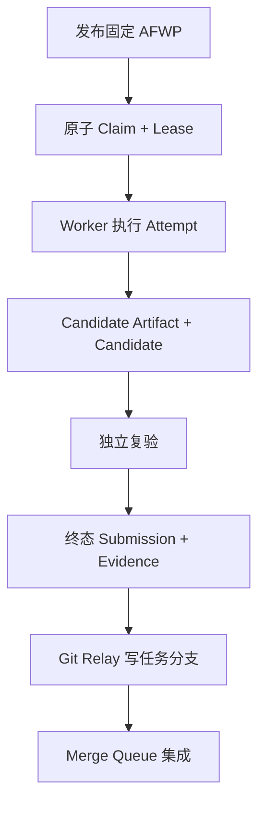
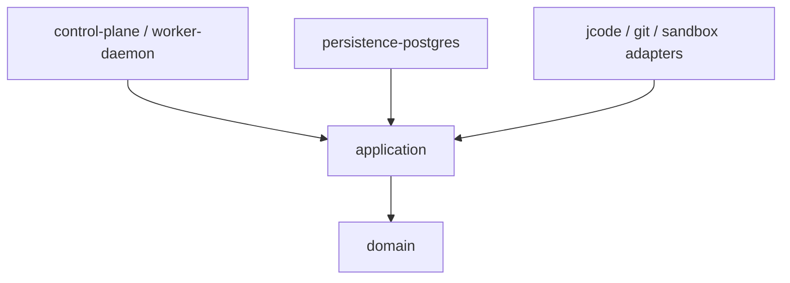
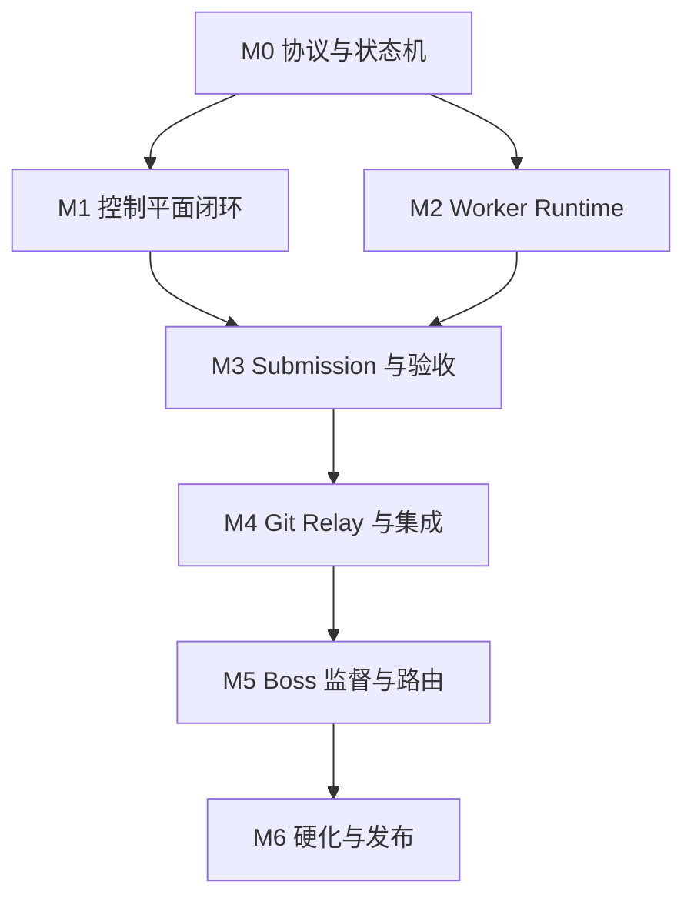

# AgentForge 可执行开发总计划

> 状态：Implementation Baseline  
> 适用范围：`v0.1.0-mvp`  
> 本文回答：第一行代码应写在哪里、组件以什么顺序出现、每个阶段怎样证明已经完成。

## 1. MVP 成功定义

MVP 不以“能同时启动多个 Agent”为成功，而以一个最小纵向闭环在故障条件下保持正确为成功：



必须同时证明：

- 相同命令重复到达不会产生重复业务副作用；
- 同一排他任务不会存在两个都能正式提交的 Lease generation；
- 旧 Worker 在 Lease 过期后恢复，只能提交 salvage，不能覆盖新 Attempt；
- Worker 重启后从本地 Journal 恢复，并先向服务器确认 Lease；
- 被本地验证、独立审查、Relay 接收和正式提交的 Candidate Commit SHA 相同；集成可产生新的 Integration Commit，但它必须绑定 Candidate 与目标基线，并在自身 SHA 上重跑集成门禁；
- Worker 没有保护分支凭据；
- Boss 会话退出不影响服务器继续回收 Lease、创建验收任务和解锁后继任务。

## 2. MVP 明确边界

### 2.1 必须实现

- 单租户、单控制平面实例、多个项目；
- Rust 模块化单体控制平面；
- PostgreSQL 作为事实来源和 Transactional Outbox；
- AFWP 1.0 与 Submission 1.0 的 Schema 校验；
- 项目、WorkPackage、Attempt、Lease、Checkpoint、Candidate、VerificationRun、Submission 基础模型；
- `exclusive` 与 `author_reviewer_pair` 两种执行模式；
- Worker 出站长轮询或 SSE；
- Linux Worker Daemon；
- jcode TypeScript SDK sidecar；
- rootless 容器沙箱；
- 确定性验证、独立 Reviewer 接口和 Evidence Manifest；
- 任务分支、Git Bundle Relay 和基础 Merge Queue；
- 持久 Obligation Timer：租约到期、停滞、待验收、重试；
- CLI 或最小管理 API；
- 全链路结构化日志、指标和审计事件。

### 2.2 MVP 暂不实现

- 多租户计费和真实货币结算；
- 自动学习的复杂模型路由；
- NATS、Kafka 或 Temporal 集群；
- 控制平面多副本自动故障切换；
- Windows 原生 Worker 正式支持；
- GPU 调度；
- 任意第三方 Agent 的完全开放市场；
- 自动生产部署；
- 全功能 Web 管理后台；
- Boss 无限制递归拆包；
- 在 A2A 上暴露全部内部管理 API。

这些能力不得提前混入核心聚合，避免 MVP 在尚未证明租约和证据正确前扩大系统面。

## 3. 冻结的技术决定

| 领域 | MVP 决定 | 允许后续替换的边界 |
| --- | --- | --- |
| 控制平面 | Rust 模块化单体 | 领域 crate 和端口保持稳定，可拆服务 |
| HTTP | Axum | 只依赖 application ports，不渗透 domain |
| 数据库 | PostgreSQL + SQLx | Repository trait 允许测试实现，不承诺换数据库 |
| 事件 | DB Event Log + Outbox + SSE | Outbox consumer 后续接 NATS |
| 协议 | AFWP JSON Schema 2020-12 | major 版本并存，禁止原地改变 |
| Worker | Rust Daemon | Executor、Sandbox、Git 使用 adapter trait |
| jcode | 官方 TypeScript SDK sidecar | 使用版本化本地 RPC，未来可加原生 adapter |
| Journal | SQLite WAL | Journal port 保持稳定 |
| 沙箱 | Linux rootless Podman 优先 | OCI adapter 可替换 Docker/VM |
| Git 交付 | Task branch + Git Bundle Relay | 可信私网可直接 push，但门禁相同 |
| 身份 | 节点 Ed25519 + 短期 capability token | TLS/OIDC 实现可演进 |

## 4. 目标代码结构

```text
AgentForge/
  Cargo.toml
  rust-toolchain.toml
  crates/
    domain/                  # package: agentforge-domain；含 WorkGraph 纯逻辑
    application/             # package: agentforge-application
    protocol/                # package: agentforge-protocol
    persistence-postgres/    # package: agentforge-storage-postgres
    control-plane/           # package: agentforge-control-plane
    obligation-engine/       # package: agentforge-obligation-engine
    outbox/                  # package: agentforge-outbox
    matcher/                 # package: agentforge-matcher
    verification/            # package: agentforge-verification
    git-integration/         # package: agentforge-git-integration
    worker-daemon/           # package: agentforge-worker-daemon
    protocol-a2a/            # package: agentforge-protocol-a2a；MVP 可 feature-gate
    test-support/            # package: agentforge-test-support
  adapters/
    jcode-bridge/
      package.json
      src/
  schemas/
  examples/
  migrations/
  tests/
    contract/
    integration/
    chaos/
    e2e/
  deploy/
    compose/
    systemd/
  docs/
```

### 4.1 依赖方向



约束：

- `domain` 不依赖 SQLx、Axum、Tokio、jcode 或 Git；
- `application` 依赖 `domain`，通过 trait 定义数据库、时钟、ID、Git、Verifier 和 Executor 端口；
- adapter 实现 application ports；
- composition root 负责组装，不把基础设施类型泄漏回领域层；
- 所有时间判断通过注入的 Server Clock，单元测试不依赖真实时间。

以上“目录 -> `Cargo.toml package.name`”映射是 MVP 唯一权威 Workspace 清单；文档讨论 crate 时使用 package name，讨论写集时使用目录路径。`WorkGraph` 是 `agentforge-domain` 内的模块，不另建 crate；TypeScript `adapters/jcode-bridge` 也不是 Cargo member。组件文档中的 `CP-*`、`W*`、`V*` 只是实施切片别名，正式排期与验收只使用文档 09 的 `WP-M{里程碑}-{序号}`。

## 5. 开发顺序与依赖



## 6. 里程碑门禁

### M0：协议、领域模型与测试模型

交付：

- Rust ID newtypes、状态 enum、领域错误；
- AFWP 与 Submission Schema；
- Schema 样例和负例；
- 状态转移函数与属性测试；
- 规范化 JSON 哈希函数；
- 事件 envelope 和幂等键定义；
- ADR-0001 至 ADR-0005。

退出条件：

- 所有合法样例通过 Schema；
- 每个 Schema 至少有一个故意失败的负例；
- 状态机不允许未列出的跃迁；
- 同一语义 JSON 在规范化后得到相同哈希；
- 未使用数据库和网络也能运行全部 domain tests。

### M1：控制平面最小闭环

交付：

- migrations；
- CreateProject、PublishPackage、ListOffers；
- ClaimPackage、RenewLease、ReleaseLease；
- PostgreSQL CAS、唯一约束和 Outbox；
- SSE/长轮询 cursor；
- Lease expiration obligation；
- 管理 CLI 或调试 API。

退出条件：

- 20 个并发 claim 只有一个获得同一排他包；
- 重复同一 Idempotency-Key 返回原结果；
- 旧 generation 的所有外部写命令均返回 `AF_LEASE_STALE`；
- 事务 rollback 时领域状态和 Outbox 都不出现；
- 服务重启后未发送 Outbox 能继续投递。

### M2：Worker Runtime 与 jcode Adapter

交付：

- Worker enrollment、能力报告、Offer 拉取；
- SQLite WAL Journal；
- Attempt workspace 与 rootless sandbox；
- jcode Bridge handshake、session、structured run、event stream；
- Turn Pump、Watchdog、Checkpoint；
- 断线 Inbox/Outbox；
- 假 Executor 用于确定性测试。

退出条件：

- jcode 或假 Executor `turn_done` 但门禁未满足时会自动继续；
- Worker 在每个可恢复状态被强制终止后都能恢复；
- 等待状态释放模型进程并由 wake condition 恢复；
- Lease 丢失后 Git、Artifact 和正式 Candidate 登记副作用立即停止；
- sandbox 内无法读取宿主凭据目录。

### M3：候选、证据与独立验收

交付：

- Criterion Runner；
- Failure Dossier；
- Candidate Artifact 预留 ID、增量 Git Bundle 分块上传、内容校验与 COMPLETE 封存；
- Candidate Commit sealing；
- Reviewer adapter；
- Clean Reproduction；
- Evidence Bundle 与签名；
- VerificationRun 状态机、终态 Submission 与返工。

退出条件：

- PASS 时 `TestedHead = ReviewedHead = SubmittedHead = CandidateHead` 由代码强制；IntegrationHead 可不同，但必须绑定 CandidateHead 与目标基线并重跑 L5；
- provenance/review/reproduction 提前失败会生成 stage-aware Failure Dossier；未执行的 Head/结果不得伪造；
- 改动候选一字节会使旧 Evidence 失效；
- `INCONCLUSIVE` 无法进入 Accepted；
- 作者身份不能满足最终 Reviewer policy；
- 独立 Runner 仅凭 base、candidate、lockfiles 和输入制品复现。

### M4：Git Relay 与 Merge Queue

交付：

- Relay 出站领取已封存 Candidate Artifact、执行 `git bundle verify` 和 ref allowlist；
- Task branch push；
- 临时合成 Commit；
- Merge Queue、冲突与 RebasePackage；
- 集成后事件与回滚点。

退出条件：

- 外网 Worker 不持有局域网 Git 凭据；
- 重复上传相同 Bundle 不产生重复分支；
- 缺少 prerequisite 或包含越权 ref 的 Bundle 被拒绝；
- 没有不可变 Candidate、COMPLETE Artifact 或登记时有效的历史 fencing 来源证明，不能进入正式 Task branch；Relay 不要求作者 Lease 当前仍有效；
- 主分支变化后必须在新合成 Commit 上重跑门禁。

### M5：监督义务、分层 Boss 与基础路由

交付：

- Obligation policies；
- Stalled、NoBid、VerifyCandidate、ReplanNeeded；
- Boss adapter 和结构化 Project Contract；
- DelegationGrant 与 ExpansionProposal；
- 硬约束路由、密封报价和按任务类型统计；
- 独立 Decomposition Critic。

退出条件：

- Boss 会话退出后到期 Lease、待验收 Submission 和完成子图仍被推进；
- 图未完成且无 Ready/Active 节点时产生 DeadlockDiagnosis；
- 子 Boss 无法突破父授权的 namespace、预算和深度；
- Executor 变更版本后不继承旧指纹的生产评分；
- 高风险任务作者和 Reviewer 不能是同一 Executor 实例。

### M6：硬化和 `v0.1.0`

交付：

- threat model 中的 MVP controls；
- 备份/恢复、日志脱敏、限流和资源配额；
- 24 小时 soak；
- 故障注入与恢复报告；
- 单机部署包、systemd/Quadlet；
- 运维手册和升级手册。

退出条件：

- 24 小时运行无丢失的业务状态或未解释的重复副作用；
- 控制平面重启、Worker 重启、网络分区、Relay 重启均通过演练；
- PostgreSQL 恢复后可从 Outbox 和 Worker Journal 收敛；
- 2C4G 目标机达到本文性能预算；
- 所有 P0/P1 安全问题关闭或由显式 waiver 接受。

## 7. MVP 性能预算

以下是工程目标，不是假定已经达到的实测结果：

| 指标 | MVP 目标 |
| --- | --- |
| 注册 Worker | 100 个 |
| 同时 Active Attempt | 30 个 |
| 项目数 | 100 个 |
| WorkPackage 总量 | 100,000 个 |
| 控制事件持续写入 | 50 events/s |
| 短时突发 | 300 events/s，持续 10 秒 |
| Offer 查询 P95 | 小于 200 ms |
| Claim 命令 P95 | 小于 250 ms |
| Lease renew P95 | 小于 150 ms |
| 重复命令去重 | 100% |
| 内存预算 | `agent-factoryd` RSS < 300 MiB；中央服务常态合计 < 2.75 GiB；至少保留 1.25 GiB 给 OS/page cache/故障余量 |
| 中央磁盘 | 大日志外置后 30 天业务数据小于 20 GB |

在目标 2C4G 机器实测前，这些数字标记为 `TARGET_NOT_VALIDATED`。若未达标，先优化索引、批处理、日志和连接池，不先拆微服务。

## 8. 配置与兼容原则

- Schema major 决定不兼容边界；minor 只能增加可选字段或新 enum 能力协商；
- 数据库 migration 只向前追加，已发布 migration 不修改；
- 所有 adapter 协议有独立版本握手；
- Worker 与控制平面至少支持当前和前一个 minor；
- 未识别事件保存原始 envelope，但不能改变聚合状态；
- 未识别的强制 AFWP extension 必须拒单；
- 服务端拒绝客户端时间参与 Lease 到期判定。

## 9. 开发纪律

每个实现任务必须：

1. 引用本文件中的里程碑与 `WP-*` 工单；
2. 指明修改的领域聚合和系统不变量；
3. 先提供失败测试或可复现夹具；
4. 在干净环境运行相关门禁；
5. 不在同一提交混入无关重构；
6. 更新 Schema、示例、migration 和文档中的受影响部分；
7. 提供回滚或兼容策略；
8. 记录无法验证的假设，不把它们写成已验证事实。

## 10. 开工顺序

第一批实际编码按依赖波次开启：

1. `WP-M0-001`：Rust workspace 与 domain 基础类型；
2. `{WP-M0-002, WP-M0-006}`：AFWP/Submission 类型与公共测试支撑；
3. `{WP-M0-003, WP-M0-004}`：状态机与 canonical JSON/hash；
4. `{WP-M0-005, WP-M0-007}`：事件/错误码与语义 Linter；
5. `WP-M0-008` + M0 Review Package：故障模拟与里程碑出口复核。

上述工单通过后，才并行开启 PostgreSQL persistence 和 Worker fake-executor。完整依赖与验收见[里程碑与首批工单](09_MILESTONES_AND_WORK_PACKAGES.md)。
