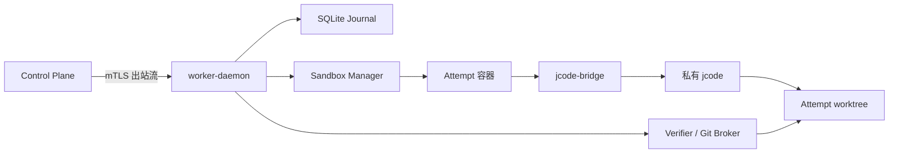

# 04：Worker Runtime 与 jcode 执行器开发规范

> 状态：Implementation Ready  
> 目标阶段：Worker 单仓库纵向 MVP 与多节点恢复  
> 主要实现：Rust `worker-daemon`、TypeScript `jcode-bridge`、Linux rootless 容器  
> 关联决策：[ADR-0004](../adr/ADR-0004-JCODE-SIDECAR.md)

本文把“Worker 接单后持续开发、自我检查、断线恢复并提交候选结果”细化为可以直接编码的实现契约。本文中的状态迁移、幂等、租约和权限检查是确定性代码；jcode 只负责需要语义判断的规划与代码修改。

---

## 1. 交付目标与边界

### 1.1 本模块必须做到

1. 从控制平面领取一个固定 revision 的 AFWP，并验证内容哈希、租约代次和输入快照。
2. 为每个 Attempt 创建隔离、可回收、可恢复的工作区。
3. 通过 jcode TypeScript SDK 驱动一个私有 jcode 实例，不依赖人工 TUI。
4. 把计划、开发、局部验证组织成验收项驱动的微循环。
5. jcode 一次 `turn_done` 后，只要仍有未满足门禁且预算允许，就自动发起下一轮。
6. 在 Worker、Sidecar、jcode 或网络进程崩溃后，从 SQLite Journal 恢复到可判定状态。
7. 租约失效后立即禁止续租以外的正式副作用，把已产生结果转为 salvage。
8. 只向 Git Broker 交付候选树和证据引用；jcode 进程不持有 Git 写凭据。

### 1.2 非目标

- 本模块不决定任务如何拆分、赏金多少或由哪个模型接单。
- 本模块不把 Worker 自测等同于中央最终验收。
- 本模块不直接写局域网 Git 的保护分支。
- MVP 不承诺 Windows 原生 Worker；Windows 先通过 WSL2 进入实验池。
- 不保存或要求模型暴露完整 chain-of-thought，只保存结构化计划、决策摘要、工具事件和证据。

### 1.3 强制不变量

| 编号 | 不变量 | 代码中的执行点 |
| --- | --- | --- |
| WR-I01 | 一个 Attempt 永久绑定 `package_id + revision + package_hash + base_commit + lease_id/generation`；重新授予创建新 Attempt | `AttemptRecord::create` 与数据库唯一约束 |
| WR-I02 | 所有服务器副作用携带当前 `lease_generation`（领域类型 `FencingToken`） | `ControlClient::send_mutation` |
| WR-I03 | `turn_done` 不是完成信号 | `TurnPump::on_turn_done` |
| WR-I04 | `INCONCLUSIVE` 不能转成 `PASS` | `CriterionState::transition` |
| WR-I05 | Worker 不能修改验收规则、阈值和允许路径 | AFWP 只读快照及 `ScopeVerifier` |
| WR-I06 | 等待必须包含机器可解释的 `wake_condition` | 状态迁移 guard |
| WR-I07 | 未确认结果的变更操作不能盲目重放 | `OperationOutcome::Unknown` 恢复分支 |
| WR-I08 | Journal 先落盘，再产生外部动作 | reducer 事务和 Outbox |
| WR-I09 | jcode、构建脚本和仓库文本均不能取得宿主凭据 | Sandbox 与 Host Broker 边界 |
| WR-I10 | 候选封存后任何字节变化都产生新候选 | Git Broker 的 tree/commit 检查 |

---

## 2. 可行性基线

截至本设计冻结版本，jcode 官方 TypeScript SDK `@1jehuang/jcode-sdk` 已提供稳定的 protocol v1，并具备以下可直接利用的能力：

- Node.js 20+；
- `JcodeClient.launch()` 启动私有实例，隔离用户日常 jcode 会话；
- 固定 `jcodeHome` 后可持久保存会话并在进程重启后枚举恢复；
- `createSession`、`run`、`runStructured`、`events`、`softInterrupt`、`cancel`、`getHistory`；
- 结构化输出使用 JSON Schema 校验并保留纠正尝试记录；
- API 通过 Unix socket 上的 NDJSON protocol v1 通信；
- Linux/macOS 有端到端覆盖，Windows 已接线但官方尚未提供完整实时 E2E 覆盖。

官方同时明确：事件流是“从 attach 起至少一次可见”，不是历史事件重放。因此 AgentForge 不能把 jcode 事件流当作事实账本；Rust Journal 必须在本地持久化关键事实，并在断线后使用 session history、Git tree 和操作记录重新对账。

版本策略：

```text
Node.js:        >= 20，固定到 worker 镜像 digest
jcode SDK:      package-lock.json 精确版本，不使用浮动 ^/~
jcode runtime:  固定二进制 SHA-256 与版本
bridge protocol: af-jcode/1（AgentForge 自有）
SDK protocol:    jcode harness protocol v1
```

每次升级 jcode/SDK 必须先运行 Sidecar 契约测试和 Worker 故障恢复测试；不得只凭语义化版本号自动进入生产池。

参考：

- [jcode TypeScript SDK 源码与 API](https://github.com/1jehuang/jcode/tree/master/sdk/typescript)
- [jcode 项目与运行方式](https://github.com/1jehuang/jcode)

---

## 3. 进程与信任边界



### 3.1 组件职责

| 组件 | 运行位置 | 可写内容 | 不得拥有 |
| --- | --- | --- | --- |
| `worker-daemon` | 宿主系统服务 | Journal、Attempt 元数据、Outbox | 生产凭据、保护分支令牌 |
| Sandbox Manager | daemon 子模块 | 容器生命周期和 cgroup | 模型语义决策 |
| `jcode-bridge` | Attempt 容器 | jcodeHome、会话状态 | Git 写凭据、中央令牌 |
| 私有 jcode | Attempt 容器 | worktree、jcodeHome | 宿主目录、Docker socket |
| Deterministic Verifier | 独立验证容器 | 临时报告目录 | 修改候选 worktree |
| Git Broker | 宿主受控进程 | 本地 bare mirror、任务分支 | 保护分支写权限 |

Sidecar 和 jcode 必须位于 Attempt 容器内。若只把 shell 命令放进容器，而 jcode 本身运行在宿主，则 jcode 的文件工具仍可能越界，这种部署不合规。

### 3.2 建议代码布局

```text
crates/worker-daemon/src/
  main.rs
  config.rs
  control/{client.rs,protocol.rs,sync.rs}
  admission/{mod.rs,resources.rs}
  attempt/{aggregate.rs,reducer.rs,runner.rs,recovery.rs}
  journal/{mod.rs,migrations.rs,inbox.rs,outbox.rs}
  sandbox/{mod.rs,podman.rs,policy.rs}
  bridge/{client.rs,protocol.rs,supervisor.rs}
  turn_pump/{mod.rs,gap_selector.rs,watchdog.rs}
  verification/{runner.rs,scope.rs,result.rs}
  evidence/{collector.rs,redaction.rs}
  git_broker/{candidate.rs,bundle.rs}

adapters/jcode-bridge/
  src/{main.ts,protocol.ts,jcode.ts,ledger.ts,redact.ts}
  schemas/*.schema.json
  package.json
  package-lock.json
```

---

## 4. Worker 配置

配置文件由管理员提供，AFWP 只能在配置允许的范围内进一步收紧，不能扩大权限。

```toml
schema_version = 1
node_id = "worker-tokyo-03"
data_dir = "/var/lib/agentforge-worker"
runtime_dir = "/run/agentforge-worker"
max_parallel_attempts = 4
shutdown_grace_seconds = 30

[control]
endpoint = "https://forge.example/v1/worker-stream"
server_name = "forge.example"
ca_file = "/etc/agentforge/ca.pem"
node_cert_file = "/etc/agentforge/node.pem"
node_key_ref = "pkcs11:agentforge-node-key"
reconnect_min_ms = 500
reconnect_max_ms = 30000

[journal]
path = "/var/lib/agentforge-worker/journal.sqlite3"
synchronous = "FULL"
checkpoint_interval_events = 100

[sandbox]
backend = "podman-rootless"
image = "registry.lan/agentforge/worker-jcode@sha256:..."
network_mode = "model-proxy-only"
cpu_default = 4
memory_mb_default = 8192
pids_default = 512
disk_mb_default = 20480
seccomp_profile = "/etc/agentforge/seccomp-worker.json"

[jcode]
bridge_protocol = "af-jcode/1"
startup_timeout_seconds = 60
event_buffer = 4096
max_frame_bytes = 1048576
inherit_logins = false

[watchdog]
process_probe_seconds = 15
process_probe_failures = 3
semantic_progress_seconds = 1200
same_fingerprint_limit = 3
max_session_restarts = 2

[git]
mirror_root = "/var/lib/agentforge-worker/git-mirrors"
worktree_root = "/var/lib/agentforge-worker/worktrees"
candidate_signing_key_ref = "pkcs11:worker-candidate-key"
```

启动时必须拒绝：

- 数据目录或 socket 目录可被其他本地用户写入；
- 镜像未固定 digest；
- `inherit_logins = true` 且节点安全级别不是显式 `trusted_personal`；
- rootless 容器不可用而配置未显式允许 VM 后端；
- 节点证书、签名密钥或 SQLite migration 无法验证。

---

## 5. 控制面消息契约

### 5.1 传输规则

- Worker 只建立出站 mTLS 连接；首选双向 gRPC stream，兼容实现可用 WebSocket/HTTPS 长轮询。
- 每条消息最多 1 MiB；大对象只能传内容寻址 URI 和 SHA-256。
- 服务器命令和 Worker 事件都带 UUID v7、schema version、correlation、causation 和幂等键；协议中的人类可读 key 另行映射，不冒充内部 ID。
- 业务 ACK 表示已持久化到 Inbox，不表示命令已经执行成功。
- 每个 NodeSession 内按 `node_seq` 有序；Attempt 状态仍以 `attempt_seq` 做 CAS。

### 5.2 公共信封

```json
{
  "schema": "af-worker-envelope/1",
  "message_id": "0198f221-52f8-7d6b-92b4-2d89aa25a33e",
  "message_kind": "command",
  "node_id": "worker-tokyo-03",
  "node_session_id": "0198f222-13b4-7a71-809d-67dbb0df247c",
  "node_seq": 84,
  "correlation_id": "att-8831",
  "causation_id": "lease-grant-91",
  "idempotency_key": "grant:att-8831:g4",
  "sent_at": "2026-08-07T10:20:30Z",
  "payload": {}
}
```

命令种类：

```rust
pub enum WorkerCommand {
    GrantAttempt(GrantAttempt),
    RenewLeaseResult(RenewLeaseResult),
    WakeAttempt(WakeAttempt),
    PermissionDecision(PermissionDecision),
    Nudge(Nudge),
    RevokeLease(RevokeLease),
    CancelAttempt(CancelAttempt),
    SyncBarrier(SyncBarrier),
}
```

`GrantAttempt` 最小 Schema：

```json
{
  "attempt_id": "att-8831",
  "package": {
    "id": "wp-lease-fencing-001",
    "revision": 3,
    "hash": "sha256:...",
    "artifact_uri": "artifact://packages/wp-lease-fencing-001/r3"
  },
  "snapshot": {
    "repo": "repo://agentforge/control-plane",
    "base_commit": "2a6d...",
    "input_digests": ["sha256:..."]
  },
  "lease": {
    "lease_id": "lease-91",
    "generation": 4,
    "expires_at": "2026-08-07T10:40:00Z",
    "renew_after": "2026-08-07T10:26:40Z",
    "offline_grace_seconds": 600
  },
  "budget": {
    "wall_seconds": 14400,
    "model_units": 24,
    "max_turns": 40
  }
}
```

MVP 在线协议只有一个单调整数：JSON 字段名为 `generation`，Rust 领域类型为 `FencingToken(u64)`；二者是同一值，不再额外制造一个字符串 bearer token。设备 mTLS 和短期 capability 负责身份/权限，generation 负责拒绝旧执行代次。

Worker 上报事件至少包含：

```rust
pub enum WorkerEvent {
    AttemptAccepted,
    AttemptRejected,
    PhaseChanged,
    BaselineCompleted,
    PlanRecorded,
    ProgressReported,
    CheckpointRecorded,
    PermissionRequested,
    BlockerRaised,
    CandidateSealed,
    CandidateHandedOff,
    SalvagePrepared,
    AttemptStopped,
    NodeCapacityChanged,
}
```

每个事件的 payload 必须包含 `attempt_id`、`attempt_seq`、`lease_generation`；正式副作用在同一请求中携带 `lease_id + attempt_id + generation + expected_lease_version`，并由服务器事务统一校验。generation 不是独立认证凭据，不能替代 mTLS/capability。

---

## 6. Rust Attempt 状态机

### 6.1 内部状态

```rust
#[derive(Debug, Clone, Copy, PartialEq, Eq, Serialize, Deserialize)]
pub enum WorkerPhase {
    Granted,
    Preparing,
    Baseline,
    Planning,
    Implementing,
    LocalVerifying,
    WaitingInput,
    SealingCandidate,
    HandingOffCandidate,
    Salvaging,
    AuthorComplete,
    LocalFailed,
    LocalCancelled,
}
```

内部状态与控制平面 Attempt 投影不是同一个枚举。控制平面可以把多个 WorkerPhase 投影为 `IMPLEMENTING`，但 Worker 恢复时必须保留更细的本地阶段。

推荐投影关系：

| WorkerPhase | 控制平面 AttemptState | 说明 |
| --- | --- | --- |
| `Granted` | `Leased` | Grant 与正式 Lease 已在服务器事务中建立 |
| `Preparing` / `Baseline` | `Preparing` | Baseline 是 Worker 内部子阶段 |
| `Planning` | `Planning` | 计划门禁通过前不实施 |
| `Implementing` | `Implementing` | jcode 修改阶段 |
| `LocalVerifying` / `SealingCandidate` / `HandingOffCandidate` | `LocalVerify`，handoff 成功后到 `Candidate` | 封存过程中还没有正式 Submission |
| `WaitingInput` | `WaitingInput` | 本地 `resume_phase` 必须持久化且只能是 `Planning/Implementing`；投影为控制面 `resume_state` |
| `Salvaging` | `Lost` | 旧结果只可 quarantine/salvage |
| `AuthorComplete` | `Candidate` | 只是 Author 执行器本地终态；Attempt 仍需 IsolatedReview、CleanReproduce、Submitted |
| `LocalFailed` / `LocalCancelled` | `Failed` / `Cancelled` | 由服务器命令确认最终投影 |

### 6.2 状态迁移表

| 当前 | 事件/条件 | 下一状态 | 必须同时写 Journal 的事实 |
| --- | --- | --- | --- |
| `Granted` | AFWP、hash、租约预检通过 | `Preparing` | 不可变任务绑定、资源预留 |
| `Granted` | 任一预检失败 | `LocalFailed` | 可重试分类、拒绝证据 |
| `Preparing` | worktree、容器和输入完成 | `Baseline` | 环境指纹、base tree |
| `Baseline` | 基线满足任务策略 | `Planning` | 基线结果摘要与 digest |
| `Baseline` | 基线阻塞 | `LocalFailed` | `BaselineBlocker`、可重试分类、`new_attempt_required=true` |
| `Planning` | plan schema 与门禁通过 | `Implementing` | `plan_digest`、AC 映射 |
| `Planning` | 计划越界或规格歧义 | `WaitingInput` | expansion/question |
| `Implementing` | 本轮产生可验证改动 | `LocalVerifying` | turn id、tree hash |
| `LocalVerifying` | 仍有可修复失败 | `Implementing` | 失败签名、下一 gap |
| `LocalVerifying` | 本地候选门禁全过 | `SealingCandidate` | AC 矩阵快照 |
| `SealingCandidate` | 候选不可变封存 | `HandingOffCandidate` | commit、tree、Author Evidence digest |
| `HandingOffCandidate` | 服务器确认 Candidate 登记 | `AuthorComplete` | candidate id；后续独立验收由 06 链路推进 |
| `Planning` / `Implementing` | 外部阻塞成立 | `WaitingInput` | wake condition、checkpoint、受限 `resume_phase` |
| `WaitingInput` | 匹配的 Wake 事件且租约有效 | 已持久化的 `Planning` 或 `Implementing` | 唤醒因果 ID |
| 任意非终态 | 发现更高 generation | `Salvaging` | 旧租约隔离原因 |
| 任意非终态 | 取消或安全终止 | `LocalCancelled` | 原因、终止者、清理结果 |

禁止直接迁移：

- `Implementing -> AuthorComplete`；
- `WaitingInput -> Implementing` 且没有匹配的 `wake_condition`；
- `WaitingInput` 的本地 `resume_phase` 保存或恢复到 `Granted/Preparing/Baseline/LocalVerifying/SealingCandidate/HandingOffCandidate`；
- 任意状态在旧 fencing token 下进入 `HandingOffCandidate`；
- `LocalFailed/LocalCancelled/AuthorComplete` 回到运行态。需要继续时必须创建新 Attempt。

MVP 的可恢复等待面只覆盖已经进入语义工作的 `Planning/Implementing`。Baseline 失败说明冻结输入、工具链或环境尚未满足当前 Attempt 的前置条件；Worker 必须以 `BaselineBlocker` 结束本地 Attempt，由控制面修复条件后创建新 Attempt，不能把旧 Baseline 快照原地唤醒为后续阶段。

### 6.3 Reducer 接口

```rust
pub trait AttemptReducer {
    fn decide(state: &WorkerAttemptState, command: AttemptCommand)
        -> Result<Vec<AttemptFact>, DomainError>;
    fn evolve(state: &mut WorkerAttemptState, fact: &AttemptFact);
}
```

`WorkerAttemptState` 是包含 `WorkerPhase`、本地 sequence 与恢复元数据的 Journal 投影，不是控制平面的 `AttemptState` enum。

`decide` 只做纯计算，不访问网络或文件系统。执行过程固定为：

```text
BEGIN IMMEDIATE
  1. 读取 attempt projection 和 version
  2. Inbox 去重
  3. reducer.decide()
  4. 追加 journal_entries
  5. 更新 projection/version
  6. 写入待执行 operations / outbox
COMMIT
  7. 异步执行 operation
  8. 将结果作为新 command 再次进入 reducer
```

这样在第 6 步以后崩溃，操作仍会被恢复；在第 6 步以前崩溃，外部动作尚未开始。

---

## 7. SQLite Journal

### 7.1 初始化参数

```sql
PRAGMA journal_mode = WAL;
PRAGMA synchronous = FULL;
PRAGMA foreign_keys = ON;
PRAGMA busy_timeout = 5000;
PRAGMA wal_autocheckpoint = 1000;
```

必须由单写入 Actor 串行提交 Attempt 状态；读取可使用连接池。不得把 SQLite 放在 NFS/SMB 目录。生产/故障恢复验收配置使用 `synchronous=FULL`；`NORMAL` 仅允许显式的本地开发 profile，并要在 Executor fingerprint 中记录，不能用于断电耐久性结论。

### 7.2 最小 Schema

```sql
CREATE TABLE attempts (
  attempt_id TEXT PRIMARY KEY,
  package_id TEXT NOT NULL,
  package_revision INTEGER NOT NULL,
  package_hash TEXT NOT NULL,
  base_commit TEXT NOT NULL,
  lease_id TEXT NOT NULL,
  lease_generation INTEGER NOT NULL,
  phase TEXT NOT NULL,
  resume_phase TEXT,
  version INTEGER NOT NULL,
  server_cursor TEXT,
  candidate_head TEXT,
  candidate_tree TEXT,
  plan_digest TEXT,
  wake_condition_json TEXT,
  budget_json TEXT NOT NULL,
  used_budget_json TEXT NOT NULL,
  created_at TEXT NOT NULL,
  updated_at TEXT NOT NULL,
  UNIQUE(package_id, package_revision, attempt_id)
);

CREATE TABLE journal_entries (
  attempt_id TEXT NOT NULL REFERENCES attempts(attempt_id),
  seq INTEGER NOT NULL,
  event_id TEXT NOT NULL UNIQUE,
  kind TEXT NOT NULL,
  causation_id TEXT,
  payload_json TEXT NOT NULL,
  payload_sha256 TEXT NOT NULL,
  occurred_at TEXT NOT NULL,
  PRIMARY KEY(attempt_id, seq)
);

CREATE TABLE inbox (
  actor_id TEXT NOT NULL,
  idempotency_key TEXT NOT NULL,
  message_id TEXT NOT NULL,
  received_at TEXT NOT NULL,
  result_json TEXT,
  PRIMARY KEY(actor_id, idempotency_key)
);

CREATE TABLE outbox (
  outbox_id TEXT PRIMARY KEY,
  attempt_id TEXT,
  destination TEXT NOT NULL,
  idempotency_key TEXT NOT NULL,
  payload_json TEXT NOT NULL,
  available_at TEXT NOT NULL,
  attempts INTEGER NOT NULL DEFAULT 0,
  delivered_at TEXT,
  last_error TEXT,
  UNIQUE(destination, idempotency_key)
);

CREATE TABLE operations (
  operation_id TEXT PRIMARY KEY,
  attempt_id TEXT NOT NULL REFERENCES attempts(attempt_id),
  kind TEXT NOT NULL,
  idempotency_class TEXT NOT NULL,
  state TEXT NOT NULL,
  request_digest TEXT NOT NULL,
  started_at TEXT,
  deadline_at TEXT,
  finished_at TEXT,
  result_digest TEXT,
  failure_signature TEXT,
  recovery_hint TEXT
);

CREATE TABLE criteria (
  attempt_id TEXT NOT NULL REFERENCES attempts(attempt_id),
  acceptance_id TEXT NOT NULL,
  hard INTEGER NOT NULL,
  state TEXT NOT NULL,
  last_result_digest TEXT,
  attempts INTEGER NOT NULL DEFAULT 0,
  updated_at TEXT NOT NULL,
  PRIMARY KEY(attempt_id, acceptance_id)
);

CREATE TABLE checkpoints (
  checkpoint_id TEXT PRIMARY KEY,
  attempt_id TEXT NOT NULL REFERENCES attempts(attempt_id),
  journal_seq INTEGER NOT NULL,
  tree_hash TEXT NOT NULL,
  session_id TEXT,
  transcript_digest TEXT,
  acceptance_matrix_digest TEXT NOT NULL,
  next_action_json TEXT NOT NULL,
  artifact_uri TEXT,
  artifact_sha256 TEXT,
  created_at TEXT NOT NULL
);

CREATE TABLE bridge_events (
  attempt_id TEXT NOT NULL REFERENCES attempts(attempt_id),
  local_seq INTEGER NOT NULL,
  turn_id TEXT,
  event_kind TEXT NOT NULL,
  sanitized_json TEXT NOT NULL,
  observed_at TEXT NOT NULL,
  PRIMARY KEY(attempt_id, local_seq)
);
```

本地 SQLite 的 `lease_generation` 必须在 Rust 层检查为正数并与 Grant/Attempt 不可变绑定；若未来允许超过 SQLite/PostgreSQL 有符号 `bigint` 的范围，需先做协议升级，不能静默截断。大日志、transcript 和制品不进入 SQLite，只保存内容哈希与 URI。

### 7.3 操作幂等分类

| 分类 | 示例 | 崩溃后规则 |
| --- | --- | --- |
| `PURE` | 计算 hash、读取状态 | 可直接重放 |
| `IDEMPOTENT` | 创建指定路径目录、上传固定 digest chunk | 用同一 key 重放 |
| `QUERY_THEN_RETRY` | 登记 Candidate、上传固定 Evidence/Bundle | 先按业务 key查询结果 |
| `NON_REPEATABLE` | 发起一次新的模型 turn | 先恢复 session 并对账，不得原样重发 |

### 7.4 启动恢复

```rust
async fn recover_all(store: &Journal) -> Result<()> {
    store.verify_hash_chain()?;
    for attempt in store.non_terminal_attempts()? {
        reconcile_server_cursor(&attempt).await?;
        reconcile_lease_generation(&attempt).await?;
        reconcile_worktree_and_candidate(&attempt)?;
        reconcile_bridge_session(&attempt).await?;
        resume_or_salvage(attempt).await?;
    }
    drain_outbox().await
}
```

恢复时先对账租约，再启动模型；否则旧 Worker 可能在恢复瞬间继续产生正式副作用。

---

## 8. AgentForge jcode Sidecar 协议

AgentForge 不让 Rust daemon 直接依赖 jcode 内部协议。`jcode-bridge` 使用官方 SDK，并向 daemon 暴露更窄的 `af-jcode/1`。

### 8.1 IPC 与帧规则

- Linux 使用 Unix domain socket：`/run/agentforge-worker/{attempt_id}/bridge.sock`；
- socket 所属用户为该 Worker，权限 `0600`，目录 `0700`；
- 每行一个 UTF-8 JSON 对象，以 `\n` 结束；
- 单帧上限 1 MiB，超限断开并记录 `frame_too_large`；
- 首帧必须完成 protocol handshake；
- 请求带 `request_id`，长操作另带稳定 `turn_id`；
- 大 Prompt、图片和 Schema 使用容器内只读 `content_ref + sha256`；
- 未知事件允许记录和忽略，未知命令返回 `unsupported_command`。

### 8.2 Handshake

请求：

```json
{
  "type": "hello",
  "protocol": "af-jcode/1",
  "worker_version": "0.1.0",
  "attempt_id": "att-8831",
  "nonce": "base64url...",
  "required_capabilities": ["structured_output", "soft_interrupt", "session_resume"]
}
```

响应：

```json
{
  "type": "hello_ok",
  "protocol": "af-jcode/1",
  "bridge_version": "0.1.0",
  "jcode_sdk_version": "exact-version",
  "jcode_runtime_version": "...",
  "sdk_protocol": 1,
  "capabilities": ["structured_output", "soft_interrupt", "session_resume"],
  "server_nonce": "base64url...",
  "nonce_proof": "hmac-sha256:..."
}
```

daemon 为每次 Sidecar 启动生成一次性 `bootstrap_secret`，通过只继承文件描述符传给容器入口，不能作为命令行参数或普通环境变量出现。响应证明计算为 `HMAC-SHA256(bootstrap_secret, protocol || attempt_id || client_nonce || server_nonce)`；双方验证后擦除 secret。Sidecar 在启动 jcode 子进程前必须把该 FD 设为 close-on-exec 并关闭，避免 jcode 继承。能力缺失时 Attempt 在准备阶段失败，不得静默降级。

### 8.3 命令

```ts
type BridgeCommand =
  | { type: "start"; request_id: string; attempt_id: string; working_dir: string;
      jcode_home: string; model: string; reasoning_effort?: string;
      inherit_logins: false }
  | { type: "resume"; request_id: string; session_id: string }
  | { type: "run_turn"; request_id: string; turn_id: string;
      prompt_ref: ContentRef; max_wall_ms: number }
  | { type: "run_structured"; request_id: string; turn_id: string;
      prompt_ref: ContentRef; schema_ref: ContentRef; max_retries: number;
      max_wall_ms: number }
  | { type: "soft_interrupt"; request_id: string; turn_id: string;
      content_ref: ContentRef; urgent: boolean }
  | { type: "permission_decision"; request_id: string; permission_id: string;
      decision: "allow_once" | "deny" }
  | { type: "snapshot"; request_id: string; history_limit: number }
  | { type: "cancel"; request_id: string; reason: string }
  | { type: "shutdown"; request_id: string; grace_ms: number };

type ContentRef = {
  path: string;       // 必须位于 /run/agentforge/input 下
  sha256: string;
  media_type: string;
};
```

`autoApprove` 永远不作为 `run_turn` 参数暴露。Sidecar 遇到 jcode `permission_request` 时必须转发给 daemon，由确定性权限策略决定允许、拒绝或升级为持久审批项。

### 8.4 事件

```ts
type BridgeEvent =
  | { type: "ready"; session_id: string; runtime: RuntimeFingerprint }
  | { type: "turn_started"; turn_id: string; session_id: string }
  | { type: "jcode_event"; turn_id?: string; local_seq: number;
      event_kind: string; sanitized: Record<string, unknown> }
  | { type: "permission_requested"; turn_id: string; permission_id: string;
      tool: string; normalized_action: Record<string, unknown> }
  | { type: "turn_completed"; turn_id: string; result_ref: ContentRef;
      usage: Usage; transcript_digest: string }
  | { type: "turn_failed"; turn_id: string; code: string;
      retry_class: "safe" | "reconcile_first" | "fatal"; diagnostic: string }
  | { type: "snapshot_result"; request_id: string; session_id: string;
      active_turn_id?: string; history_digest: string; last_turn_marker?: string }
  | { type: "bridge_health"; rss_bytes: number; child_alive: boolean }
  | { type: "fatal"; code: string; diagnostic: string };
```

文本增量默认不全量写 Journal；只写经脱敏的工具边界、permission、turn 结果、usage 和内容摘要。完整 transcript 若项目策略允许，作为加密制品单独存储。

### 8.5 一次 Turn 的耐久语义

官方 SDK 的发送操作在断线时可能出现“请求已经生效但响应丢失”。因此采用以下顺序：

1. daemon 在 Journal 写 `TurnPlanned(turn_id, prompt_digest)`；
2. 创建 `NON_REPEATABLE` operation；
3. Sidecar 在 Prompt 首尾加入不可执行的追踪标记 `AF_TURN_ID=<turn_id>`；
4. 收到 `turn_started` 后写 `TurnObserved`；
5. 每个关键 jcode 事件带 `turn_id` 写入 `bridge_events`；
6. `turn_completed` 后验证结构化输出，再写 `TurnCompleted`；
7. 连接中断时把 operation 标为 `UNKNOWN`，绝不立即重发 Prompt；
8. 重启 Sidecar，使用同一 `jcodeHome` 枚举/恢复 session，并读取 history 对账标记；
9. 若历史表明 turn 已完成，则重建结果摘要；若正在运行则重新 attach；若无法证明是否执行，则创建新的 recovery turn，说明旧 turn outcome unknown，而不是复制旧命令。

Sidecar 内存中的 `request_id` 缓存只能减少同进程重复请求，不能替代上述耐久流程。

---

## 9. Prompt Compiler 与计划门禁

### 9.1 Prompt 包

每轮发给 jcode 的 Prompt 由以下不可变/可变片段按固定顺序组成：

```text
01-system-policy.md       # 权限、禁止事项、停止协议
02-repository-contract.md # AGENTS.md 摘要、代码地图、约定
03-work-package.yaml      # 固定 revision 的 AFWP
04-current-state.json     # AC 矩阵、预算、tree、已批准决策
05-current-gap.md         # 本轮唯一或少量明确目标
06-output-schema.json     # 结构化响应格式
```

Compiler 输出 canonical tar manifest：

```json
{
  "schema": "af-prompt-pack/1",
  "attempt_id": "att-8831",
  "turn_id": "turn-17",
  "package_hash": "sha256:...",
  "files": [{"path": "...", "sha256": "sha256:..."}],
  "digest": "sha256:..."
}
```

不得把 Boss 原始对话、其他 Attempt transcript、凭据或未授权仓库目录拼入 Prompt。

### 9.2 `plan.json` Schema 要点

```json
{
  "schema": "af-jcode-plan/1",
  "understanding": "...",
  "planned_changes": [
    {"path": "crates/...", "symbols": ["..."], "reason": "..."}
  ],
  "acceptance_steps": [
    {"acceptance_id": "AC-FUNC-01", "implementation": ["..."],
     "verification": [["cargo", "test", "-p", "..."]]}
  ],
  "public_interface_changes": [],
  "risks": [{"kind": "compatibility", "mitigation": "..."}],
  "needs_expansion": false,
  "questions": []
}
```

计划门禁必须机械验证：

- 每个 hard `AC-*` 至少出现一次；
- 所有 planned path 命中 `allowed_paths` 且不命中 deny；
- 新公共接口与任务包声明一致；
- 预计命令可由权限策略表达为 argv 数组；
- `needs_expansion=true` 时停止实施并创建 ExpansionProposal。

计划失败最多允许两次带校验错误的纠正；仍失败则生成 `PLAN_SCHEMA_INVALID`，不能让模型以自由文本计划继续。

---

## 10. Turn Pump

### 10.1 结构化轮次结果

每轮使用 `runStructured` 产生：

```json
{
  "status": "continue",
  "completed_acceptance_ids": ["AC-UNIT-01"],
  "changed_files": ["crates/example/src/lib.rs"],
  "evidence_refs": ["local://evidence/turn-17/test.json"],
  "observed_failures": [],
  "next_action": {
    "acceptance_id": "AC-REGRESSION-01",
    "description": "运行 workspace 回归测试"
  },
  "wake_condition": null,
  "blocker": null,
  "decision_summary": "采用现有事务辅助函数以保持错误映射兼容"
}
```

模型声称 `completed_acceptance_ids` 只表示“建议重新验证”，Verifier 实际通过后才能把 criterion 改为 `PASS`。

### 10.2 主循环伪代码

```rust
async fn drive_attempt(id: AttemptId) -> Result<()> {
    loop {
        let s = journal.load(id)?;
        ensure_not_terminal(&s)?;

        if !lease_cache.is_current(&s.lease).await? {
            transition(id, WorkerPhase::Salvaging, "stale lease")?;
            return prepare_salvage(id).await;
        }

        if cancel_requested(&s) || security_kill_requested(&s) {
            return stop_process_tree_and_cancel(id).await;
        }

        let matrix = verifier.refresh_invalidated_results(&s).await?;
        if local_candidate_gates_pass(&s, &matrix) {
            transition(id, WorkerPhase::SealingCandidate, "all local gates pass")?;
            return seal_and_handoff_candidate(id).await;
        }

        if let Some(blocker) = proven_external_blocker(&s, &matrix)? {
            require_machine_wake_condition(&blocker)?;
            checkpoint(id).await?;
            transition_waiting(id, blocker)?;
            release_model_process(id).await?;
            return Ok(());
        }

        if budget_exhausted(&s) {
            return fail_with_reusable_dossier(id, "budget exhausted").await;
        }

        let gap = gap_selector.highest_priority(&s, &matrix)?;
        let prompt = prompt_compiler.compile_bounded(&s, &gap)?;
        let turn_id = journal.plan_turn(id, prompt.digest())?;
        let result = bridge.run_structured(turn_id, prompt).await;
        journal.observe_turn_outcome(id, turn_id, &result)?;

        match result {
            Ok(report) => {
                scope_verifier.check_worktree(&s).await?;
                verifier.run_nearest_checks(&s, &gap, &report).await?;
                checkpoint(id).await?;
                watchdog.record_semantic_fingerprint(id).await?;
            }
            Err(e) if e.requires_reconciliation() => {
                recover_unknown_turn(id, turn_id).await?;
            }
            Err(e) if e.is_safe_retry() && retry_policy.changed_condition(&e) => {
                schedule_bounded_retry(id, e)?;
            }
            Err(e) => return fail_with_reusable_dossier(id, e.code()).await,
        }
    }
}
```

### 10.3 Gap 选择顺序

1. 安全/越界失败；
2. 编译失败；
3. 与本轮变更直接关联的 hard AC；
4. 未通过的其他 hard AC；
5. 回归和非功能 hard AC；
6. soft AC；
7. 文档与残余风险收尾。

同一轮最多聚焦三个高度相关的 AC；避免把整套全量回归错误全部塞回模型。

### 10.4 可停止原因

只有以下代码枚举可结束模型循环：

```rust
pub enum StopReason {
    LocalCandidateReady,
    ExternalBlocker { wake_condition: WakeCondition },
    BudgetExhausted,
    LeaseLost,
    Cancelled,
    SecurityTermination,
    FatalInfrastructureFailure,
}
```

`LocalCandidateReady` 只表示 Author 的本地门禁允许进入 `SealingCandidate`，不等于中央 `CandidateReady/candidate_ready`，也不创建 PASS Submission 或 Relay Ticket。

“模型认为完成”“建议后续再测试”“上下文很长”不在枚举中。

---

## 11. Watchdog 与自我监督

### 11.1 三种时限独立计算

| Watchdog | 信号 | 默认动作 |
| --- | --- | --- |
| Process | Sidecar/jcode 是否存活、socket ping | 连续 3 次失败后终止进程树并恢复 session |
| Operation | 某条测试、构建、模型 turn 是否超过声明 deadline | 软中断，宽限后 SIGTERM/SIGKILL |
| Semantic | AC 状态、tree、失败签名是否长期无变化 | 进入升级阶梯 |

长时间编译但日志仍有输出，只能延长 Process 判断，不能自动视为语义进展。语义进展至少满足一个：

- 某个 hard AC 从 `NOT_RUN/FAIL` 变为 `PASS`；
- 失败签名变化且离通过更近；
- 得到新的外部决定或输入；
- 候选 tree 有与当前 gap 相关、通过范围检查的变化；
- 形成经门禁通过的拆分/扩展提议。

### 11.2 停滞指纹

```text
SHA-256(
  phase || candidate_tree ||
  sorted(failed_acceptance_ids) ||
  normalized_failure_signature ||
  normalized_next_action
)
```

连续三轮相同后依次执行，且每步只执行一次：

1. 要求 jcode 输出结构化状态快照；
2. Supervisor 指定单个最小动作；
3. 从最近 checkpoint 启动新 session，而非继续污染旧上下文；
4. 请求不同 Executor/模型的 Diagnosis Task；
5. 提交拆分、移交或 salvage 提议；
6. 封存 Failure Dossier 并结束 Attempt。

重试记录必须包含 `changed_condition`，例如新输入、新模型、新 checkpoint、新命令参数或扩大后的超时时间。空字符串或“再试一次”不通过 schema。

### 11.3 租约续期

- 续期在 `renew_after` 到达时触发，并加入不超过 5% TTL 的随机抖动；
- 不使用每秒心跳；NodeSession 健康与 TaskLease 续期分离；
- 续期请求含最近 Journal seq、语义进展时间、预算和 checkpoint digest；
- 服务器拒绝或返回更高 generation 后，先阻断 Git/制品登记等副作用，再停止/降级模型；
- 断网期间可在 `offline_grace` 内继续本地纯计算，但所有外部副作用进入 `HELD`；
- 超过 grace 后软中断并 checkpoint，不假定租约自动延长。

---

## 12. 容器与权限策略

### 12.1 Linux MVP 启动基线

下面是语义示例，实际代码必须使用 argv API 而不是拼接 shell 字符串：

```text
podman run --rm
  --userns=keep-id
  --read-only
  --cap-drop=ALL
  --security-opt=no-new-privileges
  --security-opt=seccomp=/etc/agentforge/seccomp-worker.json
  --pids-limit=512
  --cpus=4
  --memory=8g
  --memory-swap=8g
  --network=none
  --tmpfs=/tmp:rw,noexec,nosuid,nodev,size=2g
  --mount=type=bind,src=<worktree>,dst=/workspace,rw
  --mount=type=bind,src=<attempt-state>,dst=/var/lib/jcode,rw
  --mount=type=bind,src=<prompt-input>,dst=/run/agentforge/input,ro
  --mount=type=bind,src=<socket-dir>,dst=/run/agentforge/ipc,rw
  <image-digest> node /opt/agentforge/jcode-bridge/main.js
```

默认禁止：

- 宿主 `/home`、`/root`、`/etc`、`/var/run/docker.sock`；
- 其他 Attempt 的目录；
- `/dev/kvm`、原始块设备、USB；
- `CAP_SYS_ADMIN`、setuid、特权容器；
- 任意公网网络；
- SSH agent、Git 凭据和节点私钥。

### 12.2 网络模式

| 模式 | 用途 | 规则 |
| --- | --- | --- |
| `none` | 本地模型或无需下载任务 | 无网络 |
| `model-proxy-only` | 调用远程模型 | 只到宿主模型代理，短期 Attempt token |
| `dependency-proxy` | 安装依赖 | 只到声明的制品代理，记录下载 digest |
| `task-allowlist` | 特殊测试 | AFWP 与节点策略交集，逐域名/端口 |

不把 provider API key 写入 Prompt 或普通环境。生产建议由宿主模型代理代持供应商凭据；过渡期的密钥文件只能通过内存/tmpfs secret 注入，限定 Attempt，日志必须脱敏。

### 12.3 权限判定

```rust
pub enum PermissionVerdict {
    AllowOnce,
    Deny { rule_id: String },
    RequireApproval { review_item: ReviewItemDraft },
}
```

判定输入包括规范化 argv、cwd、解析后的文件路径、网络目标、预期副作用和 AFWP 权限。仓库内任何文字都不能改变判定结果。

---

## 13. 候选前的本地门禁

Worker 仅在以下条件同时成立时请求 Git Broker 封存候选：

```text
lease_current
AND all_local_hard_criteria_pass
AND scope_check_pass
AND no_untracked_required_files
AND no_secret_scan_findings
AND no_active_tool_process
AND worktree_stable_for_two_reads
AND plan_and_evidence_digests_present
AND budget_within_limit
```

Worker 的输出边界止于 `CandidateHead`。独立链路要求 `LocallyTestedHead = CandidateHead`；只有中央验收最终得到 `PASS/candidate-ready` 时，才进一步保证 `ReviewedHead = TestedHead = SubmittedHead = CandidateHead`，其中 `TestedHead` 来自 Clean Reproduction。若在 Provenance、Review 或 Clean Reproduction 提前 `FAIL/INCONCLUSIVE`，终态记录只携带实际产生且有证据的 Head，不为满足等式造值。最终集成会把 Candidate 与当时最新目标分支合成为新的 `IntegrationHead`；它通常不等于 Candidate，必须另行运行 L5，Worker/jcode 不得预先声称集成已通过。

稳定树检查：停止 jcode 写操作，连续两次读取 `git status --porcelain=v2` 和 tree hash，中间间隔至少 500 ms，结果一致后才封存。封存后 jcode 容器转只读或被停止。

Verifier 执行命令必须来自 AFWP `argv[]` 或受版本控制的 verifier 插件，禁止 `sh -c`。完整 Evidence 与 Git Relay 流程见 [06_VERIFICATION_GIT_RELAY.md](06_VERIFICATION_GIT_RELAY.md)。

---

## 14. 故障恢复矩阵

| 故障 | 判定 | 自动恢复 | 不允许 |
| --- | --- | --- | --- |
| daemon 在事务前崩溃 | 无 Journal fact | 控制命令按 Inbox key 重投 | 推测已执行 |
| daemon 在 Outbox 写入后崩溃 | operation/outbox 为 pending | 重启后 drain | 新建不同 idempotency key |
| Sidecar 启动失败 | 无 hello/进程退出 | 清理残留 socket，最多换新容器两次 | 无限重启 |
| Sidecar/jcode 在 turn 中断开 | operation=`UNKNOWN` | 同 jcodeHome 恢复、查 history 和 tree | 原样重发 turn |
| event buffer overflow | SDK 明确错误 | 停止消费、snapshot、重 attach | 静默丢事件 |
| verifier 超时 | deadline + 完整进程树 | 终止、记录 INCONCLUSIVE，按策略重跑 | 当 PASS |
| SQLite 损坏 | integrity/hash-chain 失败 | 节点隔离，保留副本，从服务器与 checkpoint 重建 | 自动删库 |
| worktree 与 Journal tree 不一致 | 重算 hash | 冻结 Attempt，建立 forensic bundle | 继续写入 |
| 租约已过期且尚未重授 | 服务器权威状态 | 原 Attempt 标记 `Lost` 并生成 salvage；若要继续，由服务器创建绑定新 generation 的新 Attempt 并显式导入 checkpoint | 在原 Attempt 更新 generation 或使用旧 token |
| 已存在更高 generation | server authority | 阻断正式副作用，生成 salvage | 提交/推送 |
| 任务 revision 已升级 | package hash 不同 | 保留旧 Attempt，等待新任务 | 在原 Attempt 热切换规格 |
| 磁盘接近上限 | 资源监控 | checkpoint、停止模型、上报阻塞 | 删除未上传证据 |

所有恢复动作都要有最大次数和最终升级对象。基础设施错误与代码错误使用不同 failure class，避免降低 Executor 的代码能力评分。

---

## 15. 可观测性

### 15.1 指标

```text
agentforge_worker_attempts{phase,result}
agentforge_worker_turns{model,outcome}
agentforge_worker_turn_duration_seconds
agentforge_worker_semantic_progress_age_seconds
agentforge_worker_watchdog_actions{level}
agentforge_worker_journal_commit_seconds
agentforge_worker_outbox_pending
agentforge_worker_lease_seconds_remaining
agentforge_worker_container_restarts
agentforge_worker_budget_used{kind}
agentforge_worker_criterion_results{kind,status}
```

### 15.2 Trace 关联

所有 span 至少带：`project_id`、`package_id`、`package_revision`、`attempt_id`、`turn_id`、`node_id`、`lease_generation`。不得把 Prompt、token、源码全文作为 span attribute。

### 15.3 审计日志

结构化日志允许保存：状态迁移、命令名、规范化路径、退出码、hash、预算和脱敏错误。禁止保存：fencing token、provider key、OAuth 文件、模型完整隐藏推理、未经策略允许的源码内容。

---

## 16. 测试计划

### 16.1 单元测试

1. 对每个状态和命令进行 table-driven transition 测试。
2. property test 随机生成命令序列，验证终态不可逆、旧 generation 不产生副作用。
3. Criterion 状态验证 `INCONCLUSIVE != PASS`。
4. Scope glob、路径归一化、symlink escape 与 Unicode 路径测试。
5. Prompt Compiler canonical digest 稳定性测试。
6. Watchdog 指纹规范化和升级次数测试。

### 16.2 Journal crash-point 测试

在下列每一步强制终止进程并重启：

- Inbox 插入前/后；
- Journal append 前/后；
- projection 更新后；
- Outbox 插入后；
- 外部 operation 开始前/后；
- 收到 jcode `turn_started` 后；
- 候选创建后但 Candidate registration ACK 前。

断言：不丢已提交事实、不重复登记 Candidate、不使用旧 fencing token。正式 Submission 由独立验收链在所有报告齐备后一次性创建，不在 Author crash 测试中提前产生。

### 16.3 Sidecar 契约测试

- 使用 fake jcode SDK 覆盖所有命令、事件与错误码；
- hello major version 不兼容时 fail closed；
- 未知 additive event 不使 Sidecar 崩溃；
- 帧超限、非法 JSON、乱序响应、socket 断开；
- `runStructured` 校验重试耗尽；
- permission 默认 deny，超时 deny；
- jcode SDK 升级时运行 protocol parity snapshot。

### 16.4 端到端与混沌测试

| 场景 | 注入点 | 期望 |
| --- | --- | --- |
| 正常 CRUD 包 | 无 | 形成 Candidate 与 Author Evidence；随后由独立验收链形成 Submission |
| jcode 提前说完成 | 第一个 turn | Turn Pump 继续到 hard AC 全过 |
| jcode 重复失败 | 相同失败 3 轮 | Watchdog 启动升级链 |
| Sidecar SIGKILL | tool 执行中 | 对账 session，不复制模型 turn |
| daemon SIGKILL | Outbox 待发 | 恢复后同 key 投递一次业务结果 |
| 控制面断网 | lease 中段 | grace 内纯计算，副作用 held |
| Lease 被重授 | Worker 断网时 | 恢复后转 salvage |
| 仓库恶意 AGENTS.md | 请求读宿主 key | 权限拒绝并留审计证据 |
| 构建 fork bomb | 测试阶段 | cgroup/PID 限制终止完整树 |
| 磁盘写满 | checkpoint 前 | 安全停止，不伪造完成 |

### 16.5 性能基线

- 100 个休眠 Attempt 的 daemon RSS 目标小于 256 MiB（不含 jcode 容器）；
- Journal 本地状态迁移 p95 小于 20 ms；
- 进程重启后 100 个非终态 Attempt 的扫描与裁决小于 10 秒，不包括镜像启动；
- 关键 jcode 事件持续 1000 event/s 时不静默丢失，达到缓冲上限时显式失败；
- 四个并行 Attempt 不得互相读取工作区。

性能数字是 MVP 初始门槛，首次真实压测后可通过 ADR/任务包 revision 调整，不能由 Worker 在执行中自行改变。

---

## 17. 开发顺序

### W1：纯状态机与 Journal

交付 `AttemptReducer`、SQLite migrations、Inbox/Outbox、property tests。此阶段用 fake operation executor，不接 jcode。

### W2：Sandbox 与 fake Sidecar

交付 rootless Podman backend、UDS transport、协议 handshake、权限决策和容器隔离测试。

### W3：真实 jcode SDK

固定 SDK/runtime 版本，实现私有 `launch()`、固定 jcodeHome、structured plan、事件转发、permission、soft interrupt 与 session recovery。

### W4：Turn Pump 与 Verifier

实现 AC 矩阵、gap selector、近端测试、Watchdog、checkpoint 和 `LocalCandidateReady` 门禁。

### W5：控制面联调

实现出站 stream、租约续期、断网同步、旧 generation salvage、Candidate/Author Evidence handoff。

每一阶段都必须能在没有外部模型的 fake harness 下确定性重放；否则无法可靠测试故障恢复。

---

## 18. 模块验收标准

| ID | 验收方法 | 通过条件 |
| --- | --- | --- |
| WR-AC-01 | `cargo test -p agentforge-worker-daemon state_machine --locked` | 所有合法/非法迁移和不变量通过 |
| WR-AC-02 | `cargo test -p agentforge-worker-daemon journal_crash --locked` | 每个 crash point 恢复后无重复副作用 |
| WR-AC-03 | `npm ci && npm run check`（`adapters/jcode-bridge`） | 类型、Schema、fake SDK 契约全绿 |
| WR-AC-04 | Linux E2E：真实 jcode 私有实例完成示例包 | 计划、至少两轮 Turn、Verifier、候选均可追踪 |
| WR-AC-05 | 第一轮让模型输出“已完成”但保留失败 AC | daemon 自动驱动下一轮，不能结束 Attempt |
| WR-AC-06 | 在模型 turn 中 SIGKILL Sidecar | 使用同 jcodeHome 恢复；不复制同一 turn |
| WR-AC-07 | 断网后在服务器生成更高 lease generation | Worker 不登记正式候选，只生成 salvage |
| WR-AC-08 | 恶意仓库尝试访问宿主和 Git 凭据 | 全部被隔离/拒绝，secret scan 无泄漏 |
| WR-AC-09 | 四个并行 Attempt 读写隔离测试 | 无跨 Attempt 文件、session 或 socket 可见性 |
| WR-AC-10 | 重新启动 daemon 并同步服务器 cursor | 10 秒内恢复裁决，状态与服务器一致 |
| WR-AC-11 | 分别在 Baseline、Planning、Implementing 注入 blocker/Wake | Baseline 结束为 `LocalFailed` 并只能由新 Attempt 继续；后两者仅在匹配 Wake 下恢复到持久化的同一阶段 |

完成定义：上述 hard AC 全部通过；Linux 安装/升级/卸载操作手册完成；真实 jcode 版本指纹写入 Evidence；不存在未说明的 root/特权容器需求。

---

## 19. 实现检查清单

- [ ] 所有外部命令均以 argv 数组执行，没有 `sh -c` 拼接。
- [ ] `worker-daemon` 只有一个 Journal 写入 Actor。
- [ ] Sidecar 和 jcode 在 Attempt 容器内，不在宿主裸跑。
- [ ] `inheritLogins` 默认且生产强制为 `false`。
- [ ] jcode SDK/runtime 使用精确版本和 SHA-256。
- [ ] 每次 turn 有稳定 `turn_id`，UNKNOWN outcome 先对账。
- [ ] 每个等待状态有可序列化 `wake_condition`，且本地 `resume_phase` 只能为 `Planning/Implementing`；控制面映射为 `resume_state`。
- [ ] Lease 失效会先关闭副作用闸门。
- [ ] `turn_done` 只能触发 Turn Pump 判定，不能直接完成任务。
- [ ] 候选封存前停止写进程并验证稳定 tree。
- [ ] Journal、日志和 Evidence 都经过 secret redaction 测试。
- [ ] fail/retry/salvage 的每条路径有上限和最终报告。
