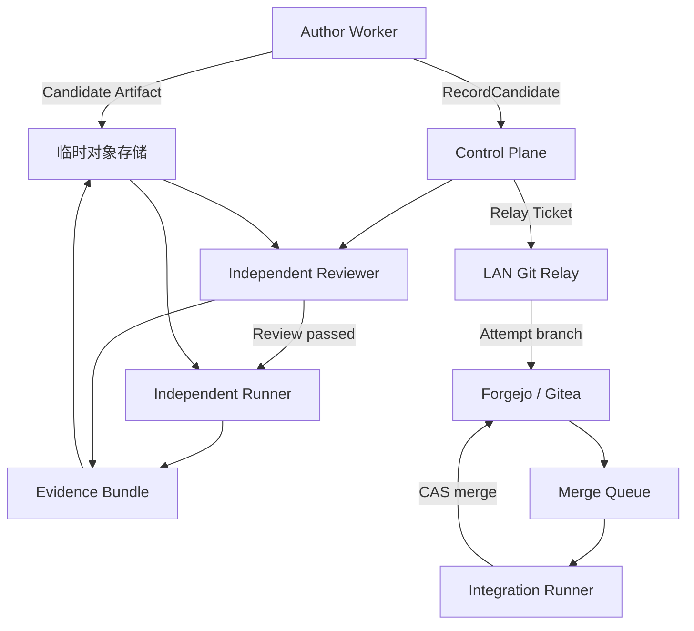

# 06：验收、Evidence、Git Relay 与 Merge Queue 开发规范

> 状态：Implementation Ready  
> 目标阶段：独立验收、局域网 Git Relay 与集成队列  
> 主要实现：Rust `verification`、`git-integration`、`git-relay`、隔离 Runner  
> 关联决策：[ADR-0005](../adr/ADR-0005-GIT-RELAY.md)

本文定义从 Worker 产生候选树，到独立验收、签名证据、外网传输、局域网分支落库、最新目标分支复验和最终合并的完整链路。目标不是“收到一份代码”，而是证明进入目标分支的代码正是被测试、审查和批准的同一组 Git 对象。

---

## 1. 结果与边界

### 1.1 必须交付的能力

1. 把 AFWP 的每个验收项编译为受控 Verifier 执行计划。
2. 对固定候选 Commit 运行确定性、契约、非功能和语义审查。
3. 生成内容寻址、可重放、节点签名的 Evidence Bundle。
4. 在有效作者 Lease 下先上传不可变 Candidate Artifact；独立验收终结后才生成不可覆盖的 Submission。
5. 外网 Worker 只上传以 `candidate_id` 标识的增量 Git Bundle，不需要访问局域网 Git。
6. 局域网 Git Relay 只建立出站连接，并在本地重新验证所有来源与 Git 不变量。
7. Merge Queue 在最新目标分支上构造合成 Commit，复验后以 CAS 方式合并。
8. 重复消息、断点续传、Relay claim 超时、Ticket 重签、Relay 重启和目标分支竞争不能产生重复分支或错误合并。

### 1.2 非目标

- Relay 不负责修改代码、自动解决语义冲突或重新解释验收标准。
- 中央对象存储不是 Git 的长期事实源；局域网 Git 和 Submission 账本才是。
- Reviewer 的自然语言“看起来可以”不能替代机器证据。
- 通过旧 base 的候选不能绕过最新目标分支复验直接进入保护分支。

### 1.3 核心不变量

| 编号 | 不变量 |
| --- | --- |
| VG-I01 | 仅对 `PASS/candidate-ready`：`TestedHead = ReviewedHead = SubmittedHead = RelayedHead = CandidateHead` |
| VG-I02 | Merge Queue 测试的合成 Commit 等于最终推入目标分支的 Commit |
| VG-I03 | `INCONCLUSIVE`、超时、Runner 崩溃和证据缺失都不等于 `PASS` |
| VG-I04 | 候选 Commit 一旦封存不得 amend、force-push 或覆盖 Submission |
| VG-I05 | 旧 lease generation 的产物只能 `QUARANTINED/SALVAGE` |
| VG-I06 | Worker、Reviewer、Runner 都不能写保护分支 |
| VG-I07 | Git Relay 只接受控制面签发、仍在有效期内且目标精确的 Relay Ticket |
| VG-I08 | Bundle、Evidence、Runner 镜像和输入制品均按 digest 固定 |
| VG-I09 | 合并冲突产生 RebasePackage，不修改旧候选 |
| VG-I10 | 每个外部写操作都有业务幂等键和本地唯一约束 |
| VG-I11 | Candidate Artifact 必须在作者 Lease 有效时完成，并在 `RecordCandidate` 中原子绑定；Submission ID 不参与候选上传 |
| VG-I12 | FAIL/INCONCLUSIVE 只声明实际完成的阶段和事实；未执行的测试、Review 与 Head 不得伪造 |
| VG-I13 | Relay 外部写必须持有当前 queue claim lease；claim fencing 同时绑定 `ticket_id + ticket_version`，旧 claim/旧票不能提交结果 |

必须区分两个等式，不能把它们压成“所有 Head 都相同”：

```text
PASS Candidate 链：TestedHead = ReviewedHead = SubmittedHead = RelayedHead = CandidateHead

Integration 链：IntegrationHead = merge(TargetBaseline, CandidateHead)
                L5TestedHead = IntegrationHead = TargetAfter
```

上述 Candidate Head 等式只属于 `PASS/candidate-ready` 门禁。`FAIL/INCONCLUSIVE` 按 `completed_stage` 允许未执行的 Tested/Reviewed/Relayed Head 缺席，不得为满足等式而造值。由于 IntegrationHead 包含最新 `TargetBaseline` 和 Candidate 两个父系，它通常不等于 CandidateHead；需要证明的是它精确绑定二者，并且最终写入目标分支的是刚刚通过 L5 的同一 IntegrationHead。

---

## 2. 端到端拓扑与责任分离



| 角色 | 可以做 | 不能做 |
| --- | --- | --- |
| Author Worker | 修改 worktree、跑本地门禁、在有效 Lease 下上传 Candidate Artifact 并登记 Candidate | 自己成为唯一 Reviewer；写保护分支；创建终态 Submission |
| Independent Runner | 在干净 checkout 执行声明的测试 | 修改候选 Commit；降低阈值 |
| Reviewer | 输出结构化 findings/verdict | 直接修候选；读取作者完整对话自我辩解 |
| Control Plane | 裁决状态、签发 Ticket、保存账本 | 伪造 Worker/Runner 签名 |
| Git Relay | 验证并推送唯一任务分支 | 合并保护分支；运行任意 Ticket 命令 |
| Integration Bot | 构造、测试并 CAS 合并 | force-push；跳过最新基线复验 |

生产部署中 Author、Reviewer 和 Integration Runner 至少使用不同的容器实例与 checkout；高风险任务还应使用不同模型家族或不同节点。

---

## 3. 领域对象与状态

### 3.1 Candidate

Candidate 是三元组：

```text
Candidate = (base_commit, candidate_commit, candidate_tree)
```

Candidate 还绑定：`package_id`、revision、hash、Attempt、lease generation、prompt pack digest 和 Worker identity。只要任一元素改变，就不是同一 Candidate。

### 3.2 CandidateArtifact

CandidateArtifact 是独立验证可解析 Candidate Git 对象的不可变传输载体，不是 Submission，也不是 Candidate 数据库行。其身份和顺序固定为：

```text
有效作者 Lease
  -> InitCandidateArtifact（服务端预留 candidate_id + artifact_id）
  -> UploadChunks
  -> CompleteCandidateArtifact（状态 COMPLETE，内容不可变）
  -> RecordCandidate（原子绑定 COMPLETE artifact、创建 VerificationRun、关闭作者 Lease）
```

最小绑定字段：`candidate_id`、`artifact_id`、package revision/hash、Attempt、Lease ID/generation、base/candidate/tree、Author Evidence digest、Bundle digest/size/chunk digests 和服务端生成的 head ref。`COMPLETE` 后禁止替换字节或 metadata；变化必须重新 init 新的 `candidate_id/artifact_id`。

CandidateArtifact 状态：

```text
UPLOADING -> ASSEMBLING -> COMPLETE
          -> EXPIRED | REJECTED | QUARANTINED
```

只有 `COMPLETE` 能被 `RecordCandidate` 绑定。若 Lease 在登记 Candidate 前失效，Artifact 只能进入 salvage/GC，不能由旧 Attempt 转成正式 Candidate。受信 LAN 的直接 Git Broker 模式也必须产生等价的 `COMPLETE` Artifact Receipt，不能跳过此状态和 digest 绑定。

### 3.3 CriterionResult

```rust
pub enum CriterionStatus {
    Pass,
    Fail,
    Inconclusive,
    Skipped,
}

pub struct CriterionResult {
    pub acceptance_id: String,
    pub criterion_revision: u32,
    pub status: CriterionStatus,
    pub hard: bool,
    pub tested_head: GitOid,
    pub runner: RuntimeFingerprint,
    pub invocation: Invocation,
    pub started_at: DateTime<Utc>,
    pub duration_ms: u64,
    pub exit_code: Option<i32>,
    pub evidence_refs: Vec<ArtifactRef>,
    pub failure_signature: Option<String>,
    pub attempts: Vec<CriterionAttempt>,
}
```

状态规则：

- hard 项只有 `Pass` 可以过门禁；`Skipped`、`Inconclusive` 和 `Fail` 都不能通过；
- 如确需豁免或降低 hard 标准，授权者必须发布新的 AFWP revision 并重新建立验收结果，不能在 Submission 中把失败结果改名为 waiver；
- flaky retry 必须保留所有尝试，按 AFWP 声明的聚合规则判定；
- 默认聚合规则是所有尝试均为 `PASS` 才得到最终 `PASS`；性能统计等特殊规则必须在版本化 criterion 中显式声明；
- 不允许“第一次失败、第二次成功，所以只上传第二次”。

### 3.4 Candidate、VerificationRun 与 Submission 状态

```text
Candidate:       SEALED（不可变）
VerificationRun: QUEUED -> PROVENANCE_CHECK -> REVIEWING -> REPRODUCING
                 -> PASS | FAIL | INCONCLUSIVE | CANCELLED
Submission:      PASS | FAIL | INCONCLUSIVE | QUARANTINED（创建即终态）
```

中间检查只推进 VerificationRun；Coordinator 在 run 终结后一次性创建 stage-aware 终态 Submission。`PASS` 表示候选满足固定基线上的验收，仍不表示已经进入目标分支；通过后进入独立 Integration 生命周期。`QUARANTINED` 只由 salvage registrar 创建。

`FAIL/INCONCLUSIVE` 可以在 `PROVENANCE_CHECK`、`REVIEWING` 或 `REPRODUCING` 任一阶段产生。终态 Submission 必须记录 `terminal_outcome`、`completed_stage` 和 Failure Dossier；只允许携带该时刻已经由签名证据证明的 Head/结果。未运行 Review 时没有 `reviewed_head`，未运行 Clean Reproduction 时没有 `tested_head`，禁止用 CandidateHead、空摘要或伪造的 `SKIPPED` 结果占位。PASS 只能在 Review 通过并完成 Clean Reproduction 后产生；此时 VerificationRun 从最后执行阶段 `REPRODUCING` 终结为 `PASS`，而对应 Submission 的 wire 字段必须是 `completed_stage="candidate_ready"`。

### 3.5 Relay 状态

```text
ISSUED -> CLAIMED -> DOWNLOADING -> VERIFYING -> PUSHING
                  -> RELAYED | REJECTED | RETRYABLE_FAILURE
ISSUED | CLAIMED | RETRYABLE_FAILURE -> EXPIRED
ISSUED | CLAIMED | RETRYABLE_FAILURE | EXPIRED -> SUPERSEDED
```

### 3.6 Merge Queue 状态

```text
QUEUED -> FETCHING -> SYNTHESIZING -> VERIFYING
       -> READY_TO_MERGE -> MERGING -> INTEGRATED
       -> REBASE_REQUIRED | FAILED | CANCELLED
```

每个状态转换都产生领域事件；对象存储 ACK、Git 命令退出和 CI 队列 ACK 都不是业务终态。

---

## 4. Verifier 执行模型

### 4.1 五层验收映射

| 层 | 典型规则 | 执行位置 | 产物 |
| --- | --- | --- | --- |
| L1 确定性 | format、lint、compile、unit、scope | Author Worker + 独立重跑 | stdout、JUnit、scope report |
| L2 契约 | OpenAPI/Proto、Schema、迁移、兼容 | 专项 Runner | contract diff、fixtures |
| L3 非功能 | 性能、安全、资源、许可证 | 固定节点/安全 Runner | raw data、SBOM、scan report |
| L4 语义 | 需求覆盖、架构、一致性 | 独立 Reviewer | signed review report |
| L5 集成 | 最新目标分支上的回归 | Integration Runner | integration evidence |

### 4.2 Verifier 插件清单

Verifier 不是任意 shell 脚本。每个插件使用签名清单注册：

```yaml
schema: af-verifier-plugin/1
plugin_id: rust-cargo-test
version: 1.2.0
image: registry.lan/agentforge/rust-runner@sha256:...
supported_kinds: [command, junit, coverage]
entrypoint: [/opt/verifiers/cargo-test]
network: none
read_only_rootfs: true
output_schema: artifact://schemas/criterion-result-v1
max_output_bytes: 104857600
signature: ed25519:...
```

控制面把 AFWP criterion 编译为 `VerificationRequest`：

```json
{
  "schema": "af-verification-request/1",
  "verification_run_id": "018f47a0-6c8a-7a10-8f01-00000000a341",
  "candidate_id": "018f47a0-6c8a-7a10-8f01-00000000a340",
  "candidate_artifact": {
    "artifact_id": "018f47a0-6c8a-7a10-8f01-00000000a342",
    "uri": "artifact://candidate-artifacts/018f47a0-6c8a-7a10-8f01-00000000a342",
    "sha256": "sha256:...",
    "manifest_sha256": "sha256:..."
  },
  "acceptance_id": "AC-FUNC-01",
  "package": {
    "id": "wp-lease-fencing-001",
    "revision": 3,
    "hash": "sha256:..."
  },
  "git": {
    "repo_id": "agentforge/control-plane",
    "base_commit": "2a6d...",
    "candidate_commit": "7bb1...",
    "candidate_tree": "12f0..."
  },
  "runner": {
    "plugin_id": "rust-cargo-test",
    "plugin_version": "1.2.0",
    "image": "registry.lan/agentforge/rust-runner@sha256:...",
    "node_class": "test-standard",
    "cpu": 4,
    "memory_mb": 8192,
    "timeout_seconds": 1800,
    "network_policy": "none"
  },
  "invocation": {
    "argv": ["cargo", "test", "-p", "agentforge-control-plane", "lease_fencing", "--", "--exact"],
    "cwd": ".",
    "env": {"RUST_BACKTRACE": "1"}
  },
  "expectation": {"exit_code": 0},
  "flaky_retry_limit": 0,
  "inputs": []
}
```

`VerificationRequest` 在 Submission 创建之前产生，因此 wire/schema/日志中都不得引用 `submission_id`。Runner 以独立 service identity、短期 capability 和 Verifier Job Lease 领取请求，并以 VerificationRun version 做 CAS；它不持有也不验证当前作者 fencing token，只验证 Candidate 中永久保存的登记来源和 `COMPLETE` CandidateArtifact。

### 4.3 安全执行规则

- `argv` 是字符串数组；Runner 调用 `execve`/Rust `Command`，禁止 `sh -c`。
- `cwd` 必须在 checkout root 内，解析 symlink 后再次检查。
- 环境变量从空白基线建立，只允许插件和 AFWP 白名单；剥离 `SSH_AUTH_SOCK`、`GIT_ASKPASS` 等。
- stdin 默认关闭；确需 fixture 时使用只读文件引用。
- stdout/stderr 分开采集，有字节上限、速率上限和脱敏。
- 超时后先 SIGTERM，宽限期后杀死 cgroup/完整进程树。
- Runner 根文件系统只读；checkout 在 criterion 执行期间只读。需要生成构建文件时使用独立 overlay，执行后确认候选 Git 对象未改变。
- 网络取 AFWP、插件策略和节点策略的交集；默认无网络。

### 4.4 结果判定

Verifier 插件只采集原始结果；通用判定器按 criterion expectation 决定状态：

```rust
fn decide(raw: &RawResult, rule: &Criterion) -> CriterionStatus {
    if raw.infrastructure_failure || raw.evidence_incomplete {
        return CriterionStatus::Inconclusive;
    }
    if raw.timed_out && !rule.expect.timeout_is_success {
        return CriterionStatus::Inconclusive;
    }
    if expectation_matches(raw, &rule.expect) {
        CriterionStatus::Pass
    } else {
        CriterionStatus::Fail
    }
}
```

测试自身断言失败是 `FAIL`；Runner 节点失联、镜像拉取失败和日志丢失是 `INCONCLUSIVE`。两者必须分别统计，避免把基础设施问题错误归因到 Executor。

---

## 5. 范围与仓库完整性检查

### 5.1 变更集合

范围检查不能只看 `git diff --name-only`，至少包括：

```text
git diff --raw --no-renames <base> <candidate>
git diff --name-status -z <base> <candidate>
git ls-tree -r <candidate>
git diff --submodule=log <base> <candidate>
```

检查内容：

- 新增、删除、修改、重命名和 copy；
- 文件 mode、可执行位和 symlink 目标；
- submodule gitlink 变化；
- Git LFS pointer 与实际允许策略；
- 大文件、二进制、生成文件和嵌套仓库；
- 大小写碰撞、Unicode 归一化碰撞和 Windows 保留名；
- `.gitmodules`、CI、部署、CODEOWNERS、依赖锁文件等高风险路径。

### 5.2 路径匹配

所有 Git 路径按原始字节解析，转换成 `/` 分隔的仓库相对路径；拒绝 NUL、绝对路径、`..` 和无法按仓库编码策略表示的路径。匹配顺序固定：

```text
if matches(any forbidden_paths) -> DENY
else if matches(any allowed_paths) -> ALLOW
else -> DENY
```

重命名必须同时检查源路径和目标路径。symlink 指向仓库外不是范围通过的理由；在 Runner materialize 时禁止跟随仓库外 symlink。

### 5.3 Secret 与供应链扫描

候选封存前和 Relay 侧各执行一次：

- 高熵/已知格式 secret scan；
- 私钥、OAuth、cookie、`.env`、云凭据模式；
- 意外大文件和可执行二进制；
- 依赖锁文件差异与许可证策略；
- SBOM 生成（适用任务）；
- 恶意 `.gitattributes`、filter、hook 和 submodule URL 检查。

扫描器失败或规则包缺失为 `INCONCLUSIVE`，不能跳过。

---

## 6. 候选 Commit 的创建与封存

### 6.1 前置条件

Git Broker 收到 Worker 请求后重新验证：

- 当前租约 generation 和 fencing token；
- AFWP revision/hash；
- worktree 稳定且没有活跃写进程；
- 所有 hard 本地门禁状态；
- allowed/forbidden paths；
- secret scan；
- base commit 与本地 mirror 一致。

### 6.2 单 Commit 候选

MVP 将 Attempt 的最终 tree 封装为一个 parent 等于 `base_commit` 的候选 Commit。中间开发 Commit 只作为 checkpoint，不进入正式候选历史。

伪代码：

```rust
fn seal_candidate(req: SealRequest) -> Result<Candidate> {
    assert_current_fence(&req.lease)?;
    freeze_attempt_writers(req.attempt_id)?;
    let status1 = read_status_and_tree(req.worktree)?;
    sleep(Duration::from_millis(500));
    let status2 = read_status_and_tree(req.worktree)?;
    ensure_eq!(status1, status2, CandidateError::UnstableTree);
    scope_check(req.base_commit, status2.tree)?;

    // Author Evidence 只绑定 package/base/tree/L1 结果，不包含尚未创建的 commit。
    let author_evidence = build_author_evidence(&req, status2.tree)?;
    let author_evidence_digest = sign_and_store_author_evidence(author_evidence)?;
    let message = build_commit_message_with_trailers(&req, author_evidence_digest)?;
    let commit = git_commit_tree_signed(
        status2.tree,
        req.base_commit,
        message,
        req.worker_signing_key,
    )?;
    ensure_commit_tree(commit, status2.tree)?;
    create_immutable_local_ref(req.attempt_id, commit)?;
    Ok(Candidate { base: req.base_commit, commit, tree: status2.tree })
}
```

Commit trailer 必须包含：

```text
Task-ID: wp-lease-fencing-001
Task-Revision: 3
Attempt-ID: att-8831
Package-Hash: sha256:...
Evidence-Digest: sha256:<author-evidence-manifest>
Worker-ID: worker-tokyo-03
Lease-Generation: 4
```

这里的 `Evidence-Digest` 明确定义为 **Author Evidence Manifest**：它绑定 package、base、最终 tree、本地 L1 结果和 Worker 环境，但不包含尚未创建的 candidate commit。最终 Submission Evidence 在 Commit 之后加入独立 Review 与 Clean Reproduction，并反向引用 `author_evidence_digest + candidate_commit`。这样既没有哈希自引用，也不需要 amend 被测试 Commit。最终完整绑定以签名 Submission Manifest 为准；不得把 final Evidence digest 强塞回 Candidate 造成循环依赖。

### 6.3 Candidate Artifact handoff 与 `RecordCandidate`

封存得到精确 Commit 后，Worker 必须在同一作者 Lease 仍有效时完成以下操作：

```rust
async fn handoff_candidate(sealed: SealedCandidate, lease: AuthorLeaseProof) -> Result<CandidateRecorded> {
    assert_current_author_fence(&lease)?;
    let init = control.init_candidate_artifact(
        sealed.identity_and_author_evidence(),
        lease.clone(),
        stable_key("candidate-artifact:init", sealed.attempt_id, sealed.commit),
    ).await?;

    let bundle = build_candidate_bundle(&sealed, &init.head_ref)?;
    let bundle_manifest = sign_bundle_manifest(&init, &sealed, &bundle)?;
    upload_missing_chunks(&init, &bundle, &bundle_manifest, &lease).await?;
    let complete = control.complete_candidate_artifact(
        init.artifact_id,
        bundle_manifest,
        lease.clone(),
        stable_key("candidate-artifact:complete", init.artifact_id, bundle.sha256),
    ).await?;
    ensure_eq!(complete.state, CandidateArtifactState::Complete);

    control.record_candidate(
        init.candidate_id,
        init.artifact_id,
        sealed.commit,
        sealed.tree,
        lease,
        stable_key("candidate:record", init.candidate_id, complete.manifest_digest),
    ).await
}
```

`RecordCandidate` 的数据库事务必须重新验证作者 identity/capability/current fence、Artifact=`COMPLETE`、Attempt/revision/base/candidate/tree/Author Evidence/Bundle digest 全部一致；随后原子创建不可变 Candidate 和 VerificationRun、把 Attempt 置 `CANDIDATE`、把 Package 置 `VERIFYING`、释放作者 Lease。对象上传不能放进该数据库事务。

在 `RecordCandidate` 提交后，作者对 Artifact/Candidate 的写权限立即终止。Verifier/Reviewer 只获得只读 Artifact capability 和自己的 Job Lease；Relay 以后凭 PASS Ticket 读取同一 Artifact。若 complete 或 RecordCandidate 响应丢失，Worker 必须用原 idempotency key 查询结果，不得 init 新 ID 或重新上传未知结果。

### 6.4 证据失效

下列任一变化使既有 CriterionResult 失效：

- candidate commit/tree 改变；
- runner image digest 改变；
- criterion revision 或 expectation 改变；
- 输入制品 digest 改变；
- Reviewer finding 导致代码修改；
- 测试命令或环境改变且没有明确等价性规则。

失效不是删除旧证据；旧 Evidence 保留 lineage，并将新结果链接到 `supersedes_result_id`。

---

## 7. Independent Reviewer

### 7.1 输入最小化

Reviewer 只接收：

- 固定 AFWP；
- repository contract 和架构约束；
- base commit、candidate commit 和 diff；
- 验收规则与已有机器结果；
- 必需的接口/Schema 文档。

默认不接收作者完整 transcript、自评分或“为何不得不这样改”的长篇辩解，避免锚定。已批准设计决策通过 `DecisionRecord` 结构化提供。

### 7.2 Reviewer 输出 Schema

```json
{
  "schema": "af-review-report/1",
  "review_id": "rv-01K...",
  "candidate_id": "018f47a0-6c8a-7a10-8f01-00000000a340",
  "verification_run_id": "018f47a0-6c8a-7a10-8f01-00000000a341",
  "reviewed_head": "7bb1...",
  "reviewer": {
    "executor_id": "exec-review-09",
    "model_fingerprint": "provider/model+prompt+tools",
    "runtime_digest": "sha256:..."
  },
  "verdict": "pass",
  "coverage": {
    "acceptance_ids": ["AC-FUNC-01", "AC-SALVAGE-01"],
    "architecture_rules": ["SYS-LEASE-04"]
  },
  "findings": [],
  "residual_risks": ["未覆盖多地域数据库拓扑"],
  "evidence_refs": ["artifact://review/rv-01K/report"],
  "signature": "ed25519:..."
}
```

finding：

```json
{
  "id": "RV-001",
  "severity": "high",
  "acceptance_id": "AC-API-02",
  "rule_id": "SYS-LEASE-04",
  "location": {"path": "src/lease.rs", "line": 120},
  "expected": "所有副作用验证 generation",
  "actual": "checkpoint 路径缺少验证",
  "reproduction": {
    "argv": ["cargo", "test", "late_checkpoint"],
    "evidence_ref": "artifact://review/rv-01K/repro"
  }
}
```

Reviewer 可以在独立临时树中生成攻击性测试，但不能修改 Candidate。需要返工时，finding 和测试作为新 Attempt 输入。

### 7.3 Reviewer 门禁

- Critical/High finding 必须为零；
- Medium 的处理策略由项目 Contract 定义，不能默认忽略；
- `reviewed_head` 必须等于 candidate commit；
- Reviewer 自身失败或输出不符合 Schema 为 `INCONCLUSIVE`；
- 高风险包要求两个不同模型家族 Reviewer，且门禁取交集，不做平均分抵消。

---

## 8. Clean Reproduction

### 8.1 构建输入

Clean Runner 只允许从以下内容重建：

```text
固定 bare mirror 中的 base commit
+ Candidate Git objects
+ 固定 lockfiles
+ Runner image digest
+ AFWP 声明的 input artifact digests
+ Verifier plugin digest
```

禁止复制 Author Worker 的：

- `target/`、`node_modules/`、虚拟环境或编译缓存（除非缓存按内容校验且只读）；
- 未跟踪文件；
- jcodeHome、transcript 或本地环境变量；
- workspace 外路径。

### 8.2 流程

```text
1. 建立全新临时目录
2. 从只读 mirror materialize base
3. 导入 Candidate 对象并 checkout exact commit
4. 验证 commit/tree/base/签名
5. 安装或挂载固定输入
6. 执行 L1-L3 hard criteria
7. 重新计算 tested_head 和 tree
8. 产出 clean-reproduction.json
9. 销毁 Runner；保留内容寻址证据
```

任何测试后候选 checkout 被修改，都记录为 `RUNNER_MUTATED_CHECKOUT` 并使复现 `INCONCLUSIVE`。构建输出只能写 overlay/output 目录。

---

## 9. Evidence Bundle

### 9.1 目录格式

```text
evidence-018f47a0-6c8a-7a10-8f01-00000000a341/
  manifest.json
  manifest.sig
  package/package.ref.json
  candidate/git.json
  candidate/diffstat.json
  candidate/scope-report.json
  criteria/AC-FUNC-01/result.json
  criteria/AC-FUNC-01/stdout.log.zst
  criteria/AC-FUNC-01/junit.xml
  criteria/AC-REGRESSION-01/result.json
  review/report.json
  review/report.sig
  clean-reproduction/report.json
  provenance/worker.json
  provenance/runner.json
  supply-chain/sbom.spdx.json
  residual-risks.json
```

所有文件必须列入 manifest；manifest 和签名文件本身除外。禁止未列出的“附加文件”被 Runner 或 Relay 隐式信任。

### 9.2 Manifest Schema

```json
{
  "schema": "af-evidence-manifest/1",
  "evidence_id": "ev-01K...",
  "candidate_id": "018f47a0-6c8a-7a10-8f01-00000000a340",
  "verification_run_id": "018f47a0-6c8a-7a10-8f01-00000000a341",
  "candidate_artifact_id": "018f47a0-6c8a-7a10-8f01-00000000a342",
  "package": {
    "id": "wp-lease-fencing-001",
    "revision": 3,
    "hash": "sha256:..."
  },
  "attempt": {
    "id": "att-8831",
    "lease_generation": 4
  },
  "candidate": {
    "base_commit": "2a6d...",
    "commit": "7bb1...",
    "tree": "12f0..."
  },
  "author_evidence": {
    "manifest_sha256": "sha256:...",
    "signed_tree": "12f0..."
  },
  "results": [
    {
      "acceptance_id": "AC-FUNC-01",
      "status": "PASS",
      "tested_head": "7bb1...",
      "path": "criteria/AC-FUNC-01/result.json",
      "sha256": "sha256:..."
    }
  ],
  "review": {
    "verdict": "pass",
    "reviewed_head": "7bb1...",
    "path": "review/report.json",
    "sha256": "sha256:..."
  },
  "clean_reproduction": {
    "verdict": "pass",
    "tested_head": "7bb1...",
    "path": "clean-reproduction/report.json",
    "sha256": "sha256:..."
  },
  "files": [
    {"path": "candidate/git.json", "size": 418, "sha256": "sha256:..."}
  ],
  "created_at": "2026-08-07T10:30:00Z",
  "signer": {"key_id": "verification-coordinator:2026q3", "algorithm": "Ed25519"}
}
```

Evidence 在 VerificationRun 内形成，早于终态 Submission，因此不得以 `submission_id` 命名或授权。Coordinator 创建 Submission 后只把该 Evidence digest 绑定进签名终态记录，不回写或重签原 Evidence。

### 9.3 Canonical 与签名

- JSON 使用 UTF-8 和 RFC 8785 JSON Canonicalization Scheme；
- digest 使用 SHA-256，格式固定为小写十六进制 `sha256:<64hex>`；
- 签名输入使用域隔离：

```text
"AgentForge Evidence Manifest v1\0" || JCS(manifest.json)
```

- 使用 Ed25519；签名文件包含 `key_id`、证书链/节点注册引用、签名和签名时间；
- Relay 必须查询或缓存可验证的节点 key 状态，并按签名时刻处理轮换/吊销；
- 仅 tar 文件的 hash 不足以替代 manifest 签名，因为需要逐文件验证和长期提取。

### 9.4 打包确定性

Evidence 可打包为 `tar.zst`，归档规则：路径字典序、mtime=0、uid/gid=0、固定 mode、禁止绝对路径/`..`/硬链接/设备文件。解包时设置文件数、单文件、总大小和压缩比上限，防止 tar traversal 与解压炸弹。

日志在打包前执行 secret scan 和脱敏；脱敏后文件 digest 才进入 manifest。原始敏感日志若确需保存，进入独立加密安全域，不进入普通 Evidence。

---

## 10. Submission Manifest 与门禁

正式 candidate Submission 由 Verification Coordinator 在 VerificationRun 到达 `PASS/FAIL/INCONCLUSIVE` 后**一次性组装并登记**。Author Worker 只完成 CandidateArtifact 和 Candidate 登记；它不能创建 Submission，也不能先创建缺少独立结果的半成品再原地补字段。以下四 ID 约束适用于 `submission_kind="candidate"`；`salvage` 走 Schema 的独立条件分支，禁止携带 Candidate、CandidateArtifact 或 VerificationRun ID，也永远不能进入 `CandidateReady`。

### 10.1 签名终态绑定

终态 wire object 必须把以下字段纳入 `AF-SUB-SIG-1` 的 JCS 签名输入，而不是只作为未签名数据库列或 URL 参数：

| 分组 | 必签字段 |
| --- | --- |
| 终态身份 | `submission_id`、`candidate_id`、`verification_run_id`、`candidate_artifact_id` |
| 结论 | `terminal_outcome: PASS|FAIL|INCONCLUSIVE`；wire `completed_stage: provenance_check|reviewing|reproducing|candidate_ready` |
| Package/Attempt | package ID/revision/hash、attempt ID、Candidate 登记时的 lease ID/generation/token hash |
| Git | base/candidate/tree、`submitted_head`，以及仅在实际产生时存在的 `tested_head/reviewed_head` |
| 证据 | Author Evidence、CandidateArtifact、Verification Evidence/Failure Dossier 的 digest 与 URI |
| 来源 | Coordinator key/role、签名时间、lineage、决策与残余风险 |

参考领域类型：

```rust
struct SignedTerminalSubmission {
    submission_id: ProtocolKey, // wire `sub-*`；不是内部 UUID
    candidate_id: CandidateId,
    verification_run_id: VerificationRunId,
    candidate_artifact_id: CandidateArtifactId,
    terminal_outcome: TerminalOutcome,
    completed_stage: CompletedStage,
    evidence_digest: Sha256Digest,
    submitted_head: GitOid,
    tested_head: Option<GitOid>,
    reviewed_head: Option<GitOid>,
    failure_dossier: Option<FailureDossierRef>,
    signature: CoordinatorSignature,
}
```

仓库中的 [`schemas/submission.schema.json`](../../schemas/submission.schema.json) 是终态 wire object 的权威结构契约：它已把 `candidate_id/candidate_artifact_id/verification_run_id/terminal_outcome/completed_stage` 纳入 `submission_kind="candidate"` 的必填或条件约束，并规定 candidate PASS 只能是 `completed_stage="candidate_ready"`；salvage 则禁止携带这三个候选链 ID。fixtures 是该 Schema 的 conformance vectors。结构校验仍不能替代签名验证、数据库外键链、Artifact `COMPLETE` 状态、run 终态与 Head 等式等上下文门禁；PASS fixture 也不能拿来伪造早期失败记录。

Submission 使用文档 02 的 `AF-SUB-SIG-1`；它与第 9.3 节 Evidence Manifest 的签名是两个独立域，禁止复用签名 bytes 或省略域分离。Coordinator 签署最终不可变终态对象；salvage 由 Salvage Registrar 签署隔离登记。仓库 fixture 公钥仅供 conformance test，生产信任根来自服务身份注册表。

### 10.2 `CandidateReady` 判定

```rust
fn candidate_ready(s: &SignedTerminalSubmission, ctx: &VerificationContext) -> Result<bool> {
    let canonical_manifest_digest = verify_af_sub_sig_1(s)?;
    ensure_eq!(s.submission_id, ctx.submission.protocol_key);
    ensure_eq!(s.candidate_id, ctx.candidate.id);
    ensure_eq!(s.verification_run_id, ctx.run.id);
    ensure_eq!(s.candidate_artifact_id, ctx.artifact.id);
    ensure_eq!(ctx.submission.candidate_id, Some(s.candidate_id));
    ensure_eq!(ctx.submission.verification_run_id, Some(s.verification_run_id));
    ensure_eq!(ctx.submission.candidate_artifact_id, Some(s.candidate_artifact_id));
    ensure_eq!(ctx.submission.state, s.terminal_outcome.as_db_state());
    ensure_eq!(ctx.submission.completed_stage, s.completed_stage.as_db_stage());
    ensure_eq!(ctx.submission.manifest_digest, canonical_manifest_digest);
    ensure_eq!(ctx.submission.evidence_digest, s.evidence_digest);
    ensure_eq!(ctx.run.evidence_digest, Some(s.evidence_digest));
    ensure_eq!(ctx.run.candidate_id, s.candidate_id);
    ensure_eq!(ctx.run.tested_head, s.tested_head);
    ensure_eq!(ctx.run.reviewed_head, s.reviewed_head);
    ensure_eq!(ctx.candidate.bundle_artifact_id, s.candidate_artifact_id);
    ensure_eq!(ctx.artifact.candidate_id, s.candidate_id);

    Ok(s.terminal_outcome == TerminalOutcome::Pass
        && s.completed_stage == CompletedStage::CandidateReady
        && ctx.run.state == VerificationRunState::Pass
        && ctx.artifact.state == CandidateArtifactState::Complete
        && ctx.candidate.lease_was_current_at_registration
        && ctx.all_hard_results_are_pass()
        && ctx.no_critical_or_high_findings()
        && s.submitted_head == ctx.candidate.commit
        && s.tested_head == Some(ctx.candidate.commit)
        && s.reviewed_head == Some(ctx.candidate.commit)
        && ctx.scope_check == Pass
        && ctx.provenance_complete()
        && ctx.all_evidence_signatures_valid())
}
```

`CandidateReady` 必须使用同一事务读出的数据库上下文，显式把签名 Submission 的 Evidence digest 与 Submission row、VerificationRun row 绑定，并把 run 保存的 tested/reviewed Head 与签名值逐项比较；不能只验证签名后继续信任客户端内嵌状态。服务器登记 Candidate 时以数据库时间和 CAS 验证作者 fencing token，并永久保存该来源事实；Coordinator 创建 Submission 时不要求已经关闭的作者 Lease 仍有效。

### 10.3 早期失败与 Failure Dossier

`FAIL/INCONCLUSIVE` 不是 PASS Manifest 填假值后的变体。Coordinator 必须根据 run 的实际终结阶段生成 Failure Dossier：

```json
{
  "schema": "af-failure-dossier/1",
  "candidate_id": "018f47a0-6c8a-7a10-8f01-00000000a340",
  "verification_run_id": "018f47a0-6c8a-7a10-8f01-00000000a341",
  "candidate_artifact_id": "018f47a0-6c8a-7a10-8f01-00000000a342",
  "terminal_outcome": "INCONCLUSIVE",
  "completed_stage": "provenance_check",
  "reason_code": "AF_BUNDLE_INVALID",
  "observed_heads": {"submitted_head": "7bb1..."},
  "completed_results": [],
  "not_executed": ["REVIEWING", "REPRODUCING"],
  "evidence_digest": "sha256:...",
  "evidence_refs": ["artifact://failures/018f47a0-6c8a-7a10-8f01-00000000a341/provenance.json"]
}
```

强制规则：

- Provenance 失败时不得出现 `reviewed_head`、`tested_head`、Review verdict 或 Clean Reproduction；
- Reviewing 失败可携带签名 `reviewed_head` 和 findings，但不得出现 Clean Reproduction/`tested_head`，也不能把 verdict 改写为 pass；
- Reproducing 失败发生在 Review 之后，可保留已签名的 Review；只有确实 checkout/执行并有签名证据的 `tested_head` 可以出现；
- 未执行的 criterion 用 `not_executed` 表达，不生成伪造的 runner digest、时间、Evidence 或 `SKIPPED` 记录；
- Submission 内联的 `failure_dossier.evidence_digest` 必须覆盖这份外部 Dossier/失败证据 manifest，并进入 `AF-SUB-SIG-1`；URI 引用本身不建立完整性；
- 每个 terminal run 恰好创建一个不可变 Submission。同一固定输入的瞬态 Job 重试只能发生在 run 终结前；终结后的重做经 ReworkReady 创建新 Attempt/Candidate/VerificationRun 和新 Submission lineage，不覆盖旧 Dossier；
- 只有 `terminal_outcome=PASS` 可以签发 Relay Ticket 或进入 Integration。

---

## 11. Git Bundle 生成

### 11.1 Ref 与增量范围

Git Bundle 必须包含一个专用 ref，而不是依赖裸 SHA：

```text
refs/agentforge/candidates/{candidate_id} -> candidate_commit
```

`candidate_id` 和精确 `head_ref` 来自 `InitCandidateArtifact` 响应。Worker 先 init，再创建该本地 ref 和 Bundle；Init 不要求尚未生成的 Bundle digest，完整 size/digest/chunk manifest 在 complete 时提交并固定。

只有控制面持有来自目标 `repo_id` 受信 LAN mirror 的 base-availability receipt 时，才生成以 base 为 prerequisite 的增量 Bundle：

```text
git bundle create candidate.bundle \
  refs/agentforge/candidates/018f47a0-6c8a-7a10-8f01-00000000a340 \
  ^2a6d...
```

代码实现必须使用 argv 数组。生成后执行：

```text
git bundle verify candidate.bundle
git bundle list-heads candidate.bundle
```

若在 Artifact complete 前已知 Relay 不拥有 base，Init/预检应要求 Worker 从一开始生成不声明该 prerequisite 的自包含 Bundle。若 Artifact 已 `COMPLETE` 或已绑定 Candidate 后才发现 `AF_BASE_MISSING`，**不得**扩大、替换或重签原 Artifact：先由受信 Repository Mirror 服务从该 `repo_id` 的管理员静态配置上游或已验证内部快照同步精确 base OID，复核 OID/祖先关系后以同一 Artifact 重试。若没有任何受信来源能提供 base，当前 Relay 流程终结为不可投递，控制面创建 ReworkPackage 和新 Attempt；新 Attempt 产生新的 CandidateArtifact/Candidate/VerificationRun/Submission lineage，并从一开始使用自包含 Bundle。Relay 不能从 Ticket、Worker 或不受信任公网地址取得补仓 URL。

### 11.2 Git Bundle Manifest

```json
{
  "schema": "af-git-bundle/1",
  "candidate_id": "018f47a0-6c8a-7a10-8f01-00000000a340",
  "candidate_artifact_id": "018f47a0-6c8a-7a10-8f01-00000000a342",
  "attempt_id": "att-8831",
  "lease_generation": 4,
  "repo_id": "agentforge/control-plane",
  "base_commit": "2a6d...",
  "candidate_commit": "7bb1...",
  "candidate_tree": "12f0...",
  "head_ref": "refs/agentforge/candidates/018f47a0-6c8a-7a10-8f01-00000000a340",
  "bundle": {
    "size": 1842021,
    "sha256": "sha256:...",
    "chunk_size": 4194304,
    "chunks": [{"index": 0, "size": 1842021, "sha256": "sha256:..."}]
  },
  "author_evidence_manifest_sha256": "sha256:...",
  "created_at": "2026-08-07T10:32:00Z",
  "signature": "ed25519:..."
}
```

Bundle 内 pack 已压缩，默认不再套用昂贵的二次压缩；Evidence 文本使用 zstd。低带宽收益主要来自增量对象、固定 chunk、内容去重和断点续传。

---

## 12. Candidate Artifact 分块上传 API

### 12.1 Init：预留 Candidate 与 Artifact ID

```http
POST /v1/attempts/att-8831/candidate-artifacts
Idempotency-Key: candidate-artifact:init:att-8831:7bb1...
Authorization: Bearer <author-capability>
X-Lease-ID: lease-04
X-Lease-Generation: 4
If-Match: "<attempt-version>"
```

```json
{
  "package_revision": 3,
  "package_hash": "sha256:...",
  "base_commit": "2a6d...",
  "candidate_commit": "7bb1...",
  "candidate_tree": "12f0...",
  "author_evidence_manifest_sha256": "sha256:...",
  "artifact_kind": "git_bundle",
  "chunk_size": 4194304
}
```

响应：

```json
{
  "candidate_id": "018f47a0-6c8a-7a10-8f01-00000000a340",
  "artifact_id": "018f47a0-6c8a-7a10-8f01-00000000a342",
  "state": "UPLOADING",
  "head_ref": "refs/agentforge/candidates/018f47a0-6c8a-7a10-8f01-00000000a340",
  "expires_at": "2026-08-08T10:32:00Z"
}
```

Init 的线性化点只预留 identity 与期望 metadata，不创建 Candidate 或 VerificationRun，也不关闭 Lease。相同业务 key/请求摘要必须返回相同 `candidate_id/artifact_id`；相同 key 不同摘要返回 `AF_IDEMPOTENCY_KEY_REUSED`。

### 12.2 Upload 与 Complete

```http
PUT /v1/candidate-artifacts/018f47a0-6c8a-7a10-8f01-00000000a342/chunks/0
Content-Length: 1842021
Digest: sha-256=<base64>
Idempotency-Key: 018f47a0-6c8a-7a10-8f01-00000000a342:chunk:0:<digest>
Authorization: Bearer <author-capability>
X-Lease-ID: lease-04
X-Lease-Generation: 4
```

```http
POST /v1/candidate-artifacts/018f47a0-6c8a-7a10-8f01-00000000a342:complete
Idempotency-Key: candidate-artifact:complete:018f47a0-6c8a-7a10-8f01-00000000a342:<bundle-digest>
Authorization: Bearer <author-capability>
X-Lease-ID: lease-04
X-Lease-Generation: 4
If-Match: "<artifact-version>"
```

Complete body 携带第 11.2 节完整、已签名的 Git Bundle Manifest（含 total size/digest/chunks）。服务器据此检查 chunk 集合是否完备；缺块时返回稳定的 `missing_chunks`，Artifact 保持 `UPLOADING`，不会进入 `COMPLETE`。

服务器 complete 时按顺序重组并计算总 SHA-256，解析签名 Bundle Manifest，并验证 head ref、base/candidate/tree、Attempt、generation 与 Init 记录；只信 chunk metadata 不合格。相同 chunk digest 可内容去重，但授权仍按 project/Attempt/CandidateArtifact 检查。Init、chunk、complete 都属于作者侧操作。服务端先认证 actor，再查询 `(actor_id, Idempotency-Key)` 回执；命中同 request hash 且首次响应仍在回放窗口时原样返回，只有 tombstone 时返回 `AF_IDEMPOTENCY_RESULT_EXPIRED`，两者都不重执行。只有回执未命中的新副作用，才必须在同一作者 Lease generation 仍有效时通过 identity、capability、fencing 和 CAS。

### 12.3 上传状态

```text
UPLOADING -> ASSEMBLING -> COMPLETE
          -> EXPIRED | REJECTED | QUARANTINED
```

重复 `init/chunk/complete` 返回原业务结果。`COMPLETE` 后 artifact bytes/metadata 不可变；`RecordCandidate` 只接受 COMPLETE 且所有绑定相等的 Artifact。`REJECTED` 表示内容或 manifest 验证失败，其 bytes 仅按短期取证策略留在 quarantine 存储；`QUARANTINED` 只用于显式 salvage 或调查保留。过期上传的 chunk 由后台 GC 删除；已绑定 Candidate、活跃 VerificationRun、Submission、Ticket 或调查引用的对象不得 GC。

### 12.4 Candidate 登记

```http
POST /v1/attempts/att-8831/candidates
Idempotency-Key: candidate:record:018f47a0-6c8a-7a10-8f01-00000000a340:<artifact-manifest-digest>
Authorization: Bearer <author-capability>
X-Lease-ID: lease-04
X-Lease-Generation: 4
If-Match: "<attempt-version>"
```

```json
{
  "candidate_id": "018f47a0-6c8a-7a10-8f01-00000000a340",
  "candidate_artifact_id": "018f47a0-6c8a-7a10-8f01-00000000a342",
  "candidate_commit": "7bb1...",
  "candidate_tree": "12f0...",
  "artifact_manifest_sha256": "sha256:..."
}
```

成功返回 `201 Candidate + VerificationRun`。事务提交后作者 Lease 已关闭；后续所有验证/Relay 读取均使用 service identity 与只读 capability，不再要求作者 fencing token。

---

## 13. Pull-based Git Relay

### 13.1 Relay Ticket

控制平面只有在 Submission `PASS` 后签发：

```json
{
  "schema": "af-relay-ticket/1",
  "ticket_id": "rt-01K...-v2",
  "ticket_version": 2,
  "supersedes_ticket_id": "rt-01K...-v1",
  "relay_id": "relay-lan-01",
  "repo_id": "agentforge/control-plane",
  "submission_id": "sub-22",
  "candidate_id": "018f47a0-6c8a-7a10-8f01-00000000a340",
  "verification_run_id": "018f47a0-6c8a-7a10-8f01-00000000a341",
  "candidate_artifact_id": "018f47a0-6c8a-7a10-8f01-00000000a342",
  "package_id": "wp-lease-fencing-001",
  "attempt_id": "att-8831",
  "lease_generation": 4,
  "candidate": {
    "base_commit": "2a6d...",
    "commit": "7bb1...",
    "tree": "12f0..."
  },
  "destination": {
    "branch": "refs/heads/task/wp-lease-fencing-001/attempt/att-8831",
    "expected_old_oid": "0000000000000000000000000000000000000000"
  },
  "bundle": {"uri": "artifact://candidate-artifacts/018f47a0-6c8a-7a10-8f01-00000000a342", "sha256": "sha256:...", "size": 1842021},
  "evidence": {"uri": "artifact://evidence/018f47a0-6c8a-7a10-8f01-00000000a341", "manifest_sha256": "sha256:..."},
  "issued_at": "2026-08-07T10:35:00Z",
  "expires_at": "2026-08-08T10:35:00Z",
  "control_key_id": "control-2026q3",
  "signature": "ed25519:..."
}
```

Ticket 的签名输入同样使用 JCS 和域隔离 `AgentForge Relay Ticket v1\0`。签名必须覆盖 `ticket_id/ticket_version/supersedes_ticket_id`、`submission_id/candidate_id/verification_run_id/candidate_artifact_id` 四个链路 ID 及全部目标/digest 字段；Relay 在线查询得到的外键链和 digest 必须与 Ticket 完全一致。`ticket_version` 在 `(submission_id, relay_id)` 内从 1 单调递增。因过期而重签时，控制面必须在一个事务中把旧票置 `SUPERSEDED`、签发新 `ticket_id/version` 并设置 `supersedes_ticket_id`；除签发/过期时间和这些版本字段外，不得改变候选、Artifact、digest 或 destination。该 Submission/Relay 已有 `RELAYED` Ticket 时不得重签。目标 branch 必须由服务器根据 package/attempt 生成，不能由 Worker 自由提供。

### 13.2 Relay 出站协议

Relay 通过 mTLS 建立出站 stream；兼容轮询：

```text
GET  /v1/git-relays/{relay_id}/tickets?after={cursor}&limit=20
POST /v1/git-relays/{relay_id}/tickets/{ticket_id}/started
POST /v1/git-relays/{relay_id}/tickets/{ticket_id}/result
```

Ticket stream/GET envelope 另带当前 `relay_job_version` 和对应 `ETag`；这是可变队列元数据，不进入不可变 Ticket 的 JCS 签名。

`started` 不是普通 ACK，而是 queue claim lease 的线性化点。Relay 使用 service identity、幂等键、语义 `ticket_version` 和期望 Relay Job aggregate version 申请：

```http
POST /v1/git-relays/relay-lan-01/tickets/rt-01K...-v2/started
Idempotency-Key: af-idem-v1:h67sVPj8jN8zQWGZ4-PnXixpNSopAgTZYHTgKjE_eZg
If-Match: "relay-job-v11"
```

```json
{
  "ticket_version": 2,
  "relay_instance_id": "relay-lan-01-a",
  "claim_request_id": "0198f221-52f8-7d6b-92b4-2d89aa25b400",
  "requested_ttl_seconds": 120
}
```

服务器在 Relay Job row 上递增 `claim_generation`，并返回只属于该 `ticket_id + ticket_version + relay_instance_id` 的短期 claim：

```json
{
  "ticket_id": "rt-01K...-v2",
  "ticket_version": 2,
  "claim_request_id": "0198f221-52f8-7d6b-92b4-2d89aa25b400",
  "claim_id": "0198f221-52f8-7d6b-92b4-2d89aa25b401",
  "claim_generation": 7,
  "claim_token": "rct.v1.<opaque>",
  "claim_expires_at": "2026-08-07T10:42:00Z",
  "relay_job_version": 12
}
```

Relay 把 token 放入 OS key store/加密 secret store，本地 SQLite 只保存 token hash 与 secret ref。控制面为了在 `/started` ACK 丢失时回放同一 token，只能把首次敏感响应放入 KMS/AEAD 加密的短期 idempotency response envelope，并在普通 `command_receipts`、日志与 trace 中只保存 hash/ref；envelope 的 TTL 不超过 claim expiry，销毁后同 key 返回 `AF_IDEMPOTENCY_RESULT_EXPIRED`，绝不能把 bearer 明文落普通 JSONB。`result` 必须携带当前 claim proof 和 Relay Job CAS；签名结果体也绑定 Ticket 版本、claim generation 与所消费的 Relay Job version：

```http
POST /v1/git-relays/relay-lan-01/tickets/rt-01K...-v2/result
Idempotency-Key: af-idem-v1:_T65fBadYP1VeVrdkcrDTVbkyWDUtpgiT4Gz_2cl1EY
X-Relay-Claim-ID: 0198f221-52f8-7d6b-92b4-2d89aa25b401
X-Relay-Claim-Generation: 7
X-Relay-Claim-Token: rct.v1.<opaque>
If-Match: "relay-job-v12"
```

`result` body：

```json
{
  "ticket_id": "rt-01K...-v2",
  "ticket_version": 2,
  "claim_id": "0198f221-52f8-7d6b-92b4-2d89aa25b401",
  "claim_generation": 7,
  "relay_job_version": 12,
  "terminal_result_digest": "sha256:abababababababababababababababababababababababababababababababab",
  "status": "RELAYED",
  "repo_id": "agentforge/control-plane",
  "branch": "refs/heads/task/...",
  "old_oid": "0000000000000000000000000000000000000000",
  "new_oid": "7bb1...",
  "verified_bundle_sha256": "sha256:...",
  "verified_evidence_manifest_sha256": "sha256:...",
  "git_server_receipt": "...",
  "relayed_at": "2026-08-07T10:40:00Z",
  "relay_key_id": "relay-lan-01:2026q3",
  "signature": "ed25519:..."
}
```

两个示例 key 都使用完整 43 字符、无填充的 base64url SHA-256，不得截断：`started` 哈希 `JCS({command:"RelayStarted", ticket_id, ticket_version, relay_instance_id, claim_request_id})`；`result` 哈希 `JCS({command:"RelayResult", ticket_id, ticket_version, claim_generation, terminal_result_digest})`。`terminal_result_digest` 是删除 `terminal_result_digest` 与 `signature` 后对 result body 做 JCS+SHA-256 的结果，随后连同其他字段一起进入 Relay Receipt 签名。相同 claim 的 ACK 恢复必得同一 key；更高 generation 或不同终态结果必得不同 key。

服务端先认证 Relay actor，再按 `(actor_id, Idempotency-Key)` 查询历史回执：同 request hash 的已提交 `started/result` 在回放窗口内原样返回，不再要求旧 claim 仍有效；只剩 tombstone 时返回 `AF_IDEMPOTENCY_RESULT_EXPIRED`，同 key 不同 hash 返回 `AF_IDEMPOTENCY_KEY_REUSED`，均不重执行。只有回执未命中的新副作用才验证 Ticket 仍为最新未 supersede 版本、claim ID/token hash/generation/holder/服务器到期时间及 Relay Job version；旧 claim 的迟到结果返回 `AF_OBLIGATION_CLAIM_STALE`，且不能写业务结果。

### 13.3 Relay 本地数据库

```sql
CREATE TABLE relay_tickets (
  ticket_id TEXT PRIMARY KEY,
  ticket_version INTEGER NOT NULL CHECK (ticket_version > 0),
  supersedes_ticket_id TEXT REFERENCES relay_tickets(ticket_id),
  relay_id TEXT NOT NULL,
  submission_id TEXT NOT NULL,
  candidate_id TEXT NOT NULL,
  verification_run_id TEXT NOT NULL,
  candidate_artifact_id TEXT NOT NULL,
  ticket_digest TEXT NOT NULL,
  ticket_expires_at TEXT NOT NULL,
  state TEXT NOT NULL,
  repo_id TEXT NOT NULL,
  destination_ref TEXT NOT NULL,
  expected_old_oid TEXT NOT NULL,
  candidate_oid TEXT NOT NULL,
  result_json TEXT,
  first_seen_at TEXT NOT NULL,
  updated_at TEXT NOT NULL,
  UNIQUE(ticket_id, ticket_version),
  UNIQUE(submission_id, relay_id, ticket_version)
);

CREATE UNIQUE INDEX relay_one_live_ticket_per_submission
ON relay_tickets(submission_id, relay_id)
WHERE state IN (
  'ISSUED','CLAIMED','DOWNLOADING','VERIFYING','PUSHING','RETRYABLE_FAILURE'
);

CREATE TABLE relay_claims (
  claim_id TEXT PRIMARY KEY,
  ticket_id TEXT NOT NULL,
  ticket_version INTEGER NOT NULL,
  claim_request_id TEXT NOT NULL,
  relay_instance_id TEXT NOT NULL,
  claim_generation INTEGER NOT NULL CHECK (claim_generation > 0),
  claim_token_hash TEXT NOT NULL,
  claim_token_ref TEXT NOT NULL,
  claim_expires_at TEXT NOT NULL,
  relay_job_version INTEGER NOT NULL,
  state TEXT NOT NULL CHECK (state IN ('ACTIVE','COMPLETED','EXPIRED','REVOKED','SUPERSEDED')),
  result_digest TEXT,
  created_at TEXT NOT NULL,
  updated_at TEXT NOT NULL,
  completed_at TEXT,
  CHECK ((state = 'COMPLETED') = (completed_at IS NOT NULL)),
  UNIQUE(ticket_id, ticket_version, claim_request_id),
  UNIQUE(ticket_id, ticket_version, claim_generation),
  FOREIGN KEY (ticket_id, ticket_version)
    REFERENCES relay_tickets(ticket_id, ticket_version)
);

CREATE UNIQUE INDEX relay_one_active_claim_per_ticket_version
ON relay_claims(ticket_id, ticket_version)
WHERE state = 'ACTIVE';

CREATE TABLE relay_downloads (
  artifact_sha256 TEXT PRIMARY KEY,
  expected_size INTEGER NOT NULL,
  local_path TEXT NOT NULL,
  verified INTEGER NOT NULL DEFAULT 0,
  bytes_present INTEGER NOT NULL DEFAULT 0,
  updated_at TEXT NOT NULL
);
```

`relay_claims.claim_token_ref` 指向 OS key store/加密 secret store，SQLite 不保存明文 bearer token；每次 generation 都保留独立历史行，partial unique index 保证每个 Ticket 版本最多一个本地 active claim。接收新版本时必须在单个本地事务中验证 `supersedes_ticket_id` 指向同 Submission/Relay 的前一版本，先把旧 Ticket 与其 active claim 置 `SUPERSEDED`，再插入新 Ticket；另行销毁旧 claim 的 secret ref。Ticket partial unique index 保证最多一个 live 版本。旧票已 `RELAYED`、新版本跳号、lineage 不连续或同版本 digest 不同都必须拒绝并告警。

Relay 重启后按 `ticket_id + ticket_version` 恢复，并用持久化的 claim metadata 向控制面对账：claim 尚有效则继续；状态未知时使用原 `claim_request_id`/幂等键恢复同一回执；服务器已确认过期后才生成新的 `claim_request_id` 调用 `started` 获得更高 `claim_generation`。若 Git 分支已经指向同一 candidate，当前 claim 可返回 `RELAYED`；若分支指向其他 Commit，则 `AF_DESTINATION_CONFLICT`，绝不 force-push。

### 13.4 Relay 验证顺序

严格按以下顺序 fail closed：

1. mTLS Relay service identity、audience/action capability；
2. 对同 actor/key/request hash 的已提交请求只回放首次回执；回执 miss 才继续新副作用门禁；
3. Ticket 控制面签名，以及 `relay_id`、expiry、repo、destination ref、`ticket_id/version` 和 supersede lineage；在线确认它仍是该 Submission/Relay 的最新未撤销版本；
4. 对 `started` 以外的新副作用验证当前 queue claim 的 ID、token hash、holder、generation、服务器到期时间、绑定的 `ticket_id/version` 与 Relay Job CAS；
5. Ticket 本地 `ticket_id/version` 幂等记录是否与首次 digest 一致；
6. 查询 Submission 仍为 `PASS` 且未撤销，验证其签名四 ID，并要求 `terminal_outcome=PASS`、`completed_stage=candidate_ready`；
7. 查询 Candidate、VerificationRun 与 CandidateArtifact 外键链完全一致，Artifact 仍为 `COMPLETE`；
8. Evidence manifest digest、Worker/Runner/Reviewer/Coordinator 签名；
9. `candidate = tested = reviewed = submitted`，且 VerificationRun 在 `REPRODUCING` 后终结为 `PASS`；
10. Bundle 总大小、chunk 和 SHA-256；
11. `git bundle verify`、`list-heads`，且只有 `refs/agentforge/candidates/{candidate_id}`；
12. 隔离 object directory 中 `git fsck --strict`；
13. base commit 已存在于局域网只读 mirror；
14. candidate parent/tree 与 manifest 一致；
15. scope、secret、危险 Git 配置和 Commit trailer 复检；
16. destination ref 命中 `refs/heads/task/{package}/attempt/{attempt}`；
17. 使用 `expected_old_oid` 执行原子 compare-and-swap push；
18. 从 Git 服务器重新 fetch ref，确认得到同一 OID；
19. 在当前 claim/CAS 下写本地结果、签名 ACK，并让控制面原子终结 Relay Job。

下载和 quarantine 校验可以跨较长时间，但在 CAS push 之前必须再次在线确认 Ticket 仍是最新未撤销版本且 `ticket.expires_at > server_now`，claim 未 supersede 且 `claim_expires_at > server_now`，并且二者较早的剩余 TTL 大于配置的最大 Git push 时限；否则停止，不得 push。控制面在 `/started` 中令 `claim_expires_at = min(server_now + requested_ttl, ticket.expires_at)`，不会发放越过 Ticket 授权窗的 claim。Git 子进程 deadline 不得越过二者较早的 expiry。push 后提交 `result` 的 receipt-miss 路径再次验证 Ticket expiry、claim/CAS；控制面只在旧 claim 到期或被明确回收后发放更高 generation，因此两个 generation 不会同时拥有合法外部写窗口。

任何一步失败都不能把对象导入主 mirror 的可信 refs。可先在 quarantine object store 解包，全部验证后再提升。

### 13.5 Git 命令安全

- Git 配置使用干净 `HOME`，显式 `GIT_CONFIG_NOSYSTEM=1`；
- 禁用 hooks、credential helpers、external diff、filters 和协议扩展；
- `protocol.file.allow=never`，只允许配置的 LAN remote；
- repo ID 映射到管理员静态配置，不接受 Ticket 提供任意 URL；
- 所有 refs 经过严格正则和 `git check-ref-format`；
- 子进程使用 argv，限制 CPU、内存、文件大小和运行时间；
- Bundle 解包目录不可执行，并有对象数/pack 大小上限。

---

## 14. Merge Queue

### 14.1 入队条件

- Submission 状态 `PASS`；
- Relay 返回签名 `RELAYED`；
- 局域网任务分支精确指向 candidate commit；
- 所有强制审批和依赖包满足；
- 没有同一 mutex/write-set 的更高优先级正在合并。

队列项：

```json
{
  "schema": "af-merge-entry/1",
  "entry_id": "mq-01K...",
  "submission_id": "sub-22",
  "candidate_id": "018f47a0-6c8a-7a10-8f01-00000000a340",
  "verification_run_id": "018f47a0-6c8a-7a10-8f01-00000000a341",
  "repo_id": "agentforge/control-plane",
  "target_ref": "refs/heads/main",
  "candidate_commit": "7bb1...",
  "priority": 80,
  "required_checks": ["workspace-test", "integration-contract"],
  "expected_package_hash": "sha256:...",
  "created_at": "2026-08-07T10:45:00Z"
}
```

### 14.2 合成与复验算法

```rust
async fn integrate(entry: MergeEntry) -> Result<IntegrationReceipt> {
    let target0 = git.fetch_and_resolve(&entry.target_ref).await?;
    let candidate = git.resolve_task_ref(&entry.candidate_id).await?;
    ensure_eq!(candidate, entry.candidate_commit);

    let synthetic = git.create_signed_merge_commit(
        target0,
        candidate,
        integration_message(&entry),
    )?;

    let results = integration_runner.run_exact(synthetic, &entry.required_checks).await?;
    ensure_all_hard_pass(&results)?;
    ensure_eq!(results.tested_head, synthetic);

    // Git 服务器端/受保护 API 必须比较 target 当前值。
    git.compare_and_swap_ref(&entry.target_ref, target0, synthetic).await?;
    let target1 = git.fetch_and_resolve(&entry.target_ref).await?;
    ensure_eq!(target1, synthetic);

    Ok(sign_integration_receipt(entry, target0, candidate, synthetic, results))
}
```

如果目标分支在测试期间从 `target0` 前进，CAS 必须失败并重新入队，从新 target 构造新 synthetic；不能把旧 synthetic 强推覆盖。

### 14.3 冲突

机械合并冲突时：

1. 保留 candidate 和旧 Evidence；
2. 记录冲突路径、target OID、candidate OID 和 merge-base；
3. 创建 `RebasePackage`，其 base 为最新 target；
4. 新 Attempt 解决冲突并完整重跑受影响验收；
5. 形成新 Candidate/Submission；
6. 旧 Submission 标记 lineage，不删除、不改写。

Integration Bot 不使用 LLM 在队列内部临时改代码，因为那会破坏被审查对象与被合并对象的一致性。

### 14.4 Integration Receipt

```json
{
  "schema": "af-integration-receipt/1",
  "integration_id": "int-01K...",
  "submission_id": "sub-22",
  "target_ref": "refs/heads/main",
  "target_before": "aa11...",
  "candidate_commit": "7bb1...",
  "merge_commit": "cc33...",
  "tested_head": "cc33...",
  "checks": [{"id": "workspace-test", "status": "PASS", "evidence_ref": "artifact://..."}],
  "target_after": "cc33...",
  "rollback": {"kind": "revert_merge", "commit": "cc33..."},
  "integrated_at": "2026-08-07T11:10:00Z",
  "signature": "ed25519:..."
}
```

只有 Receipt 签名、Git fetch 后 OID 和测试 head 三者一致时，控制平面把 WorkPackage 投影为 `INTEGRATED`。

---

## 15. 服务 API

### 15.1 Candidate-first Author API

```text
POST /v1/attempts/{attempt_id}/candidate-artifacts
GET  /v1/candidate-artifacts/{artifact_id}
PUT  /v1/candidate-artifacts/{artifact_id}/chunks/{index}
POST /v1/candidate-artifacts/{artifact_id}:complete
POST /v1/attempts/{attempt_id}/candidates
```

上述四个写动作都要求 Author Worker identity、限定 action/resource 的 capability、Idempotency-Key 和 CAS；回执未命中的新副作用还要求当前作者 Lease fencing proof。已认证 actor 对同 key/request hash 的精确重放即使 Lease 已由 `RecordCandidate` 关闭也不重新执行领域逻辑：回放窗口内返回首次回执，只剩 tombstone 时返回 `AF_IDEMPOTENCY_RESULT_EXPIRED`。不存在 `POST /attempts/{id}/submissions`；作者永远不能创建 Submission。

### 15.2 Verification 与终态 Submission API

```text
GET  /v1/verification-runs/{verification_run_id}
POST /v1/verification-runs/{verification_run_id}:claim
POST /v1/verification-runs/{verification_run_id}:advance
POST /v1/verification-runs/{verification_run_id}:finalize
GET  /v1/submissions/{submission_id}
POST /v1/submissions/{submission_id}:enqueue-integration
```

`:finalize` 只允许 Verification Coordinator 对 terminal run 调用，并一次性创建 stage-aware Submission。Verifier/Reviewer/Coordinator 使用各自 service identity、capability、Verifier Job Lease/claim token 与 VerificationRun CAS；不得要求或接收当前作者 fencing token。它们只验证 Candidate 中保存的 author lease provenance 和不可变 Artifact 绑定。

### 15.3 Relay/Integration

```text

GET  /v1/git-relays/{relay_id}/tickets
POST /v1/git-relays/{relay_id}/tickets/{ticket_id}/started
POST /v1/git-relays/{relay_id}/tickets/{ticket_id}/result

GET  /v1/merge-queues/{repo_id}
GET  /v1/integrations/{integration_id}
POST /v1/integrations/{integration_id}:requeue-target
POST /v1/integrations/{integration_id}:fail
POST /v1/integrations/{integration_id}:complete
```

Relay 使用 relay service identity、限定 Ticket 的只读 Artifact capability、绑定 `ticket_id + ticket_version` 的 queue claim lease、本地版本化 Ticket 幂等记录和 destination CAS；`started` 领取/恢复 claim，`result` 必须证明当前 claim generation 并做 Relay Job CAS。Integration 使用 Integration Bot identity、queue claim lease 和 target-ref CAS。二者不持有作者 fencing token；Ticket 中的 author generation 只是不可变来源事实。

所有写 API 都要求认证 actor、action/resource capability、`Idempotency-Key`、correlation/causation ID 以及适用的 aggregate version/CAS。只有作者侧 CandidateArtifact/Candidate 写要求 author fencing。返回错误必须是稳定代码：

```text
AF_IDEMPOTENCY_KEY_REQUIRED
AF_IDEMPOTENCY_KEY_REUSED
AF_IDEMPOTENCY_RESULT_EXPIRED
AF_LEASE_STALE
AF_LEASE_EXPIRED
AF_PRECONDITION_REQUIRED
AF_VERSION_STALE
AF_OBLIGATION_CLAIM_STALE
AF_PACKAGE_HASH_MISMATCH
AF_HEAD_MISMATCH
AF_EVIDENCE_INVALID
AF_SIGNATURE_INVALID
AF_BASE_MISSING
AF_BUNDLE_INVALID
AF_CANDIDATE_ARTIFACT_NOT_COMPLETE
AF_VERIFICATION_STAGE_INVALID
AF_DESTINATION_CONFLICT
AF_TARGET_MOVED
AF_POLICY_DENIED
```

---

## 16. 失败恢复与补偿

| 故障 | 检测 | 恢复/补偿 |
| --- | --- | --- |
| CandidateArtifact 上传部分完成 | artifact 状态/chunk bitmap | 作者 Lease 仍有效时只补 missing chunks |
| 服务在 Artifact=`ASSEMBLING` 时崩溃 | Artifact version、冻结 chunk manifest、原 complete request hash | 原请求或后台 reconciler 对同一不可变 chunk 集重复 digest/OID/tree 校验，并以 version CAS 终结；Lease 仍有效才到 COMPLETE，已过期则 EXPIRED/QUARANTINED，绝不退回 UPLOADING 或创建 Candidate |
| CandidateArtifact complete 响应丢失 | 同一 idempotency key 查询 | 返回同一 `candidate_id/artifact_id` 与 COMPLETE receipt |
| Complete 后、RecordCandidate 前 Lease 失效 | 服务器 Lease/Candidate 状态 | 不创建正式 Candidate/run；Artifact 只可 salvage 或 GC |
| RecordCandidate 提交后响应丢失 | candidate ID/幂等回执查询 | 返回已创建的同一 Candidate/run，不重复释放 Lease |
| Runner 节点失联 | Verifier Job Lease 超时 | 非终态 run 内以同输入重领 Job；预算耗尽才终结为 `INCONCLUSIVE`，后续经 ReworkReady 创建新 Attempt/Candidate/run，不覆盖旧记录 |
| Verification Evidence 上传部分完成 | upload 状态/chunk bitmap | service capability 下只补 missing chunks |
| Ticket 同版本重复投递 | Relay `(ticket_id, ticket_version)` 与 digest | 返回首次业务结果；同版本不同 digest 告警并拒绝 |
| Ticket 过期且尚未 RELAYED | 控制面 Submission/Relay Job 锁 | 原子 supersede 旧票并签发连续新版本；旧 claim/result 返回 `AF_OBLIGATION_CLAIM_STALE` |
| Relay claim 超时/进程失联 | queue claim 服务器到期时间 | 新实例以 `started` 获得更高 generation；旧实例不得 push/提交 result |
| Relay 下载中重启 | 本地 chunk/digest 状态 | Range 续传并重算总 hash |
| Bundle 已推送但 ACK 丢失 | destination ref 查询 | 相同 OID 则构造同一 RELAYED 结果 |
| destination 已有不同 OID | CAS 冲突 | `AF_DESTINATION_CONFLICT`，人工/控制面裁决 |
| Relay 缺少 Bundle prerequisite base | `git bundle verify`/LAN mirror 查询 | 先从管理员静态配置的受信 mirror/内部快照同步精确 OID；无受信来源则终结当前投递并创建新 Attempt/Candidate lineage 的自包含 Bundle，绝不改 COMPLETE Artifact |
| Evidence 或 key 被撤销 | 状态订阅/重新查询 | 未合并则撤 Ticket；已合并触发安全事件与回滚评估 |
| Merge 测试中 target 前进 | CAS 失败 | 旧 Integration 以 `TARGET_MOVED` 终结；新 Integration 复用同一 RELAYED Ticket/任务分支 Receipt，丢弃旧 synthetic Evidence 并基于新 target 排队，不重复 push Candidate |
| Merge Queue 进程崩溃 | 持久 entry/operation | 查询 target 和测试制品后恢复，不重复合并 |
| Git server 暂不可用 | 明确连接错误 | 有上限退避；Ticket 不自动改目标 |
| 对象存储临时对象过期 | retention guard | 有活跃 Ticket/Queue 引用时阻止 GC |

所有“查询后重试”必须先确认远端真实状态；不能把 CLI 非零退出简单等同于操作未生效。

---

## 17. 数据保留与 GC

| 数据 | 默认保留 | 删除前置条件 |
| --- | --- | --- |
| COMPLETE CandidateArtifact | 至少到 Relay ACK + 24 小时 | 无活跃 run/Submission/Ticket/调查引用且 LAN ref 已复核 |
| Submission manifest/摘要 | 项目生命周期 + 审计期 | 项目策略批准，通常不删 |
| PASS Evidence | 至少与对应 Git Commit 同审计期 | 无合规/缺陷引用 |
| FAIL/INCONCLUSIVE Evidence | 90 天或项目策略 | 无重试/诊断引用 |
| 临时 Git Bundle | Relay ACK 后 24 小时 | 局域网 ref 已复核且无重放需求 |
| CandidateArtifact 上传碎片 | 24 小时 | 未绑定 Candidate、无活跃作者 Lease/调查引用 |
| Runner workspace | 任务结束即销毁 | Evidence 已完整上传 |
| Relay quarantine objects | 失败后 7 天 | 取证窗口结束 |

GC 使用引用计数/可达性标记，不根据文件名猜测。删除操作产生审计事件和对象 digest 清单。

---

## 18. 测试计划

### 18.1 Schema 与密码学测试

- 所有 Manifest 使用 golden vectors 验证跨 Rust/TypeScript 的 JCS 一致性；
- 一个字节变化导致 digest/signature 验证失败；
- key rotation、过期、吊销、未知 key；
- 域隔离防止 Evidence 签名被当作 Relay Ticket；
- tar traversal、重复路径、硬链接、设备文件、压缩炸弹。

### 18.2 Git 对抗测试

- Bundle 声明 head 与实际 head 不一致；
- 多个额外 refs、缺少 prerequisite、坏 pack、sha mismatch；
- candidate tree/parent/trailer 不一致；
- 恶意 `.gitmodules`、filter、hooks、symlink escape；
- 大小写/Unicode 路径碰撞；
- branch injection、非法 ref、超长 ref；
- destination 相同 OID 的幂等重放和不同 OID 的冲突；
- 已 COMPLETE 的增量 Bundle 缺 base 时只能同步受信 mirror 或创建新 lineage，原 Artifact digest 不变；
- Relay 绝不 force-push 的集成测试。

### 18.3 验收/证据测试

- Init 返回稳定 `candidate_id/artifact_id`；同 key 不同 payload 拒绝；
- CandidateArtifact 未 COMPLETE、metadata/head/digest 任一不符时 `RecordCandidate` 拒绝且 Lease 不关闭；
- 在 `ASSEMBLING` 状态 SIGKILL complete handler，重启/原 key 重试只复核同一冻结输入；最多一次 CAS 到 COMPLETE，Lease 已过期则不能完成；
- COMPLETE 后 `RecordCandidate` 原子创建 Candidate/run 并关闭 Lease；响应丢失重试不产生第二条链；
- Provenance 阶段 FAIL/INCONCLUSIVE 能创建带 Failure Dossier 的终态 Submission，且没有伪造 tested/reviewed Head；
- hard AC 缺失、FAIL、INCONCLUSIVE、SKIPPED；
- flaky 测试所有尝试是否保留；
- Runner 修改 checkout；
- tested/reviewed/submitted/candidate head 任一不一致；
- 签名 Submission、Submission row、VerificationRun row 的 Evidence digest 或 tested/reviewed Head 任一错配；
- Reviewer Schema 非法或高危 finding；
- Evidence 文件未列 manifest、列出但缺失、digest 错误；
- 日志脱敏和 secret scanner 故障 fail closed。

### 18.4 混沌测试

| 场景 | 注入 | 通过条件 |
| --- | --- | --- |
| 低带宽上传 | 限速、随机断线 | 仅补传缺失 chunk，最终 hash 一致 |
| Relay 重启 | 下载/验证/推送各阶段 SIGKILL | 不重复分支，不错报 RELAYED |
| Relay claim 过期 | 校验后、push 前停顿到 claim 超时并由另一实例重领 | 旧 generation 不 push/不提交结果；新 claim 对账后继续 |
| ACK 丢失 | Git push 成功后断网 | 查询 ref 后返回同一结果 |
| 旧 Ticket | 延迟超过 expiry 后签发连续新版本 | 旧票变 `SUPERSEDED`；旧 claim fail closed；新票只引用原四 ID/Artifact digest |
| 目标分支竞争 | integration test 中合并另一项 | CAS 失败并基于新 target 重测 |
| 合并冲突 | 同路径相斥修改 | 创建 RebasePackage，旧候选不变 |
| 对象存储篡改 | 改一个 chunk | Relay digest 检测并拒绝 |
| key 吊销 | Ticket 签发后、Relay 前 | 按策略拒绝/在线复核 |

### 18.5 性能基线

- 4 MiB chunk、100 ms RTT、1% 断线模拟下可断点续传，不重传已确认 chunk；
- 1 GiB Bundle 的 Relay 峰值额外内存小于 256 MiB，流式 hash/落盘；
- 10 万文件范围检查不把全部 blob 加载进内存；
- Merge Queue 同一仓库严格串行更新目标 ref，不同仓库可并行；
- 单个 Relay 可维护至少 1000 条已完成 Ticket 而不线性扫描全部历史。

---

## 19. 开发顺序

### V1：Verifier 与 Schema

实现 CriterionResult、Runner 插件、argv 执行、范围检查、结果状态和 fake Runner。先覆盖 `INCONCLUSIVE` 语义。

### V2：Candidate 与 Evidence

实现稳定树封存、CandidateArtifact init/upload/complete、`RecordCandidate` 原子绑定、JCS manifest、Ed25519、确定性 tar 和 Submission 门禁。

### V3：Reviewer 与 Clean Runner

先实现结构化 Review、异构 Reviewer 策略，再实现全新 checkout、固定镜像的 Clean Reproduction；状态推进保持 Review 在复现之前。

### V4：Bundle 与 Relay

实现增量 Bundle、chunk API、版本化 Relay Ticket、queue claim lease/fencing、本地 Journal、quarantine 验证和幂等 push。

### V5：Merge Queue

实现最新 target 合成、L5 复验、CAS、RebasePackage、Integration Receipt。

每个阶段先用本地 fake Git server/对象存储跑全套故障注入，再接 Forgejo/Gitea 和真实对象存储。

---

## 20. 模块验收标准

| ID | 验收场景 | 通过条件 |
| --- | --- | --- |
| VG-AC-01 | 同一候选运行 L1-L4 | 所有 result、review、manifest 绑定同一 Commit |
| VG-AC-02 | 修改 Candidate 一个字节后复用旧 Evidence | 不能 PASS/Relay；只能按 head mismatch 形成真实失败终态或新 Candidate/run |
| VG-AC-03 | Runner 超时/崩溃 | 状态为 INCONCLUSIVE，绝不 PASS |
| VG-AC-04 | 生成、上传、Relay 1 GiB 分块 Bundle 并随机断线 | 最终 OID/digest 一致，无已确认 chunk 重传 |
| VG-AC-05 | 同一 Ticket 版本投递 10 次 | 局域网仅一个任务 ref，结果幂等一致 |
| VG-AC-06 | Bundle/Evidence/Ticket 任一被篡改 | Relay 在 push 前拒绝 |
| VG-AC-07 | 外网 Worker 无局域网路由 | 仍能通过对象存储 + 出站 Relay 落任务分支 |
| VG-AC-08 | Relay push 成功后 ACK 丢失并重启 | 查询 ref 恢复为 RELAYED，不创建第二分支 |
| VG-AC-09 | Merge 测试时 main 前进 | 旧 synthetic 不合并，基于新 main 重测 |
| VG-AC-10 | 人为制造冲突 | 创建 RebasePackage，旧 Candidate/Submission hash 不变 |
| VG-AC-11 | 最终合并 | `integration.tested_head = target_after` 且 Git fetch 可复核 |
| VG-AC-12 | jcode 沙箱查找 Git 凭据 | 不可见；只有宿主 Git Broker/Relay 有最小凭据 |
| VG-AC-13 | 有效 Lease 下完成 Artifact，再登记 Candidate | `candidate_id/artifact_id` 稳定；Candidate/run 原子创建且 Lease 关闭；外部 Runner 可只读解析 Git 对象 |
| VG-AC-14 | Provenance 校验在 Review/复现前失败 | 形成 FAIL/INCONCLUSIVE Submission + Failure Dossier；无伪造 tested/reviewed Head，且不可签发 Ticket |
| VG-AC-15 | Relay claim 到期并被更高 generation 重领 | 旧 claim 的 push/result proof 被拒；新实例按持久状态对账且最多一个业务结果 |
| VG-AC-16 | 未 RELAYED Ticket 过期后重签 | 新票版本连续并 supersede 旧票；同 Submission 允许历史多版本但最多一个 live 版本，四 ID/digest 不变 |
| VG-AC-17 | Relay 缺少 COMPLETE Artifact 的 prerequisite base | 只从受信 mirror 同步精确 OID，或创建新 Attempt/Candidate lineage 的自包含 Bundle；原 Artifact 不变 |

完成定义：以上 hard AC 全部通过；所有 schema 有版本与 golden vectors；Relay 无入站端口需求；保护分支只允许 Integration Bot；端到端演示能在 Worker 断网、Ticket 重投和目标分支竞争下最终一致地合并。

---

## 21. 实现检查清单

- [ ] CandidateArtifact、Candidate、VerificationRun、Evidence、stage-aware Submission、Relay Ticket 都有独立版本化 Schema。
- [ ] CandidateArtifact 在当前作者 Lease 下 COMPLETE，且 `RecordCandidate` 原子绑定它后才关闭 Lease。
- [ ] VerificationRequest、Review/Evidence 在终态前只使用 candidate/run/artifact ID，不引用 submission ID。
- [ ] FAIL/INCONCLUSIVE 只记录已完成阶段；未执行字段缺省且不伪造 Head/Evidence。
- [ ] 只有作者侧 Artifact/Candidate 写验证 author fencing；Verifier/Relay 使用各自 service capability/job/queue lease/CAS。
- [ ] 签名使用 JCS、域隔离和 key ID，不签名模糊字符串。
- [ ] Verifier 只接受 argv，不接受 shell 文本。
- [ ] Scope check 覆盖 rename、mode、symlink、submodule 和 Unicode 碰撞。
- [ ] hard `INCONCLUSIVE` 会阻止 PASS/Relay/Integration，但仍能 finalize 为 INCONCLUSIVE 终态 Submission。
- [ ] Evidence 中每个文件均有 digest，解包防 traversal/bomb。
- [ ] Bundle 先进入 quarantine object store，验证后才提升。
- [ ] Relay repo URL 来自本地静态映射，不来自 Ticket。
- [ ] Relay `started/result` 持久化并验证绑定 `ticket_id + ticket_version` 的 claim ID/token hash/generation/expiry；精确幂等回放不产生新副作用。
- [ ] Ticket 重签使用连续 version、`supersedes_ticket_id` 和 live-version partial unique；旧票/旧 claim 不能提交结果。
- [ ] `AF_BASE_MISSING` 不修改 COMPLETE Artifact；只走受信 base 同步或新 Attempt/Candidate lineage。
- [ ] destination ref 使用 expected old OID，绝不 force-push。
- [ ] Merge Queue 在最新 target 上测试精确 synthetic Commit。
- [ ] 冲突通过 RebasePackage 处理，不改写旧候选。
- [ ] `ACCEPTED` 和 `INTEGRATED` 在数据库、API 和 UI 中保持分离。
