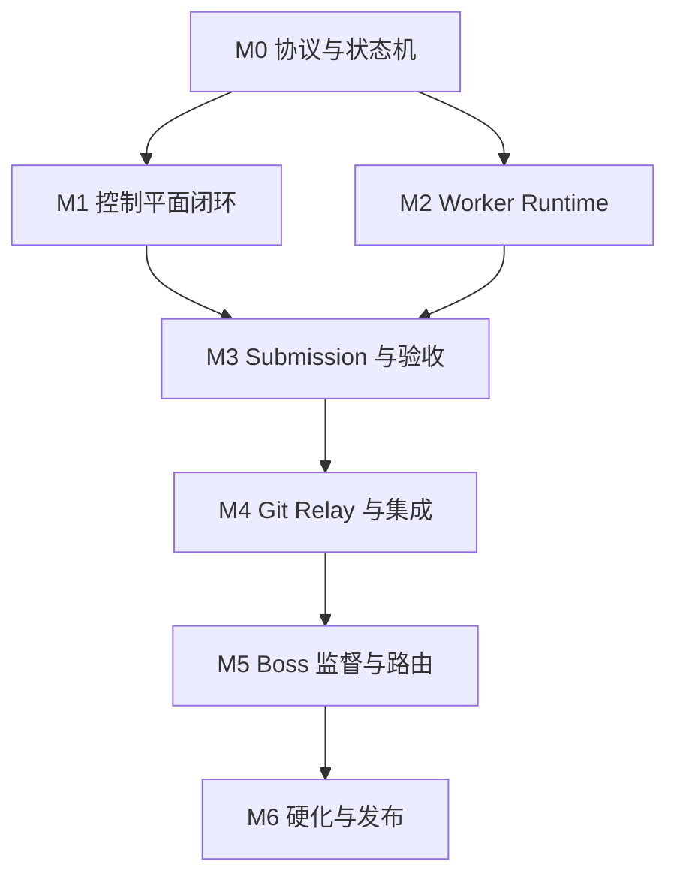

# AgentForge 开发里程碑与可执行工单

> 状态：实施基线  
> 原则：接口先行、证据先行、每包可独立验收、候选 Commit 不可变  
> 估算单位：一个“Agent 日”指一个 Executor 在完整 AFWP、可用基线和 Runner 下的有效工作量，不等于自然日

## 1. MVP 边界

MVP 必须证明的不是“同时启动多个聊天”，而是以下闭环：

1. Boss 把项目变成有依赖和验收的 AFWP；
2. 中央服务器持久化并发布任务，按能力匹配 Worker；
3. 三个局域网/外部 Worker 可非阻塞并行，断线后恢复；
4. jcode 在 Supervisor 驱动下持续计划、实现、自测和修复；
5. 旧 Lease 的迟到作者写入与 Candidate/Bundle 登记被 fencing 隔离；
6. 独立 Runner 和 Reviewer 绑定同一候选 Commit；
7. Git Broker/Relay 把结果安全送入局域网 Git；
8. Merge Queue 在最新目标分支复验后合并；
9. Boss 会话结束后 Obligation Engine 仍能唤起后续规划与督办；
10. 异构 Executor 路由和结算决策可解释、可重放。

MVP 不做：公有悬赏市场与现金支付、多地域强一致控制面、任意第三方不可信代码的完全隔离、复杂 Kubernetes 调度、原生移动客户端、全功能项目管理 UI。先提供 API、CLI 和只读运维页面。

## 2. 技术基线与仓库约定

本文件完全继承 [00_EXECUTIVE_IMPLEMENTATION_PLAN.md](00_EXECUTIVE_IMPLEMENTATION_PLAN.md) 的代码结构，不建立第二套 crate 命名：

```text
crates/
  domain/
  application/
  protocol/
  persistence-postgres/
  control-plane/
  matcher/
  obligation-engine/
  outbox/
  verification/
  git-integration/
  worker-daemon/
  protocol-a2a/
  test-support/
adapters/jcode-bridge/
schemas/
examples/
migrations/
tests/{contract,integration,chaos,e2e}/
deploy/{compose,systemd}/
docs/
```

早期草案或代码讨论中的局部名称只允许作为以下**组件别名**，不得出现在 AFWP ID、数据库聚合或另一份里程碑账本中：

| 局部别名 | 权威目录 |
| --- | --- |
| `af-core` | `crates/domain`（Cargo package `agentforge-domain`）；跨聚合用例在 `crates/application` |
| `af-protocol` | `crates/protocol`（Cargo package `agentforge-protocol`） |
| `af-store` | `crates/persistence-postgres` |
| `af-control-plane` / `af-cli` | `crates/control-plane` |
| `af-worker` | `crates/worker-daemon` |
| `af-jcode-bridge` | `adapters/jcode-bridge` |
| `af-runner` / `af-reviewer` | `crates/verification` |
| `af-git-broker` | `crates/git-integration` |
| `af-boss` | `crates/application` + `crates/domain/src/workgraph` + `crates/obligation-engine` |

公共质量门禁：

```bash
cargo fmt --all -- --check
cargo clippy --workspace --all-targets --all-features -- -D warnings
cargo test --workspace --locked
```

禁止在不同工单里同时改公共 API。公共契约由 specification 包先合并，消费者只依赖冻结 Artifact。每个实现包的 `base_commit` 必须在发布时填入真实完整 OID；本文不伪造未来 OID。

## 3. 全局 Definition of Done

所有代码包除自身 criterion 外还必须满足：

- 修改只位于 allowed paths，无未声明 submodule、生成物或大二进制；
- 新公共类型/API 有文档和向后兼容说明；
- 所有有副作用命令有 idempotency key、结构化错误和审计事件；
- 测试固定种子，不能靠 sleep 验证并发；
- 不记录 Secret、原始模型凭据或完整私有 Prompt；
- `cargo fmt/clippy/test` 通过；
- 提交信息包含 AFWP 要求的 trailers；
- L1–L4 证据完整，candidate/reviewed/tested/submitted head 一致；
- 独立 Runner 从干净 checkout 复现；
- Integrator 在最新目标分支执行 L5；
- 回滚方式已经实际演练或由测试证明。

文档/RFC 包必须通过链接、Schema、术语和需求覆盖检查，并至少由一个未参与编写的 Critic 进行冷启动复述。

## 4. 里程碑图



| 里程碑 | 演示出口 | 建议规模 |
| --- | --- | ---: |
| M0 | Schema、hash、事件/错误、Linter、四状态机和故障模拟一致 | 10–15 Agent 日 |
| M1 | PostgreSQL 事实源完成 publish/offer/claim/lease/fencing 闭环 | 15–22 Agent 日 |
| M2 | Linux Worker + jcode 可恢复执行；三 Worker 并行和断线场景通过 | 18–25 Agent 日 |
| M3 | candidate/evidence/reviewer/clean reproduction 绑定同一 Commit | 15–22 Agent 日 |
| M4 | 外部 Worker 通过 Git Bundle Relay，Merge Queue 在最新目标复验 | 10–16 Agent 日 |
| M5 | Boss session 退出后 obligation 持续推进；基础异构路由可解释 | 20–30 Agent 日 |
| M6 | 备份恢复、观测、故障演练、24 小时 soak 与 `v0.1.0` 试点 | 15–25 Agent 日 |

这些估算用于预算上界，不作为 Worker 自报工期。每个 Work Package 应控制在约 0.5–2 Agent 日；超过 2 日或触及三个以上公共组件时，Planner 必须重新拆分。

## 5. 权威里程碑与组件映射

工单 ID 统一为 `WP-M{里程碑}-{三位序号}`。下面的“组件轨”只是查找视图，不是另一套 Epic/Gate：

| 组件轨别名 | 所属权威里程碑 | 内容 |
| --- | --- | --- |
| Foundation / Protocol | M0 | workspace、测试支撑、AFWP/Submission、状态、hash、event/error、Linter |
| Control Plane | M1 | PostgreSQL、WorkGraph、Offer/Bid、Lease/Gateway |
| Worker | M2 | Node、Journal、jcode、Supervisor、local verifier、恢复 |
| Verification | M3 | Candidate、Submission/Evidence、Clean Runner、Reviewer |
| Git | M4 | Bundle Relay、Merge Queue 与 L5 |
| Boss / Routing | M5 | Project Contract、Decomposition、Obligation、PlanPatch、Matcher |
| Operations / Pilot | M6 | telemetry、恢复、chaos、真实试点与发布 |

## 6. M0：工程基础工单

### WP-M0-001：Cargo workspace 与最小服务骨架

- 类型：implementation；路由：`rust.repository-bootstrap`；风险：low；估算：1.0 Agent 日
- 依赖：无
- allowed paths：`Cargo.toml`、`Cargo.lock`、`rust-toolchain.toml`、`crates/**` 中各 crate 的空骨架、`.gitignore`、`README.md`
- 交付：上述 workspace；每个 crate 有 `lib.rs`/`main.rs` 和最小 smoke test；固定 Rust channel
- AC-M0-001-A：`cargo metadata --locked --no-deps` 退出 0，列出的 workspace members 与第 2 节一致；hard
- AC-M0-001-B：`cargo build --workspace --locked` 在干净 Linux Runner 退出 0；hard
- AC-M0-001-C：`cargo test --workspace --locked` 至少执行一个 smoke test/核心 crate，退出 0；hard
- AC-M0-001-D：仓库不包含凭据、target 目录或超过 1 MiB 的非声明二进制；hard

### WP-M0-006：公共测试与证据约定

- 类型：specification + implementation；路由：`test.infrastructure`；风险：medium；估算：1.0 Agent 日
- 依赖：WP-M0-001
- allowed paths：`tests/**`、`crates/test-support/**`、`docs/development/**`
- 交付：固定时钟、UUID v7 generator、deterministic RNG、event recorder、JUnit/JSON evidence helper
- AC-M0-006-A：同 seed/clock 的两次测试输出（去除运行时 duration）字节一致；hard
- AC-M0-006-B：测试 helper 禁止调用真实外网和宿主 Git credential；hard
- AC-M0-006-C：一个故意失败 fixture 产生包含 argv、exit code、seed、runner fingerprint 的证据；hard

#### M0 构建先决条件（非里程碑出口）

`cargo fmt/clippy/test` 在固定 Runner 全部通过；新开发者只根据 README 可在 15 分钟内启动数据库并运行 workspace tests。

## 7. M0：协议与状态工单

### WP-M0-002：AFWP/Submission Rust 类型与 Schema 嵌入

- 类型：implementation；路由：`rust.schema`；风险：medium；估算：1.5 Agent 日
- 依赖：WP-M0-001
- allowed paths：`crates/protocol/**`、`schemas/**`、`examples/**`
- 交付：严格 serde 类型；draft 2020-12 validator；Schema digest API；正反例 fixture
- AC-M0-002-A：AFWP、candidate Submission 与 salvage Submission 三个仓库示例通过对应 Schema；hard
- AC-M0-002-B：缺任一 required 字段、未知字段、错误 ID/hash/OID pattern 的反例逐个失败并命中预期 JSON Pointer；hard
- AC-M0-002-C：解析重复 JSON key 必须失败；hard
- AC-M0-002-D：`af-cli schema list` 输出 schema_version、`$id` 和 SHA-256；hard

### WP-M0-004：JCS canonicalization 与 package hash

- 类型：implementation；路由：`protocol.crypto-canonicalization`；风险：high；估算：1.0 Agent 日
- 依赖：WP-M0-002
- allowed paths：`crates/protocol/src/canonical/**`、`crates/protocol/tests/hash_*`、conformance vectors
- 交付：`AFWP-C14N-1`；hash verify；跨语言 vector
- AC-M0-004-A：示例任务包计算值严格等于 `sha256:e02271c1d96c4b82fa250eecaac34ea4a8542639b9d87d7cf4b26d11ac95b83f`；hard
- AC-M0-004-B：键顺序/空白变化不改变 hash；数组调序、字符串或数字变化改变 hash；hard
- AC-M0-004-C：移除字段必须只移除顶层 `package_hash`，嵌套同名字段不得特殊处理；hard
- AC-M0-004-D：与独立 JavaScript JCS 实现跑 1000 个 property vectors 完全一致；hard

### WP-M0-005：事件 Envelope、幂等键与稳定错误码

- 类型：specification + implementation；路由：`protocol.domain-events`；风险：high；估算：1.0 Agent 日
- 依赖：WP-M0-001、WP-M0-003
- allowed paths：`crates/domain/src/event/**`、`crates/domain/src/error/**`、`crates/domain/tests/event_*`、`docs/development/02_AFWP_PROTOCOL_SPEC.md`
- 交付：版本化 event envelope；command metadata；idempotency scope/key；稳定 error enum 与 HTTP adapter mapping fixture
- AC-M0-005-A：同一 command ID/idempotency key 同 payload 可重放，同 key 不同 payload 返回 `AF_IDEMPOTENCY_KEY_REUSED`；hard
- AC-M0-005-B：所有领域错误都有稳定 code、retryable 分类和不含 Secret 的 details；hard
- AC-M0-005-C：event encode/decode 后 aggregate ID、version、causation、correlation、actor 与 payload digest 不变；hard
- AC-M0-005-D：未知 optional event metadata 被安全保留，未知强制语义不得改变 aggregate；hard

### WP-M0-007：AFWP 语义 Linter

- 类型：implementation；路由：`protocol.validation`；风险：high；估算：2.0 Agent 日
- 依赖：WP-M0-002、WP-M0-004
- allowed paths：`crates/protocol/src/lint/**`、`crates/control-plane/src/cli/commands/lint*`、`tests/contract/lint/**`
- 交付：发布 profile、candidate-ready profile；稳定 finding code/JSON Pointer；CLI JSON 输出
- AC-M0-007-A：检测 MUST 未被 hard AC 覆盖、悬空 covers、重复 ID、Lease 时间关系、缺 changed-path gate；hard
- AC-M0-007-B：检测 DAG 环、缺 dependency revision、委派越权；hard
- AC-M0-007-C：每个仓库反例只断言稳定 code，不依赖人类 message；hard
- AC-M0-007-D：`af-cli afwp lint examples/afwp-lease-fencing.json --profile publish` 退出 0；hard

### WP-M0-003：四 aggregate 状态机

- 类型：implementation；路由：`rust.domain-model`；风险：high；估算：1.5 Agent 日
- 依赖：WP-M0-006
- allowed paths：`crates/domain/src/state/**`、`crates/domain/tests/state_*`
- 交付：WorkPackage、Attempt、Lease、Submission 命令/事件/transition；expected_version CAS 输入
- AC-M0-003-A：每个允许 transition 有表驱动 PASS 测试；每个未声明 transition 返回 `DomainError::InvalidTransition`，HTTP 映射为 `AF_TRANSITION_INVALID`；hard
- AC-M0-003-B：Lease 终态不可恢复，Submission 终态不可覆盖；hard
- AC-M0-003-C：property test 的任意命令序列不能产生两个 ACTIVE generation；hard
- AC-M0-003-D：事件重放得到的状态与在线 apply 一致；hard

### WP-M0-008：协议故障模拟器

- 类型：test；路由：`distributed-systems.testing`；风险：high；估算：1.5 Agent 日
- 依赖：WP-M0-005、WP-M0-007、WP-M0-003
- allowed paths：`tests/conformance/simulator/**`
- 交付：内存 aggregate/outbox/inbox 模拟；重复、乱序、丢响应、过期注入
- AC-M0-008-A：10,000 个 seeded schedule 无双重正式 Submission；hard
- AC-M0-008-B：DB commit 后丢响应并重试，只产生一个 domain effect/outbox event；hard
- AC-M0-008-C：generation 3 在 generation 4 生效后所有正式写入都被拒绝；hard
- AC-M0-008-D：失败 seed 可持久化并单独重放；hard

#### M0 退出门禁

- 陌生 Critic 只读示例 AFWP，正确复述 4 条 requirement、范围与 5 条验收；
- Schema/hash/Linter/state simulator 全通过；
- 100% MUST 有 hard AC；
- 重复、乱序、过期模拟不产生双重副作用。

## 8. M1：中央控制平面

### WP-M1-001：本地 PostgreSQL 与测试夹具

- 类型：implementation；路由：`devex.test-infrastructure`；风险：low；估算：1.0 Agent 日
- 依赖：WP-M0-001
- allowed paths：`deploy/compose/**`、`crates/persistence-postgres/tests/**`、`scripts/dev/**`、相关文档
- 交付：固定 digest 的 PostgreSQL compose；migration/test database helper；ready/cleanup 命令
- AC-M1-001-A：在全新环境启动后 60 秒内 healthcheck healthy；hard
- AC-M1-001-B：并行启动两个测试数据库时 schema/name 隔离，清理后无残留 container/volume；hard
- AC-M1-001-C：固定 seed 连续运行 setup/teardown 20 次无失败；hard
- AC-M1-001-D：数据库密码只从本地 ephemeral env/file 注入，不提交默认生产凭据；hard

### WP-M1-002：PostgreSQL event、aggregate、Outbox/Inbox

- 类型：implementation；路由：`backend.postgresql`；风险：critical；估算：2.0 Agent 日
- 依赖：WP-M1-001、WP-M0-003
- allowed paths：`crates/persistence-postgres/**`、`migrations/**event*outbox*`
- 交付：事务 repository；aggregate version unique constraint；outbox poller；inbox dedupe
- AC-M1-002-A：命令 domain write 与 outbox 同事务；在每个 commit point kill/restart 后不存在孤儿行；hard
- AC-M1-002-B：并发 expected_version 更新只有一个成功，失败为稳定 conflict；hard
- AC-M1-002-C：同 event 投递 100 次仅应用一个 projection effect；hard
- AC-M1-002-D：从空投影重放 100,000 个事件的结果 digest 与在线投影一致；hard

### WP-M1-003：Project/WorkGraph 与 Ready 投影

- 类型：implementation；路由：`backend.graph-state`；风险：high；估算：1.5 Agent 日
- 依赖：WP-M0-007、WP-M1-002
- allowed paths：`crates/control-plane/src/project/**`、`crates/domain/src/workgraph/**`、相关 migrations/tests
- 交付：package publish/supersede；依赖边；Ready/Blocked 原因；graph version
- AC-M1-003-A：不存在、revision 不符或条件未满足的依赖不能 OFFERED；hard
- AC-M1-003-B：accepted 与 integrated 条件被区分；依赖 integrated 的包不会在仅 accepted 时 Ready；hard
- AC-M1-003-C：并发发布形成环时事务拒绝最后一条边；hard
- AC-M1-003-D：图无 Ready/Active 且项目未完成时产生 `graph.deadlock_suspected`；hard

### WP-M1-004：Offer、Bid 与 Claim API

- 类型：implementation；路由：`backend.crud`；风险：medium；估算：1.5 Agent 日
- 依赖：WP-M1-003
- allowed paths：`crates/control-plane/src/offer/**`、`crates/control-plane/src/bid/**`、`crates/control-plane/src/routes/**`、相关 migrations/tests
- 交付：去敏 Offer；Bid expiry；provisional claim；stable errors；OpenAPI
- AC-M1-004-A：同 executor/offer 的重复 Bid key 返回原记录，不重复预留容量；hard
- AC-M1-004-B：过期 Bid 不可 claim；两个 exclusive claim 并发时只有一个成功；hard
- AC-M1-004-C：Offer 不包含 repository Secret、完整私有输入或 Prompt；hard
- AC-M1-004-D：OpenAPI contract test 覆盖成功及全部 4xx error code；hard

### WP-M1-005：正式 Lease 与 generation fencing

- 类型：implementation；路由：`backend.distributed-concurrency`；风险：critical；估算：2.0 Agent 日
- 依赖：WP-M1-002、WP-M1-004
- allowed paths：`crates/control-plane/src/lease/**`、`crates/control-plane/src/attempt/**`、lease migrations/tests
- 规格实例：`examples/afwp-lease-fencing.json`
- 交付：原子 generation；renew/checkpoint/artifact/submission fence；salvage 隔离
- AC-M1-005-A：执行示例 `AC-FENCE-01`；hard
- AC-M1-005-B：执行示例 `AC-IDEMP-02` 的至少 1000 cases；hard
- AC-M1-005-C：执行示例 `AC-SALVAGE-03`，旧结果 QUARANTINED 且无 verify event；hard
- AC-M1-005-D：客户端时间前移/后移不改变 generation 与过期判断；hard

### WP-M1-006：Worker Gateway（HTTPS + SSE/长轮询）

- 类型：implementation；路由：`backend.networking`；风险：high；估算：2.0 Agent 日
- 依赖：WP-M1-004、WP-M1-005
- allowed paths：`crates/control-plane/src/gateway/**`、`crates/control-plane/src/auth/**`、`crates/control-plane/src/middleware/**`、相关 routes/tests
- 交付：outbound-only Worker session；cursor resume；mTLS/token adapter；rate limit
- AC-M1-006-A：NAT 后 Worker 不开入站端口仍能取 Offer、续 Lease、传事件；hard
- AC-M1-006-B：SSE 在 event 37 断线，以 cursor 37 恢复后无缺口；重复事件可安全去重；hard
- AC-M1-006-C：无效/过期 node credential 无法读项目 Offer；hard
- AC-M1-006-D：恶意大 payload、慢请求和超率请求被限制且不占满连接池；hard

### WP-M1-007：MVP Lease 到期义务 Timer

- 类型：implementation；路由：`workflow.durable-timer`；风险：high；估算：1.0 Agent 日
- 依赖：WP-M1-002、WP-M1-005
- allowed paths：`crates/obligation-engine/src/lease_expiration/**`、`crates/persistence-postgres/**`、相关 migrations/tests
- 交付：持久到期义务；`FOR UPDATE SKIP LOCKED`/CAS owner claim；server-clock 扫描；expire/reoffer 事件
- AC-M1-007-A：服务在到期前后任意点重启，义务最终执行且同 Lease 只产生一个 expire 业务效果；hard
- AC-M1-007-B：两个 Timer 实例并发领取同义务时只有一个 owner 成功，失败实例不重复 reoffer；hard
- AC-M1-007-C：Worker 客户端时间不能延迟到期；renew 与 expire 并发时由同一事务/CAS 决出唯一结果；hard
- AC-M1-007-D：执行失败按持久 backoff 重试，达到上限产生可见告警而不丢义务；hard

#### M1 退出门禁

通过 API 发布 AFWP、报价、claim、激活/续期/过期；PostgreSQL 故障注入后状态可重建；到期义务可恢复；旧 generation 永远无法产生 checkpoint/artifact 等正式副作用。Submission 的完整证据登记留到 M3。

## 9. M2：Worker Runtime 与 jcode

### WP-M2-001：Node 注册、Executor 指纹与容量

- 类型：implementation；路由：`worker.runtime`；风险：medium；估算：1.0 Agent 日
- 依赖：WP-M0-005、WP-M0-007
- allowed paths：`crates/worker-daemon/src/node/**`、`crates/worker-daemon/src/config/**`、相关测试
- 交付：配置解析；fingerprint；NodeSessionLease；slot 状态；draining
- AC-M2-001-A：相同配置跨重启 fingerprint 一致，模型/Prompt/jcode/tool 任一变化则不同；hard
- AC-M2-001-B：NodeSession 过期不直接取消 TaskLease；hard
- AC-M2-001-C：容量不超卖，draining 不接受新任务；hard

### WP-M2-002：工作区与本地 Journal

- 类型：implementation；路由：`worker.git-filesystem`；风险：high；估算：1.5 Agent 日
- 依赖：WP-M2-001
- allowed paths：`crates/worker-daemon/src/workspace/**`、`crates/worker-daemon/src/journal/**`、tests
- 交付：每 Attempt 独立 worktree；SQLite WAL Journal；checkpoint；cleanup/quarantine
- AC-M2-002-A：并行 Attempt 的文件、branch、环境和 journal 完全隔离；hard
- AC-M2-002-B：在每个 journal write 边界 kill 进程，重启后恢复到最后完整 record，无半行；hard
- AC-M2-002-C：路径穿越、symlink 越界和 forbidden path 修改被拒绝；hard
- AC-M2-002-D：Lease 丢失后 workspace 只读/隔离，不再由 jcode 改动；hard

### WP-M2-003：jcode Bridge 与 Prompt Compiler

- 类型：implementation；路由：`agent-runtime.integration`；风险：high；估算：2.0 Agent 日
- 依赖：WP-M0-007、WP-M2-002
- allowed paths：`adapters/jcode-bridge/**`、adapter fixtures
- 交付：会话启动/继续/取消；AFWP 编译 prompt；结构化 tool/event capture；mock jcode
- AC-M2-003-A：Prompt 明确目标、scope、interfaces、AC、权限、请示规则，不含宿主 Secret；hard
- AC-M2-003-B：只给 mock Agent 编译 prompt，它能输出与 Linter 一致的目标/边界/验收复述；hard
- AC-M2-003-C：Agent 结束一轮只产生 `turn.ended`，不自动把 Attempt 标为完成；hard
- AC-M2-003-D：取消/timeout 能终止子进程树并保存最后 checkpoint；hard

### WP-M2-004：Supervisor、Turn Pump 与 Watchdog

- 类型：implementation；路由：`agent-runtime.supervision`；风险：critical；估算：2.0 Agent 日
- 依赖：WP-M2-003
- allowed paths：`crates/worker-daemon/src/supervisor/**`、`adapters/jcode-bridge/src/turn_pump/**`
- 交付：确定性 phase loop；milestone；无进展检测；预算；waiting/wake；升级链
- AC-M2-004-A：Agent 提前说“完成”但 hard AC 未跑时，Supervisor 继续发送下一最小动作；hard
- AC-M2-004-B：连续两轮 tree hash、criterion、finding 和 milestone 均无变化，触发诊断而非无限 nudge；hard
- AC-M2-004-C：达到预算/时间/重试上限时结构化 BLOCKED，不继续花费；hard
- AC-M2-004-D：进入 WAITING_INPUT 释放模型 slot，wake event 后从 journal 精确恢复；hard

### WP-M2-005：Worker 本地 Verifier 与 Evidence capture

- 类型：implementation；路由：`test.runner`；风险：high；估算：2.0 Agent 日
- 依赖：WP-M0-007、WP-M2-004
- allowed paths：`crates/verification/src/local/**`、`crates/worker-daemon/src/verifier/**`
- 交付：argv spawn；环境/网络/资源策略；criterion result；changed paths；日志 digest
- AC-M2-005-A：不使用 shell 解析，包含空格/引号/元字符的 argv 原样传给 fixture；hard
- AC-M2-005-B：timeout 杀死进程树，结果为 FAIL/INCONCLUSIVE 策略定义值且保留证据；hard
- AC-M2-005-C：所有 flaky 尝试都记录，不能选择性丢弃失败；hard
- AC-M2-005-D：候选有一字节改变时旧本地证据不再可用；hard

### WP-M2-006：断网、恢复与 salvage

- 类型：implementation；路由：`worker.resilience`；风险：high；估算：1.5 Agent 日
- 依赖：WP-M1-006、WP-M2-002、WP-M2-004
- allowed paths：`crates/worker-daemon/src/recovery/**`、gateway client、tests
- 交付：cursor reconnect；offline grace；outbound event spool；lost lease handling
- AC-M2-006-A：断网 5 分钟再连，未过期 Lease 续传 checkpoint 且不重复副作用；hard
- AC-M2-006-B：断网跨过 TTL，恢复后旧正式事件停止，仅允许 salvage；hard
- AC-M2-006-C：本地队列达到上限时停止新 Agent turn，不丢弃已有事件；hard
- AC-M2-006-D：模拟磁盘满返回明确 fault，不能生成声称完整的 Evidence；hard

### WP-M2-007：rootless OCI Sandbox

- 类型：implementation；路由：`worker.sandbox`；风险：critical；估算：1.5 Agent 日
- 依赖：WP-M2-002
- allowed paths：`crates/worker-daemon/src/sandbox/**`、`deploy/containers/**`、sandbox fixtures/tests
- 交付：rootless Podman 优先的 OCI adapter；只读基线 + 可写 Attempt mount；网络/资源策略；进程树清理
- AC-M2-007-A：容器内不能读取宿主凭据目录、control-plane token、SSH agent/socket 或其他 Attempt workspace；hard
- AC-M2-007-B：默认网络 deny；AFWP allowlist 之外的 DNS/IP/loopback/link-local 访问全部失败并留审计；hard
- AC-M2-007-C：CPU、memory、pids、disk/timeout 上限可执行，超限产生结构化 failure dossier；hard
- AC-M2-007-D：Agent 退出/取消/Worker 重启后无孤儿容器和子进程，工作区与 Journal 保留策略正确；hard

#### M2 退出门禁

- 单 Worker 用 fake Executor 走到 WorkerPhase `AuthorComplete`（服务端 AttemptState 为 `Candidate`）；再用真实 jcode 完成一个低风险 fixture 的本地门禁；M2 可以用 fake Candidate Broker，正式 sealing/独立验收由 M3 实现；
- 三 Worker 同时完成三个不冲突任务；
- 强制 kill Worker、断网和 Lease 过期，恢复后 journal 一致；
- Lease 丢失后 generation 3 的 Git、Artifact 和正式 Candidate 登记副作用立即停止；generation 4 可从新 Attempt 正常推进。

## 10. M3：候选、证据与独立验收

### WP-M3-001：Git Broker 与不可变候选 Commit

- 类型：implementation；路由：`git.security`；风险：critical；估算：2.0 Agent 日
- 依赖：WP-M2-002、WP-M2-005
- allowed paths：`crates/git-integration/src/candidate/**`、`crates/git-integration/src/policy/**`、相关 tests
- 交付：宿主 Broker；branch prefix；trailers；Candidate Artifact 分块上传/完成；candidate freeze；Git OID/tree verify
- AC-M3-001-A：jcode 沙箱没有 Git push credential，只有 Broker 能写 task branch；hard
- AC-M3-001-B：越界 branch、缺 trailer、base 不可达或 dirty/untracked 交付均拒绝；hard
- AC-M3-001-C：candidate freeze 后 amend/force push 被拒绝，新字节只能创建新 candidate；hard
- AC-M3-001-D：并发重复 create 同 idempotency key 只得到一个 candidate OID；hard
- AC-M3-001-E：有效作者 Lease 下 init 预留 Candidate ID，分块上传并 complete 后，`RecordCandidate` 只能绑定同 Attempt/token/OID/tree 的 COMPLETE Artifact，随后原子关闭 Lease 并创建 VerificationRun；独立 Runner 在作者离线后仍能按 Candidate ID 取得并验证精确 Bundle；hard

### WP-M3-002：Submission 与 Evidence Bundle

- 类型：implementation；路由：`provenance.supply-chain`；风险：critical；估算：2.0 Agent 日
- 依赖：WP-M0-007、WP-M1-005、WP-M3-001
- allowed paths：`crates/control-plane/src/submission/**`、`crates/verification/src/evidence/**`、migrations/tests
- 交付：Submission validation；Failure Dossier；bundle manifest；content addressing；Ed25519 verification；lineage
- AC-M3-002-A：示例 Submission 通过 Schema 和 candidate-ready 语义验证；hard
- AC-M3-002-B：package hash、generation、head、deliverable 或 signature 任一篡改均失败；hard
- AC-M3-002-C：相同 Submission 不可覆盖；新版本保留 lineage；hard
- AC-M3-002-D：过期 Lease 的 normal Candidate 登记返回 `AF_LEASE_EXPIRED` 且不创建 Candidate；只有显式 salvage API 可创建 `QUARANTINED` Submission；hard
- AC-M3-002-E：交换 candidate 与 salvage 的 `signer_role` 时，即使攻击者使用已注册但仅获错误角色授权的 key 重新计算 digest 和有效 Ed25519 签名，语义验证仍返回稳定的 `AF_SIGNATURE_INVALID`，不得产出 candidate-ready 或 quarantine 记录；hard
- AC-M3-002-F：分别在 `PROVENANCE_CHECK` 阶段注入确定性 `FAIL` 与 `INCONCLUSIVE`，VerificationRun 和关联 Attempt 必须收敛到对应终态并生成 stage-aware Failure Dossier；签名 Manifest 绑定 package revision、Candidate、Candidate Artifact、VerificationRun、失败阶段、outcome 与 evidence digest，不得伪造尚未发生的 criterion、Review 或 clean-reproduction 事实，也不得冒充 candidate-ready Submission；hard

### WP-M3-003：干净 Runner

- 类型：implementation；路由：`test.isolated-reproduction`；风险：critical；估算：2.0 Agent 日
- 依赖：WP-M3-001、WP-M3-002
- allowed paths：`crates/verification/src/isolated/**`、runner image、tests
- 交付：固定镜像；clean checkout；dependency hydration；network off；result signer
- AC-M3-003-A：只用 base/candidate/lock/input digest 在空缓存环境复现；hard
- AC-M3-003-B：依赖未跟踪文件的故意坏候选，本地 PASS 但 clean Runner 必须 FAIL；hard
- AC-M3-003-C：Runner 接收候选只读，不可 push 或改写 branch；hard
- AC-M3-003-D：tested_head 和 evidence 中 tree hash 与候选一致；hard

### WP-M3-004：独立 Reviewer

- 类型：implementation；路由：`review.correctness`；风险：high；估算：2.0 Agent 日
- 依赖：WP-M3-002、WP-M3-003
- allowed paths：`crates/verification/src/reviewer/**`、review prompt/fixtures
- 交付：read-only review package；finding Schema；model-family independence check；adjudication hook
- AC-M3-004-A：Reviewer 不读取 author conversation/journal，只读取允许输入；hard
- AC-M3-004-B：Reviewer 不能修改 candidate，攻击性测试只在临时目录保存为 Artifact；hard
- AC-M3-004-C：open Critical/High 或 verdict != pass 时 candidate-ready 为 false；hard
- AC-M3-004-D：critical 包的同模型家族 author/reviewer 组合被拒绝；hard

#### M3 退出门禁

PASS/candidate-ready 时 `TestedHead = ReviewedHead = SubmittedHead = CandidateHead` 由代码强制；提前失败只记录真实已产生的 Head。候选任一字节变化使旧 Evidence 失效；`INCONCLUSIVE` 不可 Accepted；独立 Runner 只靠冻结输入复现。IntegrationHead 可不同，但必须绑定 Candidate 与目标基线并另跑 L5。

## 11. M4：Git Relay 与 Merge Queue

### WP-M4-001：Git Bundle Relay

- 类型：implementation；路由：`git.networking`；风险：high；估算：2.0 Agent 日
- 依赖：WP-M3-001、WP-M3-002
- allowed paths：`crates/git-integration/src/bundle/**`、relay service/tests
- 交付：外部 Worker 增量 bundle；upload resume；server verify；局域网 task branch materialization
- AC-M4-001-A：外部 Worker 无局域网 Git 路由仍能上传并生成精确 candidate branch；hard
- AC-M4-001-B：截断、篡改、缺 base 或超大小 Bundle 被拒绝；hard
- AC-M4-001-C：同 bundle 重复/分片重传不重复生成 branch/submission；hard
- AC-M4-001-D：Relay 只允许声明 task branch，不能写主分支/tag；hard

### WP-M4-002：Merge Queue 与 L5

- 类型：implementation；路由：`integration.git`；风险：critical；估算：2.0 Agent 日
- 依赖：WP-M3-003、WP-M3-004、WP-M4-001
- allowed paths：`crates/git-integration/src/merge_queue/**`、integration runner/tests
- 交付：queue；synthetic integration commit；conflict -> RebasePackage；L5；rollback point
- AC-M4-002-A：只有 PASS Submission 可入队；head/evidence/fence 任一不符拒绝；hard
- AC-M4-002-B：目标分支前移时基于候选和最新目标生成新 synthetic commit 并重跑，不 amend candidate；hard
- AC-M4-002-C：冲突创建 RebasePackage，不能由 Integrator 静默修改已验收候选；hard
- AC-M4-002-D：L5 失败不合并；成功合并记录 integration OID 与可执行 rollback；hard

#### M4 退出门禁

外部 Worker 不访问局域网 Git，通过 Relay 提交；candidate、reviewed、tested OID 完全一致；目标分支前移和一次人为冲突被安全处理；最终 L5 合并且可回滚。

## 12. M5：分层 Boss 与持续监督

### WP-M5-001：Project Contract 与 Root Boss Adapter

- 类型：implementation；路由：`architecture.agent-orchestration`；风险：high；估算：2.0 Agent 日
- 依赖：WP-M0-007、WP-M1-003
- allowed paths：`crates/application/src/boss/project/**`、adapter/prompt/tests
- 交付：用户需求 -> Project Contract draft；需求 IDs；约束/非目标；Boss provenance
- AC-M5-001-A：固定需求 fixture 生成的每个 MUST 有稳定 source ID，未解决歧义被列出而非猜测；hard
- AC-M5-001-B：Boss 无权直接发布，输出先进入 Decomposition Critic/Linter；hard
- AC-M5-001-C：重启 Boss session 后可仅从 Project Contract/事件恢复，不依赖隐藏聊天；hard

### WP-M5-002：Decomposition 与冷启动 Critic

- 类型：implementation；路由：`planning.decomposition`；风险：critical；估算：2.0 Agent 日
- 依赖：WP-M5-001
- allowed paths：`crates/application/src/boss/decomposition/**`、`crates/domain/src/workgraph/**`、critics/tests
- 交付：WorkGraph/AFWP drafts；DQS；冷启动复述；interface-first rule
- AC-M5-002-A：每个项目 MUST 至少映射到一个 package requirement 和 hard AC；hard
- AC-M5-002-B：包含共享接口的任务先生成 specification package，消费者依赖其 integrated/accepted contract；hard
- AC-M5-002-C：Critic 只读 AFWP 能输出目标、边界、首动作、验收；偏离则不能 publish；hard
- AC-M5-002-D：任务超过预算/写集/上下文阈值时提出拆分，不递归超过 grant；hard

### WP-M5-003：Obligation Engine

- 类型：implementation；路由：`workflow.durable-supervision`；风险：critical；估算：2.0 Agent 日
- 依赖：WP-M1-002、WP-M1-003、WP-M5-001
- allowed paths：`crates/obligation-engine/**`、migrations/tests
- 交付：持久 obligation；wake conditions；Nudge/diagnose/replan escalation；owner lease
- AC-M5-003-A：Boss 进程在产生 obligation 后退出，条件满足时另一实例恰好唤起一次处理；hard
- AC-M5-003-B：重复事件不重复创建逻辑 obligation；handler crash 后可重试；hard
- AC-M5-003-C：项目未完成且 10 分钟无 Ready/Active 时创建 deadlock diagnosis；hard
- AC-M5-003-D：N 次无进展按 policy 从 nudge -> diagnose -> critic -> replan 升级，不无限催促；hard

### WP-M5-004：DelegationGrant、ExpansionProposal 与 PlanPatch

- 类型：implementation；路由：`workflow.dynamic-dag`；风险：critical；估算：2.0 Agent 日
- 依赖：WP-M5-002、WP-M5-003
- allowed paths：`crates/application/src/boss/delegation/**`、`crates/domain/src/workgraph/plan_patch/**`、graph tests
- 交付：分层 Domain Boss；权限/预算子集校验；影响分析；graph CAS
- AC-M5-004-A：子 Boss 不能扩大路径、Secret、外部副作用、预算、深度或 task kind；hard
- AC-M5-004-B：旧 graph_version 的 PlanPatch 返回冲突并要求重算；hard
- AC-M5-004-C：Patch 列出新增/替代/取消包及 requirement coverage 影响，不能制造环；hard
- AC-M5-004-D：已 active 包受接口变更影响时进入明确 supersede/rebase/continue 决策，不静默改变规格；hard

### WP-M5-005：架构 Tournament 与 synthesis

- 类型：implementation；路由：`architecture.tournament`；风险：medium；估算：1.5 Agent 日
- 依赖：WP-M5-002、WP-M5-004
- allowed paths：`crates/application/src/boss/tournament/**`、rubrics/tests
- 交付：N 个独立 RFC；反方 Critic；统一量表；来源追踪 synthesis
- AC-M5-005-A：参赛 Agent 不读取其他候选；输入与预算相同；hard
- AC-M5-005-B：Critic 评分覆盖正确性、故障、演进、成本、回滚，不以文风决定胜者；hard
- AC-M5-005-C：synthesis 标记吸收来源、被拒方案和原因，并生成可执行后续 AFWP；hard

#### M5 Boss 子门禁

Root Boss 为演示项目生成接口、CRUD、前端、Review、Integration 包；Boss session 退出后，子包完成/阻塞/失败事件仍由 Obligation Engine 驱动下一步；动态扩图不越权且 requirement coverage 保持 100%。

## 13. M5：异构匹配与悬赏

### WP-M5-006：Executor Profile、taxonomy 与 fingerprint

- 类型：implementation；路由：`scheduler.capability-model`；风险：high；估算：1.5 Agent 日
- 依赖：WP-M2-001、WP-M1-002
- allowed paths：`crates/matcher/src/profile/**`、taxonomy/migrations/tests
- 交付：immutable profile；capability taxonomy；qualification lifecycle
- AC-M5-006-A：Profile 变化产生新 fingerprint，旧 outcome 不被当作同一配置；hard
- AC-M5-006-B：层级能力不错误蕴含所有子能力；hard
- AC-M5-006-C：security qualification 按 task class/security level 保存；hard

### WP-M5-007：硬过滤、预测、Pareto 与评分

- 类型：implementation；路由：`scheduler.optimization`；风险：critical；估算：2.0 Agent 日
- 依赖：WP-M5-006、WP-M1-004
- allowed paths：`crates/matcher/src/route/**`、policy/tests
- 交付：纯函数 route；decision snapshot；stable rejection codes
- AC-M5-007-A：不满足 required 的候选不可能被分数救回；hard
- AC-M5-007-B：同 snapshot + seed 的决策字节一致；hard
- AC-M5-007-C：Pareto 与风险权重使用 `05_MATCHING_BOUNTY_CAPABILITY.md` fixture 验证；hard
- AC-M5-007-D：无可行候选返回 BLOCKED，不自动放宽；hard

### WP-M5-008：Outcome、保守统计与手动 Canary

- 类型：implementation；路由：`scheduler.outcome-statistics`；风险：high；估算：2.0 Agent 日
- 依赖：WP-M3-002、WP-M5-006
- allowed paths：`crates/matcher/src/outcome/**`、stats/canary/tests
- 交付：按 task class/repository 的切片统计；Beta 可信下界；人工批准 Canary/qualification；suspend。MVP 不自动训练复杂路由模型，自动探索 feature-gate 默认关闭
- AC-M5-008-A：`AF_TASK_INVALID`/infra failure 不计质量失败，Submission 重复不重复计数；hard
- AC-M5-008-B：半衰期和相似度权重的固定 fixture 得到预期 alpha/beta；hard
- AC-M5-008-C：新 fingerprint 不能直接接 critical；按阈值晋级；hard
- AC-M5-008-D：模拟性能突降后停止关键路由并保留旧决策可重放；hard

### WP-M5-009：Bid 校准、预算与结算账本

- 类型：implementation；路由：`scheduler.bounty-ledger`；风险：high；估算：1.5 Agent 日
- 依赖：WP-M5-007、WP-M5-008
- allowed paths：`crates/matcher/src/bid/**`、`settlement/**`、migrations/tests
- 交付：sealed bid；估时校准；double-entry ledger；分阶段 payout
- AC-M5-009-A：总 debit = total credit，重复 settlement cause 不重复入账；hard
- AC-M5-009-B：TASK_INVALID 不处罚信誉，实际基础设施成本仍进入项目账；hard
- AC-M5-009-C：高返工低首价 fixture 中，expected total cost 路由选择更稳候选；hard
- AC-M5-009-D：作者、Reviewer、Runner、integration reserve 总额不超 AFWP budget；hard

#### M5 退出门禁

配置四类异构 Executor bootstrap 先验，运行标准基准和至少 10 个 low-risk Canary；所有选择可解释到硬过滤、后验、Pareto 和 policy；新模型升级不会继承 TRUSTED 状态。

## 14. M6：硬化、试点与灾难恢复

### WP-M6-001：指标、追踪与操作看板

- 类型：implementation；路由：`operations.observability`；风险：medium；估算：2.0 Agent 日
- 依赖：WP-M1-006、WP-M2-004、WP-M4-002、WP-M5-007
- allowed paths：`crates/**/telemetry/**`、`deploy/observability/**`、只读 console
- 交付：OpenTelemetry；task/attempt/lease/submission timeline；route explanation；告警
- AC-M6-001-A：从单个 trace 可关联 package revision、attempt、lease generation、submission 和 integration；hard
- AC-M6-001-B：指标/日志不含 token、Secret、私有 prompt；hard
- AC-M6-001-C：stale write、deadlock suspicion、outbox lag、lease expiry storm 有告警 fixture；hard

### WP-M6-002：备份、恢复与事件重建

- 类型：operations；路由：`database.disaster-recovery`；风险：critical；估算：2.0 Agent 日
- 依赖：WP-M1-002、WP-M3-002
- allowed paths：`deploy/backup/**`、restore tooling/docs/tests
- 交付：PostgreSQL backup/restore；Artifact inventory；projection rebuild；RPO/RTO report
- AC-M6-002-A：从备份在隔离环境恢复，package/attempt/lease/submission counts 与 digest 一致；hard
- AC-M6-002-B：清空 projection 后从 event ledger 重建得到相同 snapshot；hard
- AC-M6-002-C：Artifact 缺失会列出精确 digest，不静默标记完整；hard
- AC-M6-002-D：演练达到试点 RPO <= 5 分钟、RTO <= 60 分钟，或明确记录未达标 blocker；hard

### WP-M6-003：端到端故障演练

- 类型：test；路由：`distributed-systems.chaos`；风险：critical；估算：2.0 Agent 日
- 依赖：WP-M4-002、WP-M5-003、WP-M5-007
- allowed paths：`tests/e2e/**`、`tests/chaos/**`、演练报告
- 交付：可重复 E2E harness；网络/进程/Git/DB fault injection；证据报告
- AC-M6-003-A：三 Worker 并行，其中一个 kill、一个断网跨 TTL，项目仍完成；hard
- AC-M6-003-B：旧 Lease 恢复后的制品只能形成 `QUARANTINED` salvage Submission，不能形成 Candidate；hard
- AC-M6-003-C：制造目标分支冲突，生成 RebasePackage，不改写候选；hard
- AC-M6-003-D：控制面重启和 Outbox 重投不丢任务/重复合并；hard
- AC-M6-003-E：Boss session 全部退出，obligation 仍推进到最终集成；hard

### WP-M6-005：MVP 安全控制闭环

- 类型：implementation + review；路由：`security.platform-hardening`；风险：critical；估算：2.0 Agent 日
- 依赖：WP-M6-001、WP-M4-002
- allowed paths：`crates/control-plane/src/auth/**`、`crates/worker-daemon/src/sandbox/**`、`crates/git-integration/src/policy/**`、security tests/docs
- 交付：短期 capability token；节点 Ed25519；日志脱敏；rate/resource quotas；Artifact/Git/SSRF policies；threat-model closure report
- AC-M6-005-A：无效、过期、错项目/Attempt/generation 的 capability token 均不能执行副作用；hard
- AC-M6-005-B：secret scanning fixture 覆盖 API、日志、Evidence、A2A Card/Message，输出无明文 credential；hard
- AC-M6-005-C：路径穿越、symlink、Bundle 越权 ref、Artifact SSRF 和仓库提示注入测试全部被策略层拦截；hard
- AC-M6-005-D：全部 P0/P1 finding 关闭或有 owner/到期时间的显式 waiver；fencing/保护分支越权不得 waiver；hard

### WP-M6-006：单机部署包与 24 小时 soak

- 类型：operations；路由：`operations.release-engineering`；风险：high；估算：2.0 Agent 日
- 依赖：WP-M6-002、WP-M6-003、WP-M6-005
- allowed paths：`deploy/compose/**`、`deploy/systemd/**`、release/upgrade/runbook/tests
- 交付：2C4G 单机 compose；systemd/Quadlet；备份/升级/回滚手册；soak harness；`v0.1.0` 候选
- AC-M6-006-A：全新 Linux 主机按手册在 30 分钟内启动 control plane、PostgreSQL、Gateway/Relay；hard
- AC-M6-006-B：24 小时 soak 无任务丢失、未解释重复副作用、stale 正式写入或资源无界增长；hard
- AC-M6-006-C：控制面/Relay/Worker/网络分区逐项故障后收敛；内存、磁盘和 P95 指标出具报告；hard
- AC-M6-006-D：从前一候选升级和回滚各演练一次，数据库 migration 不被原地修改；hard

### WP-M6-004：真实仓库试点与复盘

- 类型：integration；路由：`program.integration`；风险：high；估算：3–5 Agent 日（需继续拆成项目 AFWP）
- 依赖：WP-M6-003、WP-M6-005、WP-M6-006
- 范围：选择一个中等、测试可运行、无生产 Secret 的仓库
- 必须子包：接口/Schema、CRUD backend、frontend component、独立 Review、Integration
- 故障：断网、Lease 过期、一次分支冲突
- AC-M6-004-A：所有子包需求追踪到项目需求，覆盖率 100%；hard
- AC-M6-004-B：至少三类不同 Executor 真正被路由和执行；hard
- AC-M6-004-C：最终代码进入局域网 Git，所有 accepted candidate 有 Evidence Bundle；hard
- AC-M6-004-D：记录首轮通过率、返工、成本、P95、逃逸缺陷和路由解释；hard
- AC-M6-004-E：复盘形成下一版 PlanPatch，不以手工后台改数据“修好演示”；hard

#### M6 退出门禁

连续 24 小时无任务丢失、无保护分支越权、无 stale generation 正式写入；恢复演练通过；试点仓库产物可回滚；所有重大人工介入都有结构化命令/waiver，而非直接改数据库，形成可发布的 `v0.1.0` 候选。

## 15. 建议执行波次

同一波内以 `、` 并列且不存在依赖边的工单可以并行，但必须遵守写集互斥；`→` 表示左侧全部完成后才能执行右侧 Review/Gate：

| 波次 | 任务与门禁 | 合流点 |
| --- | --- | --- |
| W0 | WP-M0-001 | workspace 可构建 |
| W1 | WP-M0-002、WP-M0-006 | Schema 类型与测试支撑可并行 |
| W2 | WP-M0-003、WP-M0-004 | 状态机与 hash；依赖均已满足 |
| W3 | WP-M0-005、WP-M0-007 | 事件/错误与 Linter |
| W3G | WP-M0-008 → M0 Review Package | M0 退出 |
| W4 | WP-M1-001、WP-M2-001 | DB fixture；Worker contract/fake gateway |
| W5 | WP-M1-002、WP-M2-002 | 事实源；workspace/Journal |
| W6 | WP-M1-003、WP-M2-003、WP-M2-007 | WorkGraph；jcode；sandbox |
| W7 | WP-M1-004、WP-M2-004 | Offer/Bid；Supervisor |
| W8 | WP-M1-005、WP-M2-005 | fencing；local verifier |
| W9a | WP-M1-006、WP-M1-007 → M1 Review Package | Gateway/timer 完成，M1 退出 |
| W9b | WP-M2-006 → M2 Review Package | recovery/salvage 完成，M2 退出 |
| W10 | WP-M3-001 | candidate sealing |
| W11 | WP-M3-002 | Submission/Evidence |
| W12 | WP-M3-003 | clean reproduction |
| W13 | WP-M3-004 → M3 Review Package | M3 退出 |
| W14 | WP-M4-001 | Git Bundle Relay |
| W15 | WP-M4-002 → M4 Review Package | Merge Queue，M4 退出 |
| W16 | WP-M5-001、WP-M5-006 | Boss/Profile 基础 |
| W17 | WP-M5-002、WP-M5-003、WP-M5-007 | 分解、义务、基础 route |
| W18 | WP-M5-004、WP-M5-008 | 动态图、保守统计/Canary |
| W19 | WP-M5-005、WP-M5-009 → M5 Review Package | Tournament、预算/结算，M5 退出 |
| W20a | WP-M6-001、WP-M6-002 | 观测与恢复基线完成 |
| W20b | WP-M6-005 | 依赖 W20a 的安全控制闭环 |
| W21 | WP-M6-003 | chaos gate |
| W22 | WP-M6-006 | 部署与 24 小时 soak |
| W23 | WP-M6-004 子图 → M6 Review Package | 真实试点与发布候选 |

`WP-M2-001 设计包` 在 WP-M1-006 前只能冻结 Node/Gateway contract，不提前实现依赖未定的 HTTP client。Planner 应把规格和实现分 revision/包表达。

## 16. 首个可立即发布的任务包序列

仓库第一次 commit 后，Root Boss 按以下依赖波次填入真实 `base_commit` 并发布；花括号内可以并行：

1. `WP-M0-001`：Rust workspace 与 domain 基础类型；
2. `{WP-M0-002, WP-M0-006}`：Schema/类型与公共测试支撑；
3. `{WP-M0-003, WP-M0-004}`：状态机与 canonical JSON/hash；
4. `{WP-M0-005, WP-M0-007}`：事件/错误码与语义 Linter；
5. `WP-M0-008` 与独立 M0 Review Package：协议故障模拟和出口复核。

上述五个依赖步骤（共八个 M0 工单）及独立 M0 Review Package 构成 00 总计划规定的唯一第一批权威发布序列；`WP-M0-006`、`WP-M0-007`、`WP-M0-008` 已分别包含在第 2、4、5 步，不得重复发布或另建同义编号。M0 Review Package 通过前不得开启正式 M1/M2 实现，接口草案不算实现 Lease。

每个条目必须先由 Package Planner 从本文生成完整 AFWP JSON，再运行：

```bash
af-cli afwp hash <package.json>
af-cli afwp lint <package.json> --profile publish
af-cli graph validate <project-graph.json>
```

没有真实 `base_commit`、Runner digest 或依赖 Artifact digest 时，包保持 DRAFT/BLOCKED，不得用省略号发布。

## 17. 必须单独创建的 Review 工单

每个 Gate 都创建不可与作者同 Attempt 的 Review Package：

| Gate | Reviewer 重点 | 反例/故障 |
| --- | --- | --- |
| M0 Review | hash、Schema、状态、event/error 与语义 Linter | 重复键、环、未覆盖 MUST、乱序 |
| M1 Review | DB 事务、fencing、幂等、到期 timer | 双 claim、commit 丢响应、时钟偏移 |
| M2 Review | jcode 监督、Journal、sandbox、越界 | Agent 早停、无进展、kill、磁盘满 |
| M3 Review | candidate/evidence/reviewer/provenance | amend、篡改、未跟踪文件、同源审查 |
| M4 Review | Relay、Merge Queue 与 L5 | Bundle 重放、越权 ref、目标前移、冲突 |
| M5 Review | Boss 权限、义务、路由冷启动 | 会话退出、无限拆包、旧 graph patch、零候选 |
| M6 Review | 安全、恢复、发布 | DB/Worker/Git/网络组合故障与 24h soak |

Review finding 必须引用 requirement/AC、精确位置、复现和证据。Reviewer 不得直接修作者候选；修复创建 rework Attempt。

## 18. 变更管理

- 本文工单 ID 稳定；范围实质变化创建 AFWP 新 revision；
- 公共接口变化先创建 specification package 和 impact analysis；
- 已 ACTIVE 的消费者不能被静默改规格，选择继续旧契约、SUPERSEDE 或 RebasePackage；
- Gate 失败时只重开最小失败包及受影响下游，不全局推倒重来；
- 所有临时 waiver 必须有 owner、原因、过期时间、风险和补偿工单，hard security/fencing 不允许永久 waiver；
- 若真实开发发现一个包超过两个 Agent 日、反复跨越三个 crate 或无法单独复现，应由 Boss 提交 ExpansionProposal，而不是 Worker 私下扩大修改。
