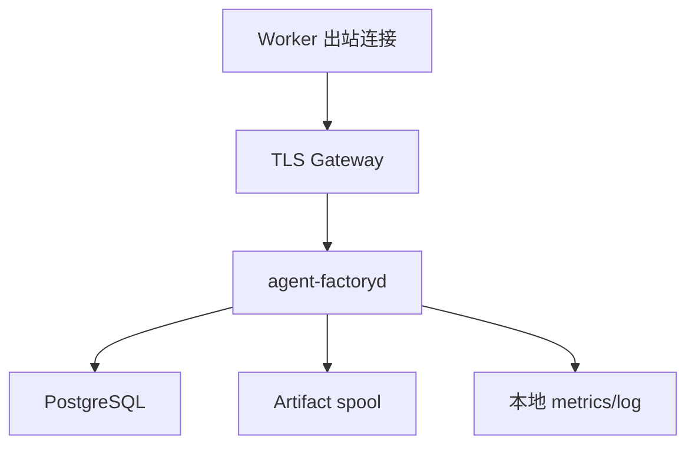

# AgentForge 本地开发与单机部署规范

> 本文定义目标开发体验和生产单机拓扑。仓库尚处设计阶段时，命令标记为“目标命令”；只有相应工单完成并进入 CI 后才视为真实可用。

## 1. 支持矩阵

### 1.1 控制平面

| 项目 | MVP 支持 |
| --- | --- |
| Linux x86_64 | Required |
| Linux ARM64 | Build required，发布前 smoke |
| Windows/macOS | 本地客户端可访问，不运行生产控制平面 |
| PostgreSQL | 16、17、18 contract test；开发默认固定一个版本 |
| Rust | `rust-toolchain.toml` 固定 stable toolchain |

### 1.2 Worker

| 项目 | MVP 支持 |
| --- | --- |
| Linux x86_64 + rootless Podman | Required |
| Linux ARM64 | Optional，能力卡标明架构 |
| Windows WSL2 | Experimental |
| Windows 原生 | 暂不承诺，jcode/容器 E2E 通过后再晋级 |
| macOS | Experimental，经 Linux VM 执行 sandbox |

jcode SDK 当前要求 Node.js 20 或更高。Node 和 jcode 版本必须进入 Executor 指纹。

## 2. 本地先决条件

开发机目标安装：

- Git 2.43+；
- Rust stable，具体版本由 `rust-toolchain.toml`；
- Node.js 20+ 与 npm；
- PostgreSQL client；
- rootless Podman 5+，或 Docker 兼容环境用于开发；
- `just` 作为统一命令入口；
- `cargo-nextest`、`cargo-deny`、`sqlx-cli`；
- `jq` 和 `git bundle`；
- 可选：`age` 用于开发密钥文件加密。

不要要求开发者把生产 Git、模型或对象存储密钥写入 `.env`。本地只使用专门的开发凭据。

## 3. 目标开发命令

以下命令由文档 09 的工单分阶段实现：M0 先交付命令骨架、`doctor/check/test`；后续里程碑在对应闭环可运行后再启用 `dev-up/migrate/test-integration/test-e2e`。命令存在不等于其后端能力已通过门禁。

```bash
just doctor
just dev-up
just migrate
just seed
just check
just test
just test-integration
just test-e2e
just dev-down
```

语义：

| 命令 | 行为 |
| --- | --- |
| `just doctor` | 检查版本、rootless、端口、磁盘和必需命令，不修改系统 |
| `just dev-up` | 启动 PostgreSQL、开发 Artifact store 和控制平面依赖 |
| `just migrate` | 对开发数据库执行当前 migration |
| `just seed` | 生成确定性测试项目、Worker 和 WorkPackage |
| `just check` | format check、clippy、Schema、TypeScript typecheck |
| `just test` | 纯 domain/unit/schema tests |
| `just test-integration` | 启动隔离 PostgreSQL/SQLite 跑集成测试 |
| `just test-e2e` | 启动 fake executor 完成最小纵向闭环 |
| `just dev-down` | 停止开发服务，默认保留 volume；显式命令才清数据 |

禁止让普通 `dev-down` 删除数据库 volume。清除数据使用显式、带目标检查的 `just dev-reset`，并在执行前输出将删除的开发资源。

## 4. 配置分层

优先级从低到高：

1. 编译默认值；
2. `/etc/agentforge/*.toml` 或用户指定配置文件；
3. `AGENTFORGE_*` 环境变量；
4. CLI 参数；
5. 服务器签发给 Worker 的短期策略。

秘密值不允许写入普通 TOML。配置解析启动时输出非秘密的最终摘要和来源。

## 5. 控制平面配置

```toml
[server]
listen = "127.0.0.1:8080"
public_base_url = "https://10.0.0.2:8443"
shutdown_grace = "20s"
request_body_limit_bytes = 1048576
work_package_body_limit_bytes = 2097152

[database]
url_env = "AGENTFORGE_DATABASE_URL"
max_connections = 16
min_connections = 2
acquire_timeout = "5s"
api_statement_timeout = "5s"
job_statement_timeout = "15s"

[outbox]
batch_size = 100
poll_interval = "250ms"
max_attempts = 20

[leases]
default_ttl = "20m"
min_ttl = "2m"
max_ttl = "4h"

[artifacts]
backend = "filesystem"
root = "/var/lib/agentforge/artifacts"
# 仅开发环境；2C4G 生产默认 10 MiB 且短 TTL，较大 Evidence/Bundle 外置。
max_single_upload_bytes = 268435456

[security]
node_ca_file = "/etc/agentforge/pki/node-ca.pem"
token_signing_key_file = "/etc/agentforge/secrets/token-key.pem"
trust_proxy_headers = false

[telemetry]
log_format = "json"
metrics_listen = "127.0.0.1:9090"
```

### 5.1 环境变量

| 变量 | 必需 | 秘密 | 说明 |
| --- | --- | --- | --- |
| `AGENTFORGE_DATABASE_URL` | 是 | 是 | PostgreSQL DSN |
| `AGENTFORGE_CONFIG` | 否 | 否 | 配置文件路径 |
| `AGENTFORGE_LOG` | 否 | 否 | filter，不得包含 token |
| `AGENTFORGE_ARTIFACT_KEY_FILE` | 视后端 | 是 | Artifact 加密密钥文件 |
| `AGENTFORGE_ADMIN_BOOTSTRAP_FILE` | 首次 | 是 | 一次性 bootstrap 凭据 |

禁止环境变量保存 Worker 的长期 Git 私钥。生产密钥通过只读文件、systemd credentials 或专用 secret provider 注入。

## 6. Worker 配置

```toml
[worker]
control_plane_url = "https://10.0.0.2:8443"
data_dir = "/var/lib/agentforge-worker"
max_parallel_attempts = 2
offer_wait = "30s"
offline_grace = "10m"

[identity]
node_id = "0198f221-52f8-7d6b-92b4-2d89aa25a33e"
node_name = "worker-tokyo-03"
certificate_file = "/etc/agentforge-worker/pki/node.pem"
private_key_file = "/etc/agentforge-worker/pki/node-key.pem"
ca_file = "/etc/agentforge-worker/pki/control-ca.pem"

[executor.jcode]
bridge_command = ["node", "/opt/agentforge/jcode-bridge/dist/main.js"]
node_home = "/var/lib/agentforge-worker/jcode"
startup_timeout = "30s"
request_timeout = "10m"

[sandbox]
driver = "podman-rootless"
network_default = "none"
memory_mb_per_attempt = 4096
cpu_per_attempt = 2
pids_per_attempt = 512
disk_mb_per_attempt = 10240
wall_clock_limit = "4h"

[journal]
path = "/var/lib/agentforge-worker/journal.db"
sync = "normal"
wal = true

[git]
mirror_root = "/var/cache/agentforge-worker/git"
workspace_root = "/var/lib/agentforge-worker/workspaces"
bundle_outbox = "/var/lib/agentforge-worker/bundles"
```

## 7. 本地服务拓扑

开发 Compose 目标包含：

| 服务 | 端口 | 数据 | 必需 |
| --- | --- | --- | --- |
| `postgres` | 5432，仅本机 | named volume | 是 |
| `control-plane` | 8080 | 无状态 | 是 |
| `artifact-dev` | 9000/9001 | named volume | M3 起 |
| `git-dev` | 3000/2222 | named volume | M4 起 |
| `relay-dev` | 无公开端口 | 临时 bare repo | M4 起 |
| `fake-worker` | 无公开端口 | 临时 Journal | 是 |

生产 Compose 不暴露 PostgreSQL、Artifact 管理端和 metrics 到公网。

## 8. 数据库初始化

规则：

- migration 文件名使用单调版本和动作描述；
- 已合入 main 的 migration 不修改；
- 控制平面启动只检查版本，不默认自动迁移生产库；
- 独立 `agentforge-admin migrate` 执行升级；
- 每次发布说明最低数据库版本、预计锁和回滚方案；
- migration transaction 能力按 SQL 内容明确，不能假设所有 DDL 都适合单事务；
- 测试总是从空库运行全链路 migration。

目标命令：

```bash
agentforge-admin migrate plan
agentforge-admin migrate apply
agentforge-admin migrate status
```

## 9. 节点注册

推荐流程：

1. 管理员在控制平面创建一次性 enrollment token；
2. Worker 本地生成 Ed25519 keypair，私钥不离开节点；
3. Worker 发送公钥、节点名和最小硬件摘要；
4. 控制平面签发短期或可轮换节点证书；
5. Worker 建立 mTLS 连接并提交完整 Capability Profile；
6. 管理员或策略确认安全域；
7. Worker 进入 `IDLE`，可接收匹配 Offer。

目标命令：

```bash
agentforge-admin enrollment create --expires 10m
agentforge-worker enroll --server https://10.0.0.2:8443 --token-file /run/secrets/enroll
agentforge-admin nodes approve worker-tokyo-03 --trust project-private
```

Enrollment token 单次使用；失败或超时后不可重放。

## 10. 无域名与跨网络

优先方案：中央服务器和受信任节点通过 WireGuard/Headscale 私网访问。若只使用公网 IP：

- 建立私有根 CA；
- 服务器证书包含固定 IP SAN；
- Worker 固定 CA 和预期 server identity；
- 不关闭 TLS hostname/IP 校验；
- API、Artifact 和 Worker stream 共用 443/8443 网关；
- 原始 PostgreSQL、NATS、Git 和 metrics 不暴露公网；
- 所有连接由 Worker/Relay 主动出站建立。

证书轮换必须支持当前和下一 CA 的重叠信任期。

## 11. 生产单机拓扑



2C4G 建议初始资源预算（全部为 `TARGET_NOT_VALIDATED`）：

| 组件 | 内存上限/目标 | 说明 |
| --- | --- | --- |
| PostgreSQL 进程 + shared buffers | 1.0–1.5 GiB 目标，1.75 GiB hard budget | `shared_buffers=512MiB`，连接池 16 |
| agent-factoryd | 300 MiB RSS 目标，512 MiB hard budget | 不运行构建/模型 |
| TLS gateway + telemetry | 128–256 MiB 目标，384 MiB hard budget | 可精简或内置 TLS |
| Artifact spool | 内存流式，磁盘配额限制 | 生产单对象默认 10 MiB、严格 TTL；大件外置 |
| OS page cache/故障余量 | 至少 1.25 GiB | 避免 swap 风暴 |

这是部署起点，不是已经验证的最优配置；不得把各项 hard budget 同时吃满。最终值由目标机 24 小时 soak 决定。

## 12. systemd/Quadlet

生产服务要求：

- 独立低权限用户；
- `NoNewPrivileges=true`；
- 只读系统路径；
- 限制可写目录；
- `PrivateTmp=true`；
- capability 清零；
- restart 带退避，避免数据库故障时快速循环；
- 有界 stop grace，等待请求结束和 Outbox checkpoint；
- 日志 JSON 到 journald 或受控文件；
- secret 通过 systemd credentials；
- 数据目录单独备份。

## 13. 备份与恢复

### 13.1 必须备份

- PostgreSQL base backup/WAL 或定期逻辑备份；
- token/节点 CA 和签名密钥；
- Artifact registry 中未完成或需长期保留的 Evidence；
- 配置和已接受 ADR/Schema 版本；
- Git 代码本身由局域网 Git 的备份策略负责。

### 13.2 不依赖备份恢复

- Worker 临时 worktree；
- 可重新生成的 build cache；
- 已 Relay 并确认的临时 Bundle；
- 高频 token delta。

### 13.3 恢复演练

1. 在隔离网络恢复数据库和密钥；
2. 以只读模式启动并检查 schema/event 序列；
3. 恢复 Artifact 引用；
4. 启动 Outbox dispatcher；
5. Worker 重连，以 cursor 和 Journal 收敛；
6. 对所有 Active Lease 做服务器时间裁决；
7. 检查未完成 Obligation；
8. 才恢复对外写流量。

每个发布里程碑至少演练一次。

## 14. 日志与监控

结构化字段：

```text
timestamp, level, service, version,
project_id, package_id, attempt_id, lease_generation,
event_id, correlation_id, causation_id,
actor_id, command, outcome, error_code, duration_ms
```

禁止记录：

- Provider API key、refresh token、Git 私钥；
- 完整用户 Prompt 或模型隐藏推理；
- 未脱敏 stdout/stderr；
- 私有仓库内容；
- Artifact signed URL。

核心告警：

- Outbox backlog age；
- obligation overdue；
- active Lease 无语义进度；
- claim/renew error rate；
- PostgreSQL connections/WAL/disk；
- Artifact spool quota；
- Worker reconnect storm；
- Relay quarantine count；
- Evidence signature failure。

## 15. 滚动升级

MVP 单实例升级流程：

1. 暂停发布新 Offer，不撤销已有 Lease；
2. 等待短请求和 Outbox batch 完成；
3. 备份数据库；
4. 执行 migration plan 并检查；
5. 停止服务、应用 migration、启动新版本；
6. 运行 readiness 和协议兼容 smoke；
7. 恢复 Offer；
8. 观察 Worker 重连、旧 minor 和 Outbox；
9. 保留可回滚二进制，但数据库回滚按 migration 策略处理。

升级期间 Worker 可以继续策略允许的本地执行，但正式 Candidate 登记必须等待控制平面确认当前 Lease；独立验收只处理已经成功登记的 Candidate。

## 16. 开发环境 Definition of Ready

只有以下全部通过，才允许把环境问题归因于 Agent 代码：

- `just doctor` 全绿；
- 当前 migration 成功；
- Schema 和示例验证通过；
- FakeClock、FakeExecutor 和临时 PostgreSQL 可运行；
- Git Bundle 基础 probe 通过；
- rootless sandbox probe 证明挂载和网络策略；
- 测试使用开发凭据而非个人/生产凭据；
- 工作区和缓存磁盘余量达到配置要求。
